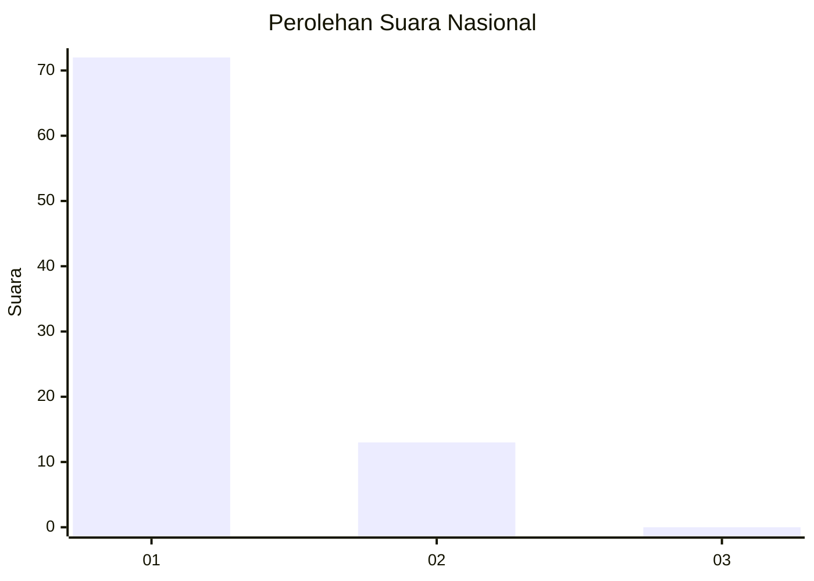
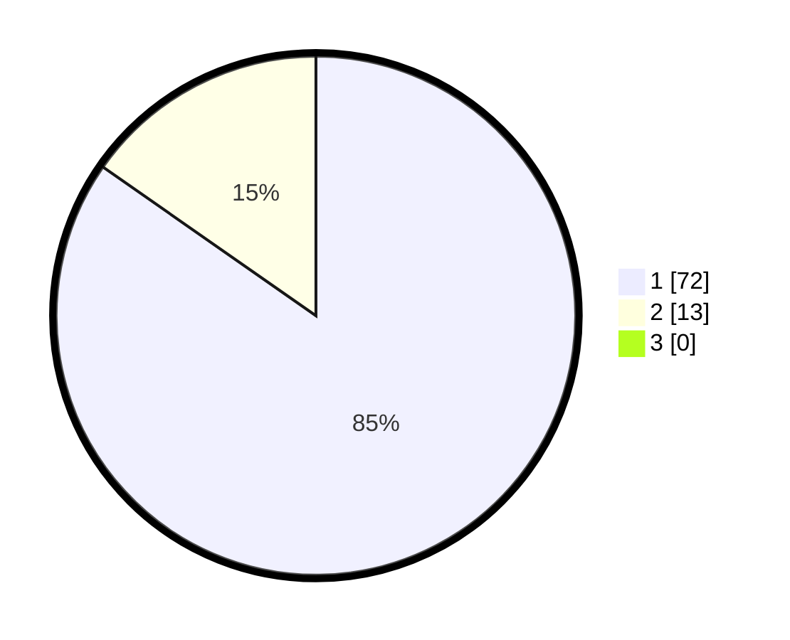

# Hasil

## Grafik

## Tabel

| No. | Nama Paslon    | Suara | Suara (raw) | Persentase |
|:--- |:-------------- | -----:| -----------:| ----------:|
| 1   | ANIES MUHAIMIN | 72    | [72][p-1]   | 84,71      |
| 2   | PRABOWO GIBRAN | 13    | [13][p-2]   | 15,29      |
| 3   | GANJAR MAHFUD  | 0     | [0][p-3]    | 0,00       |

[p-1]: https://github.com/gigit-pemilu/pemilu-2024/blob/main/pilpres/hitung-suara/sub/11-aceh/sub/07-pidie/sub/17-sakti/sub/2011-mancang/sub/001-tps/sub/paslon-1.txt
[p-2]: https://github.com/gigit-pemilu/pemilu-2024/blob/main/pilpres/hitung-suara/sub/11-aceh/sub/07-pidie/sub/17-sakti/sub/2011-mancang/sub/001-tps/sub/paslon-2.txt
[p-3]: https://github.com/gigit-pemilu/pemilu-2024/blob/main/pilpres/hitung-suara/sub/11-aceh/sub/07-pidie/sub/17-sakti/sub/2011-mancang/sub/001-tps/sub/paslon-3.txt

## Foto C Plano

https://sirekap-obj-formc.kpu.go.id/5ea1/pemilu/ppwp/11/07/17/20/11/1107172011001-20240216-131205--aa3438e7-4394-48c9-b1b3-edb944c60769.jpg

https://sirekap-obj-formc.kpu.go.id/5ea1/pemilu/ppwp/11/07/17/20/11/1107172011001-20240216-131206--d37f5b42-c5f8-4c78-af8c-b3afb031a374.jpg

https://sirekap-obj-formc.kpu.go.id/5ea1/pemilu/ppwp/11/07/17/20/11/1107172011001-20240216-131206--831655ca-4027-4a15-8190-5187f4d22a30.jpg

## Metadata

| Key        | Value               |
| ---------- | ------------------- |
| Time Stamp | 2024-02-17 00:00:00 |

## DATA PEMILIH TETAP

Jumlah pemilih dalam DPT: **97**.
 * L: **48**.
 * P: **49**.

## DATA PENGGUNA HAK PILIH

Jumlah pengguna hak pilih dalam DPT: **89**.
 * L: **45**.
 * P: **44**.

Jumlah pengguna hak pilih dalam DPTb: **0**.
 * L: **0**.
 * P: **0**.

Jumlah pengguna hak pilih dalam DPK: **0**.
 * L: **0**.
 * P: **0**.

Jumlah pengguna hak pilih: **89**.
 * L: **45**.
 * P: **44**.

## JUMLAH SUARA SAH DAN TIDAK SAH

JUMLAH SELURUH SUARA SAH: **85**.

JUMLAH SUARA TIDAK SAH: **4**.

JUMLAH SELURUH SUARA SAH DAN SUARA TIDAK SAH: **89**.

