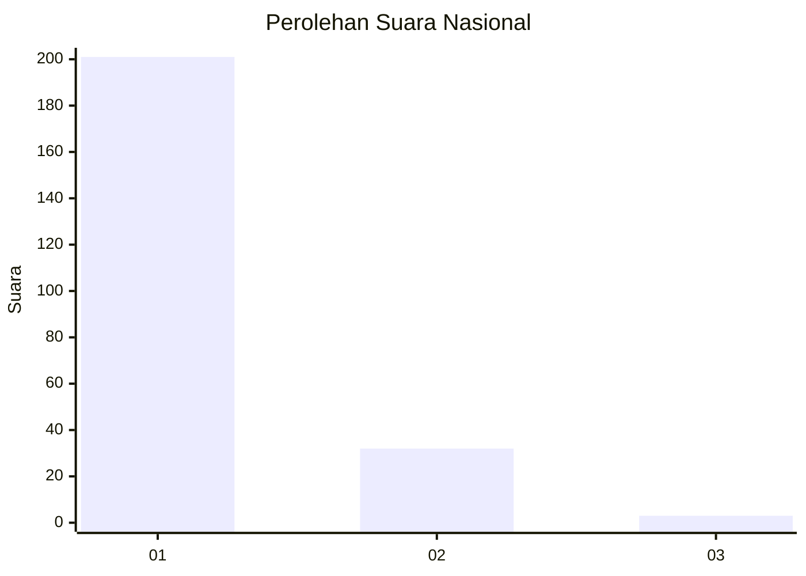
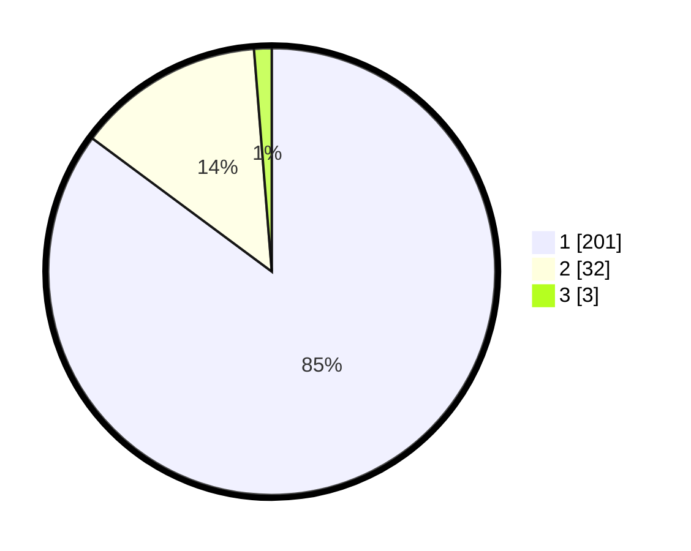

# Hasil

## Grafik

## Tabel

| No. | Nama Paslon    | Suara | Suara (raw) | Persentase |
|:--- |:-------------- | -----:| -----------:| ----------:|
| 1   | ANIES MUHAIMIN | 201   | [201][p-1]  | 85,17      |
| 2   | PRABOWO GIBRAN | 32    | [32][p-2]   | 13,56      |
| 3   | GANJAR MAHFUD  | 3     | [3][p-3]    | 1,27       |

[p-1]: https://github.com/gigit-pemilu/pemilu-2024/blob/main/pilpres/hitung-suara/sub/11-aceh/sub/07-pidie/sub/17-sakti/sub/2013-bucue/sub/001-tps/sub/paslon-1.txt
[p-2]: https://github.com/gigit-pemilu/pemilu-2024/blob/main/pilpres/hitung-suara/sub/11-aceh/sub/07-pidie/sub/17-sakti/sub/2013-bucue/sub/001-tps/sub/paslon-2.txt
[p-3]: https://github.com/gigit-pemilu/pemilu-2024/blob/main/pilpres/hitung-suara/sub/11-aceh/sub/07-pidie/sub/17-sakti/sub/2013-bucue/sub/001-tps/sub/paslon-3.txt

## Foto C Plano

https://sirekap-obj-formc.kpu.go.id/9426/pemilu/ppwp/11/07/17/20/13/1107172013001-20240215-050723--655fb7ea-04e3-4cd4-9caa-fae5b18c34d1.jpg

https://sirekap-obj-formc.kpu.go.id/9426/pemilu/ppwp/11/07/17/20/13/1107172013001-20240215-050907--67bf3aaf-d009-4051-ae99-d285dea13894.jpg

https://sirekap-obj-formc.kpu.go.id/9426/pemilu/ppwp/11/07/17/20/13/1107172013001-20240215-051221--7239b158-72c5-472b-89aa-5e3e4b125dba.jpg

## Metadata

| Key        | Value               |
| ---------- | ------------------- |
| Time Stamp | 2024-02-24 22:31:28 |

