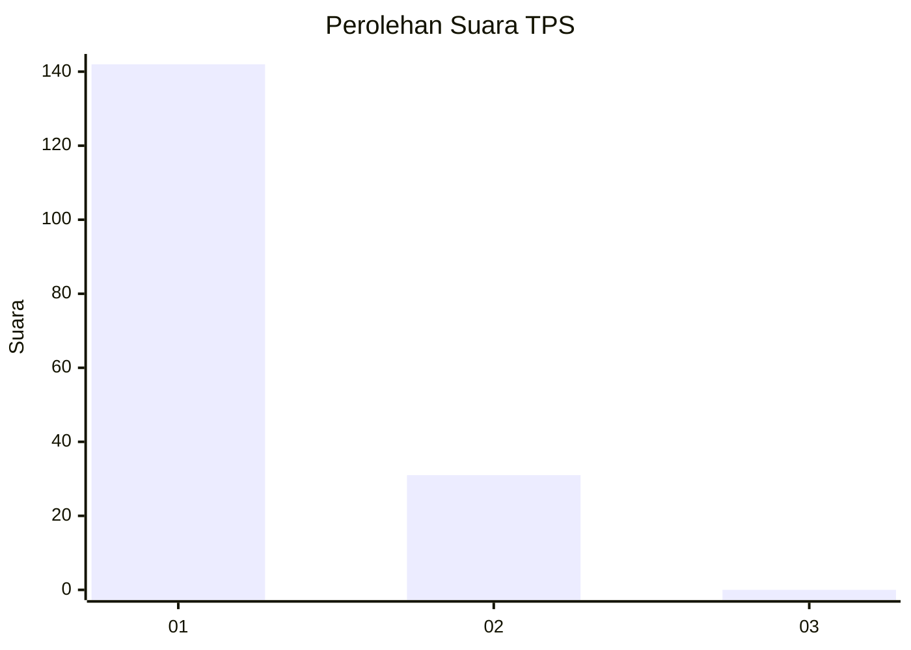
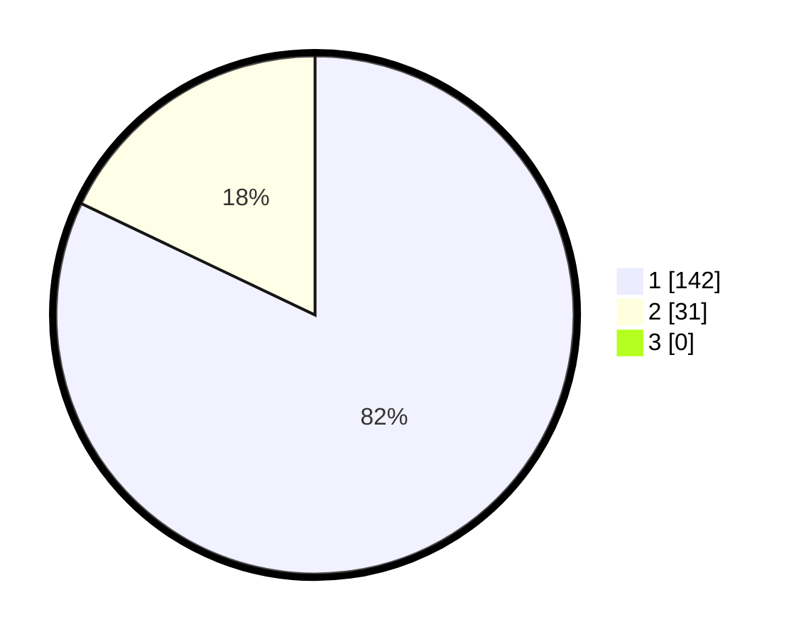

# Hasil

## Grafik

## Tabel

| No. | Nama Paslon    | Suara | Suara (raw) | Persentase |
|:--- |:-------------- | -----:| -----------:| ----------:|
| 1   | ANIES MUHAIMIN | 142   | [142][p-1]  | 82,08      |
| 2   | PRABOWO GIBRAN | 31    | [31][p-2]   | 17,92      |
| 3   | GANJAR MAHFUD  | 0     | [0][p-3]    | 0,00       |

[p-1]: https://github.com/gigit-pemilu/pemilu-2024-11-aceh/blob/main/pilpres/hitung-suara/sub/11-aceh/sub/07-pidie/sub/17-sakti/sub/2014-lhok-panah/sub/001-tps/sub/paslon-1.txt
[p-2]: https://github.com/gigit-pemilu/pemilu-2024-11-aceh/blob/main/pilpres/hitung-suara/sub/11-aceh/sub/07-pidie/sub/17-sakti/sub/2014-lhok-panah/sub/001-tps/sub/paslon-2.txt
[p-3]: https://github.com/gigit-pemilu/pemilu-2024-11-aceh/blob/main/pilpres/hitung-suara/sub/11-aceh/sub/07-pidie/sub/17-sakti/sub/2014-lhok-panah/sub/001-tps/sub/paslon-3.txt

## Foto C Plano

https://sirekap-obj-formc.kpu.go.id/e91e/pemilu/ppwp/11/07/17/20/14/1107172014001-20240215-071845--3bb2e044-5097-4a8b-8ec9-49848b62046a.jpg

https://sirekap-obj-formc.kpu.go.id/e91e/pemilu/ppwp/11/07/17/20/14/1107172014001-20240215-072040--0cb8bd06-4ace-44ea-903d-f700f1b16d44.jpg

https://sirekap-obj-formc.kpu.go.id/e91e/pemilu/ppwp/11/07/17/20/14/1107172014001-20240215-072216--f2301009-eb0e-46d6-98c4-05c6b5efcd64.jpg

## Metadata

| Key        | Value               |
| ---------- | ------------------- |
| Time Stamp | 2024-02-19 06:16:00 |

