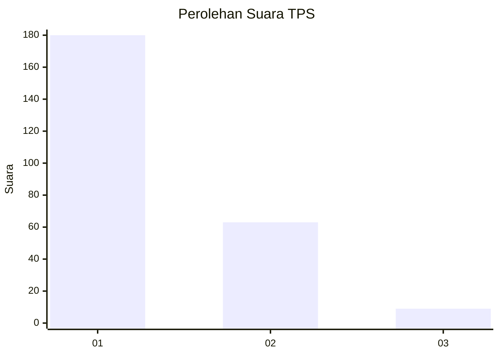
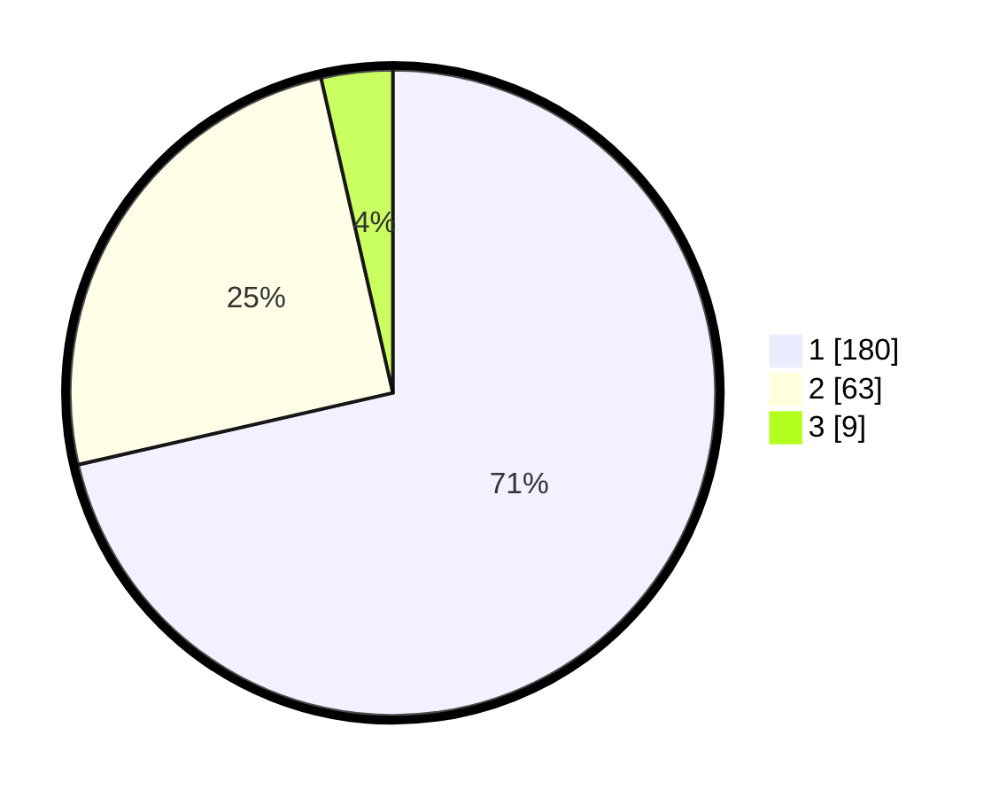

# Hasil

## Grafik

## Tabel

| No. | Nama Paslon    | Suara | Suara (raw) | Persentase |
|:--- |:-------------- | -----:| -----------:| ----------:|
| 1   | ANIES MUHAIMIN | 180   | [180][p-1]  | 71,43      |
| 2   | PRABOWO GIBRAN | 63    | [63][p-2]   | 25,00      |
| 3   | GANJAR MAHFUD  | 9     | [9][p-3]    | 3,57       |

[p-1]: https://github.com/gigit-pemilu/pemilu-2024-11-aceh/blob/main/pilpres/hitung-suara/sub/11-aceh/sub/07-pidie/sub/17-sakti/sub/2015-murong-cot/sub/001-tps/sub/paslon-1.txt
[p-2]: https://github.com/gigit-pemilu/pemilu-2024-11-aceh/blob/main/pilpres/hitung-suara/sub/11-aceh/sub/07-pidie/sub/17-sakti/sub/2015-murong-cot/sub/001-tps/sub/paslon-2.txt
[p-3]: https://github.com/gigit-pemilu/pemilu-2024-11-aceh/blob/main/pilpres/hitung-suara/sub/11-aceh/sub/07-pidie/sub/17-sakti/sub/2015-murong-cot/sub/001-tps/sub/paslon-3.txt

## Foto C Plano

https://sirekap-obj-formc.kpu.go.id/57e3/pemilu/ppwp/11/07/17/20/15/1107172015001-20240214-202227--0bb4a698-3586-4354-a7e4-4ec9652fd58f.jpg

https://sirekap-obj-formc.kpu.go.id/57e3/pemilu/ppwp/11/07/17/20/15/1107172015001-20240214-202445--e5653cfc-cee5-42fb-aa65-dd17d2ae957d.jpg

https://sirekap-obj-formc.kpu.go.id/57e3/pemilu/ppwp/11/07/17/20/15/1107172015001-20240214-202642--38445b34-1d3d-49cb-80c7-fc247b07eba0.jpg

## Metadata

| Key        | Value               |
| ---------- | ------------------- |
| Time Stamp | 2024-02-24 22:31:28 |

