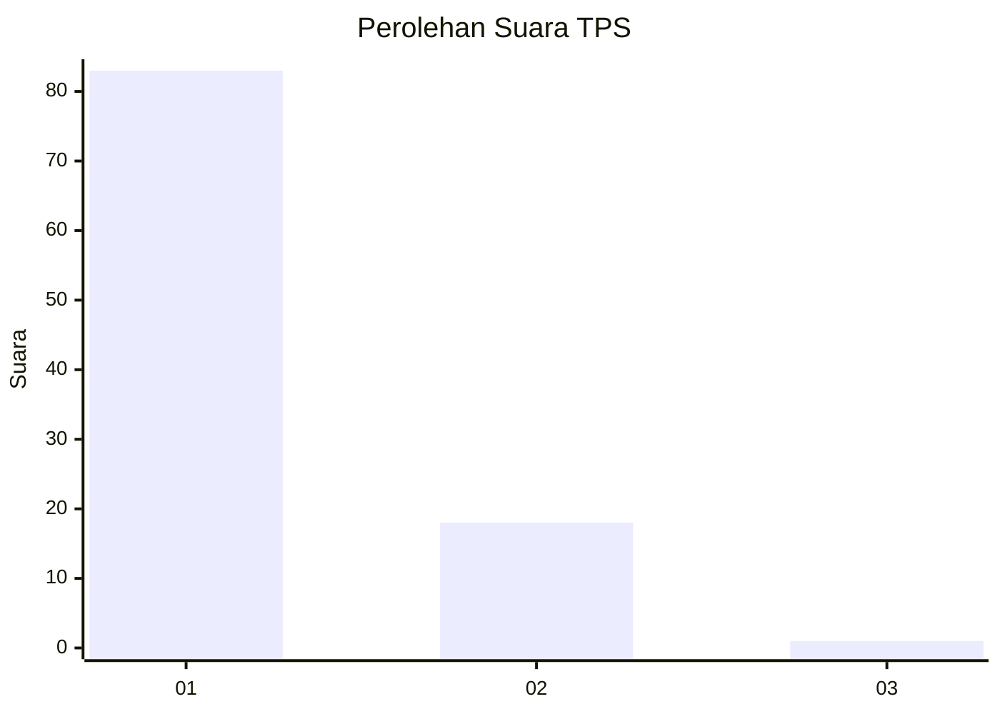
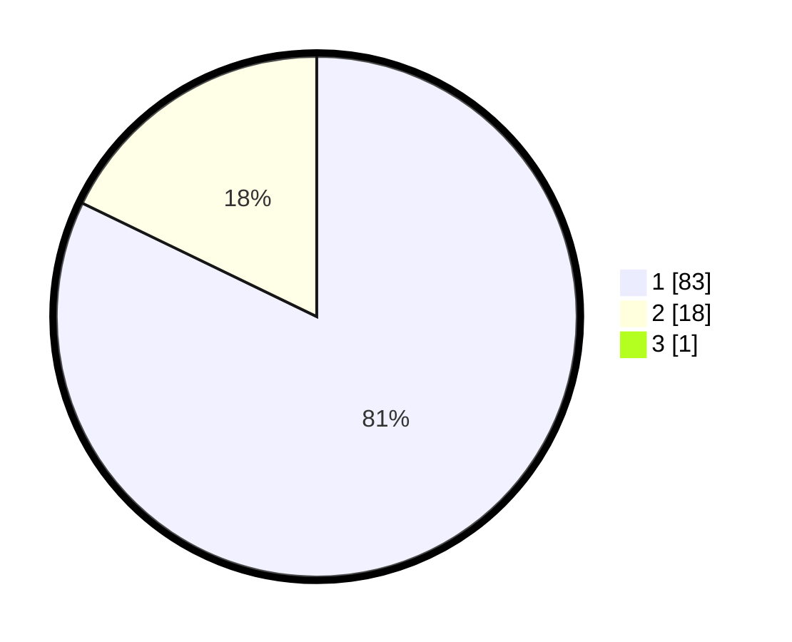

# Hasil

## Grafik

## Tabel

| No. | Nama Paslon    | Suara | Suara (raw) | Persentase |
|:--- |:-------------- | -----:| -----------:| ----------:|
| 1   | ANIES MUHAIMIN | 83    | [83][p-1]   | 81,37      |
| 2   | PRABOWO GIBRAN | 18    | [18][p-2]   | 17,65      |
| 3   | GANJAR MAHFUD  | 1     | [1][p-3]    | 0,98       |

[p-1]: https://github.com/gigit-pemilu/pemilu-2024-11-aceh/blob/main/pilpres/hitung-suara/sub/11-aceh/sub/07-pidie/sub/17-sakti/sub/2019-blang-cot/sub/001-tps/sub/paslon-1.txt
[p-2]: https://github.com/gigit-pemilu/pemilu-2024-11-aceh/blob/main/pilpres/hitung-suara/sub/11-aceh/sub/07-pidie/sub/17-sakti/sub/2019-blang-cot/sub/001-tps/sub/paslon-2.txt
[p-3]: https://github.com/gigit-pemilu/pemilu-2024-11-aceh/blob/main/pilpres/hitung-suara/sub/11-aceh/sub/07-pidie/sub/17-sakti/sub/2019-blang-cot/sub/001-tps/sub/paslon-3.txt

## Foto C Plano

https://sirekap-obj-formc.kpu.go.id/d13a/pemilu/ppwp/11/07/17/20/19/1107172019001-20240216-135320--49a65955-81d6-4ff3-94dd-acde5219534a.jpg

https://sirekap-obj-formc.kpu.go.id/d13a/pemilu/ppwp/11/07/17/20/19/1107172019001-20240216-135321--7ae85f1f-4e4b-4755-932d-c216b3514ad4.jpg

https://sirekap-obj-formc.kpu.go.id/d13a/pemilu/ppwp/11/07/17/20/19/1107172019001-20240216-135320--61a1213f-15bc-404f-8a3e-87da9e011551.jpg

## Metadata

| Key        | Value               |
| ---------- | ------------------- |
| Time Stamp | 2024-02-17 00:00:00 |

## DATA PEMILIH TETAP

Jumlah pemilih dalam DPT: **102**.
 * L: **50**.
 * P: **52**.

## DATA PENGGUNA HAK PILIH

Jumlah pengguna hak pilih dalam DPT: **100**.
 * L: **49**.
 * P: **51**.

Jumlah pengguna hak pilih dalam DPTb: **2**.
 * L: **1**.
 * P: **1**.

Jumlah pengguna hak pilih dalam DPK: **0**.
 * L: **0**.
 * P: **0**.

Jumlah pengguna hak pilih: **102**.
 * L: **50**.
 * P: **52**.

## JUMLAH SUARA SAH DAN TIDAK SAH

JUMLAH SELURUH SUARA SAH: **102**.

JUMLAH SUARA TIDAK SAH: **1**.

JUMLAH SELURUH SUARA SAH DAN SUARA TIDAK SAH: **103**.

