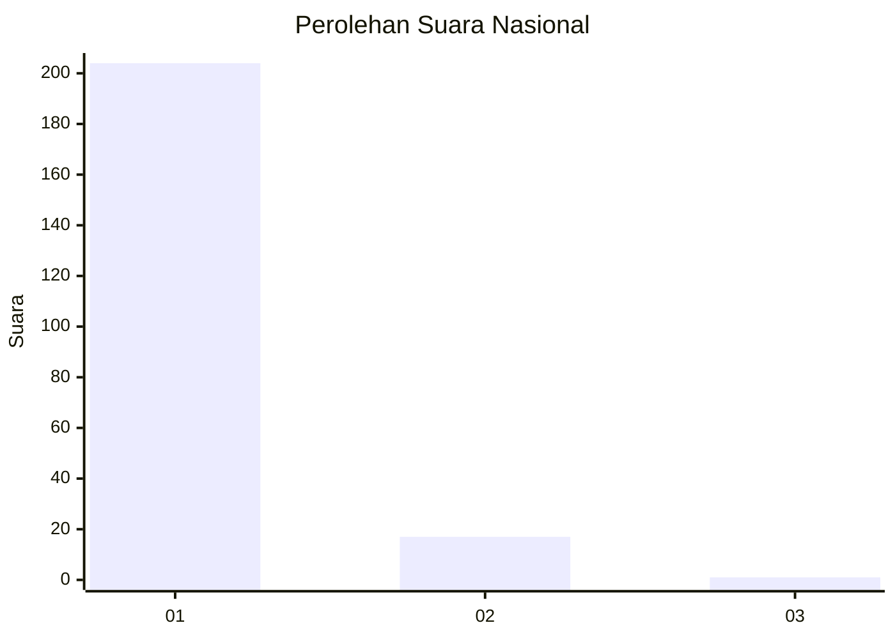
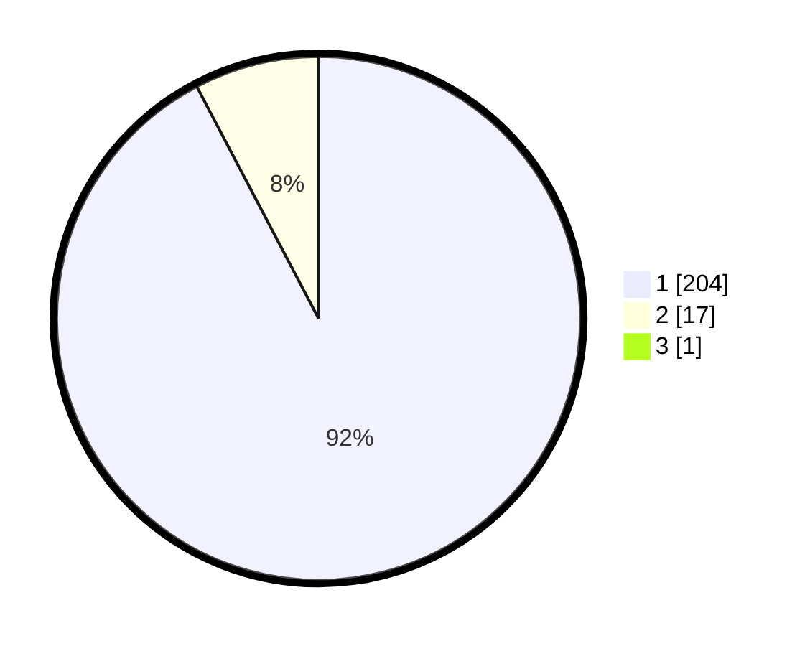

# Hasil

## Grafik

## Tabel

| No. | Nama Paslon    | Suara | Suara (raw) | Persentase |
|:--- |:-------------- | -----:| -----------:| ----------:|
| 1   | ANIES MUHAIMIN | 204   | [204][p-1]  | 91,89      |
| 2   | PRABOWO GIBRAN | 17    | [17][p-2]   | 7,66       |
| 3   | GANJAR MAHFUD  | 1     | [1][p-3]    | 0,45       |

[p-1]: https://github.com/gigit-pemilu/pemilu-2024/blob/main/pilpres/hitung-suara/sub/11-aceh/sub/07-pidie/sub/17-sakti/sub/2023-cumbok-niwa/sub/001-tps/sub/paslon-1.txt
[p-2]: https://github.com/gigit-pemilu/pemilu-2024/blob/main/pilpres/hitung-suara/sub/11-aceh/sub/07-pidie/sub/17-sakti/sub/2023-cumbok-niwa/sub/001-tps/sub/paslon-2.txt
[p-3]: https://github.com/gigit-pemilu/pemilu-2024/blob/main/pilpres/hitung-suara/sub/11-aceh/sub/07-pidie/sub/17-sakti/sub/2023-cumbok-niwa/sub/001-tps/sub/paslon-3.txt

## Foto C Plano

https://sirekap-obj-formc.kpu.go.id/3784/pemilu/ppwp/11/07/17/20/23/1107172023001-20240215-023617--f9572fe1-ffaa-495f-a9b3-2268974627d1.jpg

https://sirekap-obj-formc.kpu.go.id/3784/pemilu/ppwp/11/07/17/20/23/1107172023001-20240215-031822--d768231f-419a-460e-b341-7936601ec4e2.jpg

https://sirekap-obj-formc.kpu.go.id/3784/pemilu/ppwp/11/07/17/20/23/1107172023001-20240215-050136--d1ddc03f-4779-4deb-aeff-db1a07cffda6.jpg

## Metadata

| Key        | Value               |
| ---------- | ------------------- |
| Time Stamp | 2024-02-26 16:00:00 |

