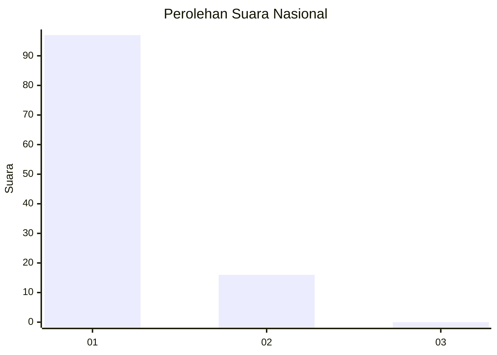
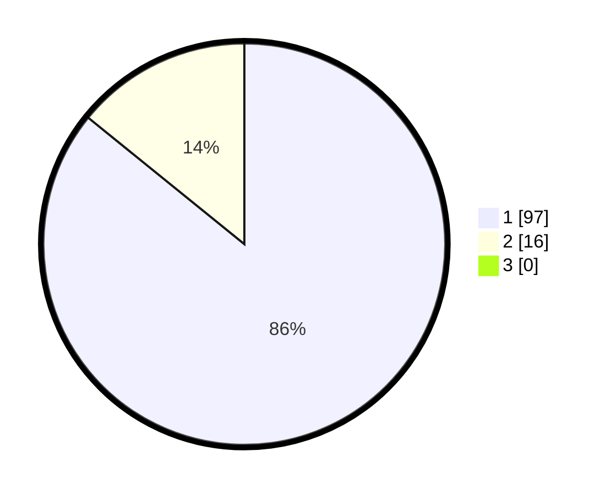

# Hasil

## Grafik

## Tabel

| No. | Nama Paslon    | Suara | Suara (raw) | Persentase |
|:--- |:-------------- | -----:| -----------:| ----------:|
| 1   | ANIES MUHAIMIN | 97    | [97][p-1]   | 85,84      |
| 2   | PRABOWO GIBRAN | 16    | [16][p-2]   | 14,16      |
| 3   | GANJAR MAHFUD  | 0     | [0][p-3]    | 0,00       |

[p-1]: https://github.com/gigit-pemilu/pemilu-2024/blob/main/pilpres/hitung-suara/sub/11-aceh/sub/07-pidie/sub/17-sakti/sub/2025-pulo-jeumpa/sub/001-tps/sub/paslon-1.txt
[p-2]: https://github.com/gigit-pemilu/pemilu-2024/blob/main/pilpres/hitung-suara/sub/11-aceh/sub/07-pidie/sub/17-sakti/sub/2025-pulo-jeumpa/sub/001-tps/sub/paslon-2.txt
[p-3]: https://github.com/gigit-pemilu/pemilu-2024/blob/main/pilpres/hitung-suara/sub/11-aceh/sub/07-pidie/sub/17-sakti/sub/2025-pulo-jeumpa/sub/001-tps/sub/paslon-3.txt

## Foto C Plano

https://sirekap-obj-formc.kpu.go.id/089f/pemilu/ppwp/11/07/17/20/25/1107172025001-20240215-020058--b83b2574-701c-4a54-a014-d105c5eee5e4.jpg

https://sirekap-obj-formc.kpu.go.id/089f/pemilu/ppwp/11/07/17/20/25/1107172025001-20240215-020245--23621180-1123-4258-9d5d-801e0376fa3f.jpg

https://sirekap-obj-formc.kpu.go.id/089f/pemilu/ppwp/11/07/17/20/25/1107172025001-20240215-020403--d71334b2-ba0d-4651-b39a-4d8c93ecdece.jpg

## Metadata

| Key        | Value               |
| ---------- | ------------------- |
| Time Stamp | 2024-02-19 06:16:00 |

