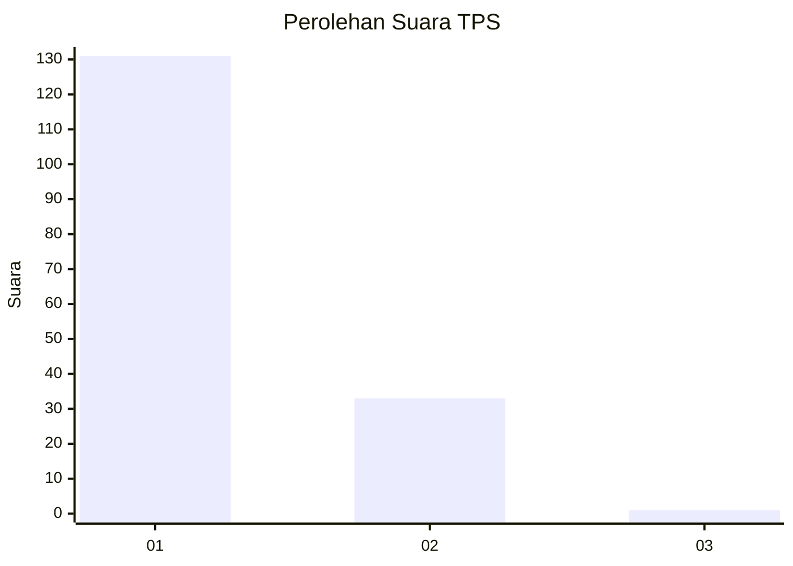
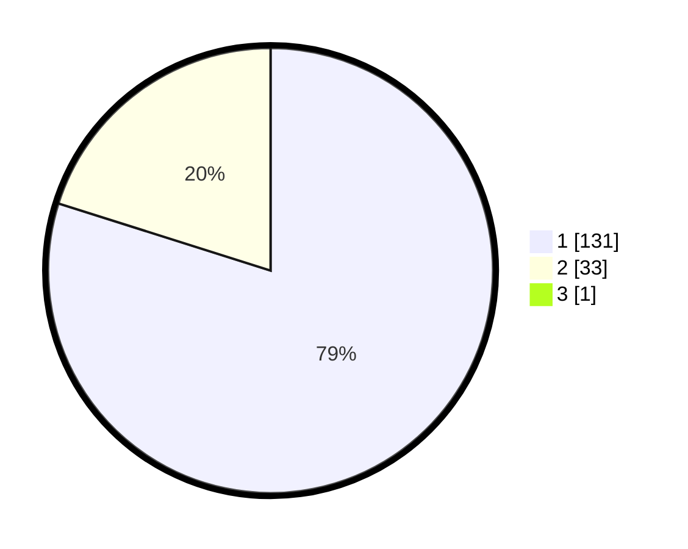

# Hasil

## Grafik

## Tabel

| No. | Nama Paslon    | Suara | Suara (raw) | Persentase |
|:--- |:-------------- | -----:| -----------:| ----------:|
| 1   | ANIES MUHAIMIN | 131   | [131][p-1]  | 79,39      |
| 2   | PRABOWO GIBRAN | 33    | [33][p-2]   | 20,00      |
| 3   | GANJAR MAHFUD  | 1     | [1][p-3]    | 0,61       |

[p-1]: https://github.com/gigit-pemilu/pemilu-2024-11-aceh/blob/main/pilpres/hitung-suara/sub/11-aceh/sub/07-pidie/sub/17-sakti/sub/2043-mns-blang-sakti/sub/001-tps/sub/paslon-1.txt
[p-2]: https://github.com/gigit-pemilu/pemilu-2024-11-aceh/blob/main/pilpres/hitung-suara/sub/11-aceh/sub/07-pidie/sub/17-sakti/sub/2043-mns-blang-sakti/sub/001-tps/sub/paslon-2.txt
[p-3]: https://github.com/gigit-pemilu/pemilu-2024-11-aceh/blob/main/pilpres/hitung-suara/sub/11-aceh/sub/07-pidie/sub/17-sakti/sub/2043-mns-blang-sakti/sub/001-tps/sub/paslon-3.txt

## Foto C Plano

https://sirekap-obj-formc.kpu.go.id/1ba3/pemilu/ppwp/11/07/17/20/43/1107172043001-20240218-162145--7d02fc23-a991-47de-8f77-456362293a2e.jpg

https://sirekap-obj-formc.kpu.go.id/1ba3/pemilu/ppwp/11/07/17/20/43/1107172043001-20240218-162015--994d6a86-f22f-4584-b655-8a523a3c2a94.jpg

https://sirekap-obj-formc.kpu.go.id/1ba3/pemilu/ppwp/11/07/17/20/43/1107172043001-20240218-162045--ea115d58-dac0-4447-a85a-8e231d2acadb.jpg

## Metadata

| Key        | Value               |
| ---------- | ------------------- |
| Time Stamp | 2024-02-24 22:31:28 |

