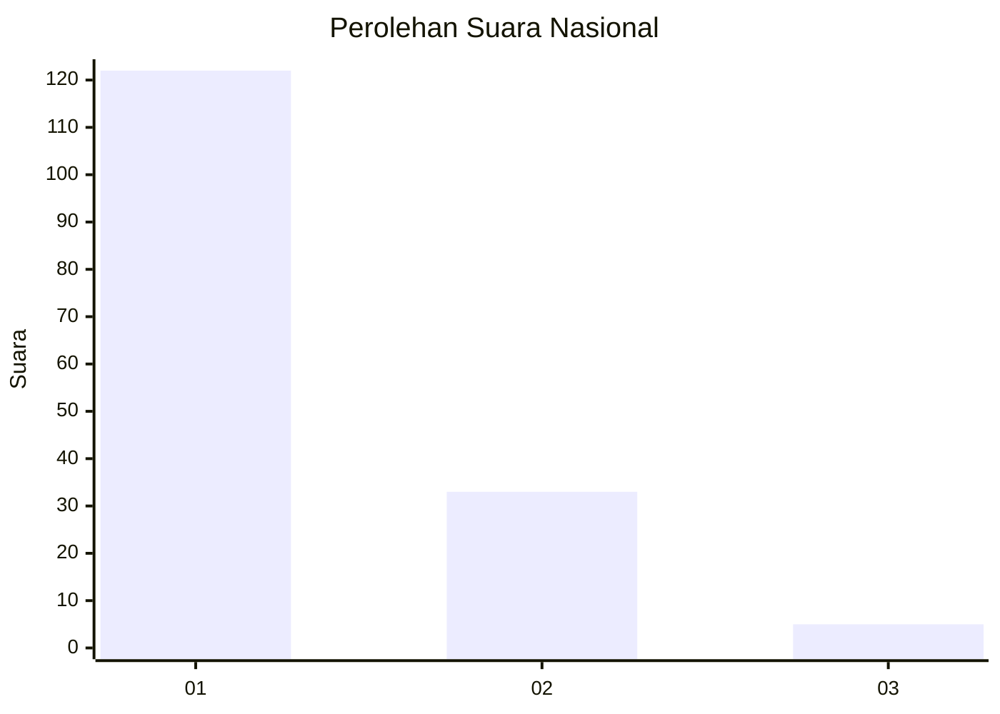
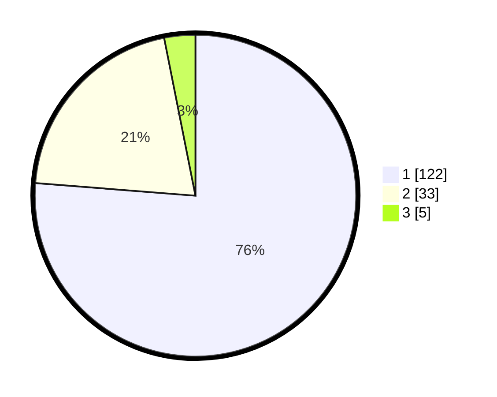

# Hasil

## Grafik

## Tabel

| No. | Nama Paslon    | Suara | Suara (raw) | Persentase |
|:--- |:-------------- | -----:| -----------:| ----------:|
| 1   | ANIES MUHAIMIN | 122   | [122][p-1]  | 76,25      |
| 2   | PRABOWO GIBRAN | 33    | [33][p-2]   | 20,63      |
| 3   | GANJAR MAHFUD  | 5     | [5][p-3]    | 3,13       |

[p-1]: https://github.com/gigit-pemilu/pemilu-2024/blob/main/pilpres/hitung-suara/sub/11-aceh/sub/07-pidie/sub/17-sakti/sub/2043-mns-blang-sakti/sub/002-tps/sub/paslon-1.txt
[p-2]: https://github.com/gigit-pemilu/pemilu-2024/blob/main/pilpres/hitung-suara/sub/11-aceh/sub/07-pidie/sub/17-sakti/sub/2043-mns-blang-sakti/sub/002-tps/sub/paslon-2.txt
[p-3]: https://github.com/gigit-pemilu/pemilu-2024/blob/main/pilpres/hitung-suara/sub/11-aceh/sub/07-pidie/sub/17-sakti/sub/2043-mns-blang-sakti/sub/002-tps/sub/paslon-3.txt

## Foto C Plano

https://sirekap-obj-formc.kpu.go.id/f6c7/pemilu/ppwp/11/07/17/20/43/1107172043002-20240214-221840--b78f0c33-38a3-4312-9142-0aa004cef1bd.jpg

https://sirekap-obj-formc.kpu.go.id/f6c7/pemilu/ppwp/11/07/17/20/43/1107172043002-20240214-221951--8ebe7c85-0808-491e-a1ee-4bca727c5b37.jpg

https://sirekap-obj-formc.kpu.go.id/f6c7/pemilu/ppwp/11/07/17/20/43/1107172043002-20240214-222042--aa8658ab-e5ff-4a66-8d17-ee845170a0d8.jpg

## Metadata

| Key        | Value               |
| ---------- | ------------------- |
| Time Stamp | 2024-02-15 17:30:25 |

## DATA PEMILIH TETAP

Jumlah pemilih dalam DPT: **198**.
 * L: **91**.
 * P: **107**.

## DATA PENGGUNA HAK PILIH

Jumlah pengguna hak pilih dalam DPT: **158**.
 * L: **67**.
 * P: **91**.

Jumlah pengguna hak pilih dalam DPTb: **0**.
 * L: **0**.
 * P: **0**.

Jumlah pengguna hak pilih dalam DPK: **4**.
 * L: **1**.
 * P: **3**.

Jumlah pengguna hak pilih: **162**.
 * L: **68**.
 * P: **94**.

## JUMLAH SUARA SAH DAN TIDAK SAH

JUMLAH SELURUH SUARA SAH: **160**.

JUMLAH SUARA TIDAK SAH: **2**.

JUMLAH SELURUH SUARA SAH DAN SUARA TIDAK SAH: **162**.

