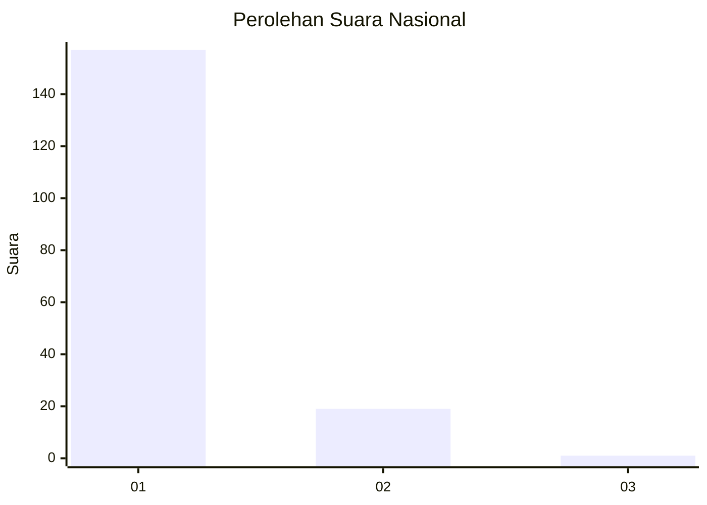
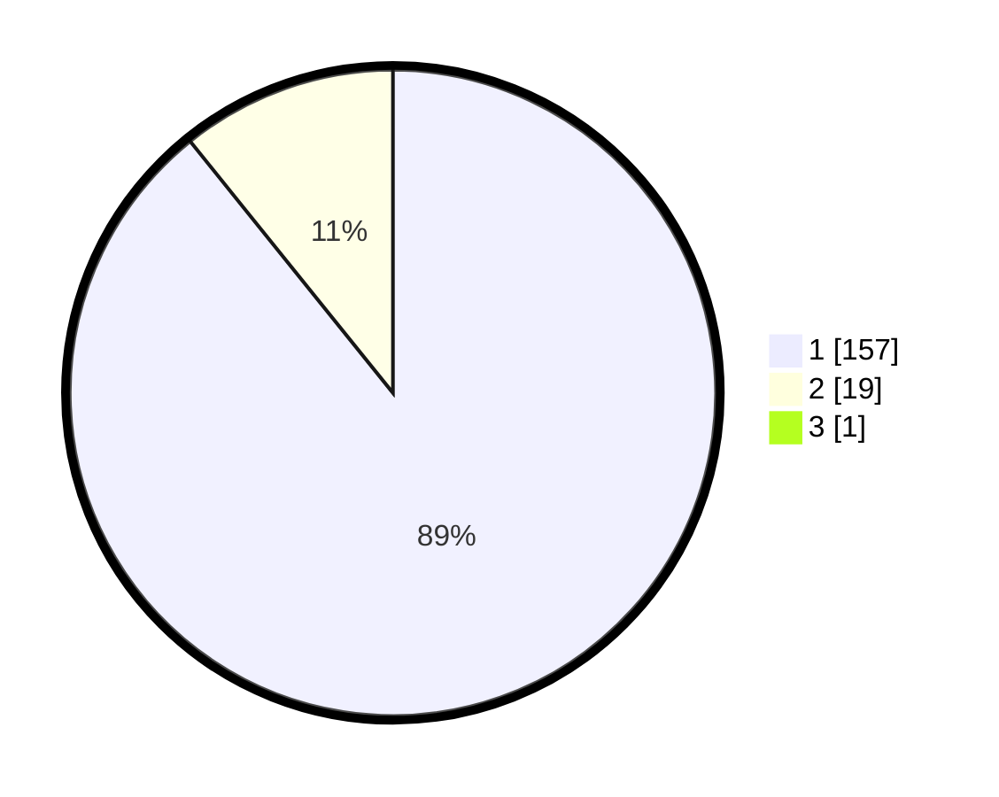

# Hasil

## Grafik

## Tabel

| No. | Nama Paslon    | Suara | Suara (raw) | Persentase |
|:--- |:-------------- | -----:| -----------:| ----------:|
| 1   | ANIES MUHAIMIN | 157   | [157][p-1]  | 88,70      |
| 2   | PRABOWO GIBRAN | 19    | [19][p-2]   | 10,73      |
| 3   | GANJAR MAHFUD  | 1     | [1][p-3]    | 0,56       |

[p-1]: https://github.com/gigit-pemilu/pemilu-2024/blob/main/pilpres/hitung-suara/sub/11-aceh/sub/07-pidie/sub/17-sakti/sub/2045-lingkok/sub/002-tps/sub/paslon-1.txt
[p-2]: https://github.com/gigit-pemilu/pemilu-2024/blob/main/pilpres/hitung-suara/sub/11-aceh/sub/07-pidie/sub/17-sakti/sub/2045-lingkok/sub/002-tps/sub/paslon-2.txt
[p-3]: https://github.com/gigit-pemilu/pemilu-2024/blob/main/pilpres/hitung-suara/sub/11-aceh/sub/07-pidie/sub/17-sakti/sub/2045-lingkok/sub/002-tps/sub/paslon-3.txt

## Foto C Plano

https://sirekap-obj-formc.kpu.go.id/7901/pemilu/ppwp/11/07/17/20/45/1107172045002-20240215-050256--fab52c8e-f12b-4c09-84a3-3ed0875cec20.jpg

https://sirekap-obj-formc.kpu.go.id/7901/pemilu/ppwp/11/07/17/20/45/1107172045002-20240215-050448--6e19aca2-477b-4ac5-a201-3d8738d7bb61.jpg

https://sirekap-obj-formc.kpu.go.id/7901/pemilu/ppwp/11/07/17/20/45/1107172045002-20240215-051134--1492ed2b-b582-46da-b4c5-fad3e7c95026.jpg

## Metadata

| Key        | Value               |
| ---------- | ------------------- |
| Time Stamp | 2024-02-24 22:31:28 |

