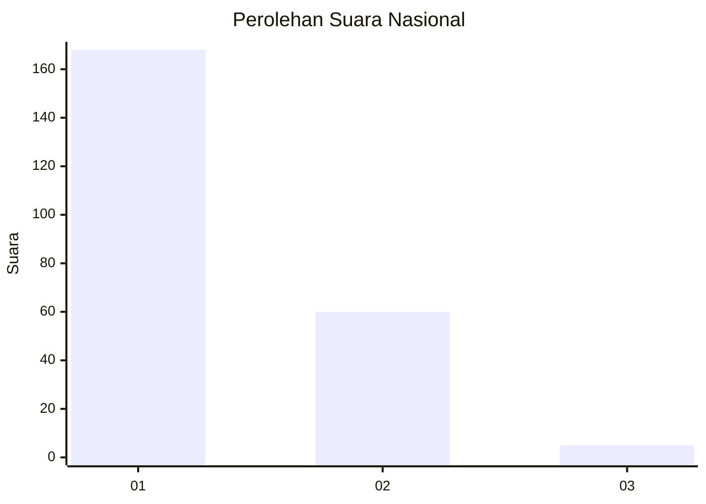
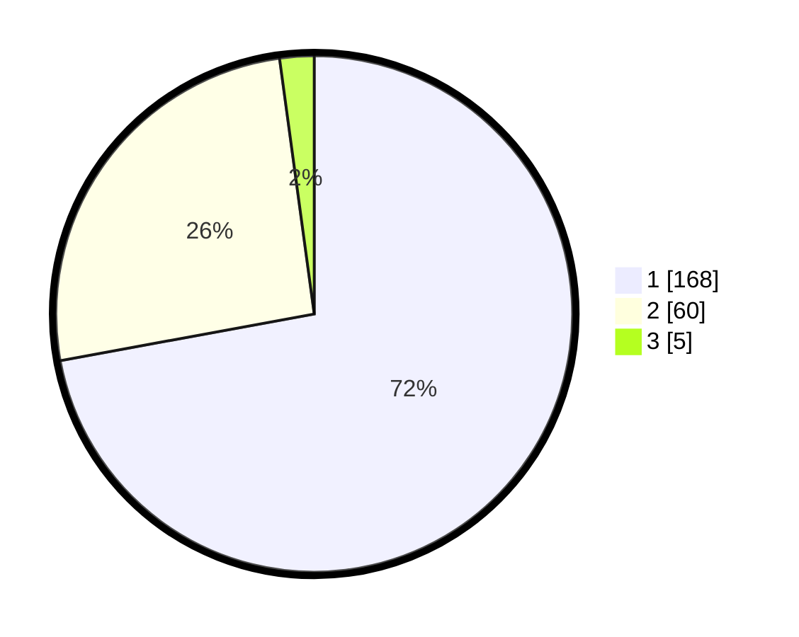

# Hasil

## Grafik

## Tabel

| No. | Nama Paslon    | Suara | Suara (raw) | Persentase |
|:--- |:-------------- | -----:| -----------:| ----------:|
| 1   | ANIES MUHAIMIN | 168   | [168][p-1]  | 72,10      |
| 2   | PRABOWO GIBRAN | 60    | [60][p-2]   | 25,75      |
| 3   | GANJAR MAHFUD  | 5     | [5][p-3]    | 2,15       |

[p-1]: https://github.com/gigit-pemilu/pemilu-2024/blob/main/pilpres/hitung-suara/sub/11-aceh/sub/07-pidie/sub/17-sakti/sub/2046-pasar-kota-bakti/sub/001-tps/sub/paslon-1.txt
[p-2]: https://github.com/gigit-pemilu/pemilu-2024/blob/main/pilpres/hitung-suara/sub/11-aceh/sub/07-pidie/sub/17-sakti/sub/2046-pasar-kota-bakti/sub/001-tps/sub/paslon-2.txt
[p-3]: https://github.com/gigit-pemilu/pemilu-2024/blob/main/pilpres/hitung-suara/sub/11-aceh/sub/07-pidie/sub/17-sakti/sub/2046-pasar-kota-bakti/sub/001-tps/sub/paslon-3.txt

## Foto C Plano

https://sirekap-obj-formc.kpu.go.id/6941/pemilu/ppwp/11/07/17/20/46/1107172046001-20240215-155223--6ba1e344-b2d2-4cae-8639-55ebe7a579f6.jpg

https://sirekap-obj-formc.kpu.go.id/6941/pemilu/ppwp/11/07/17/20/46/1107172046001-20240215-102502--fa93a8f9-c26a-4520-a78f-dc8390563ffd.jpg

https://sirekap-obj-formc.kpu.go.id/6941/pemilu/ppwp/11/07/17/20/46/1107172046001-20240215-102621--055361da-fbad-4f24-baaa-ed07d97ee2a3.jpg

## Metadata

| Key        | Value               |
| ---------- | ------------------- |
| Time Stamp | 2024-02-19 06:16:00 |

