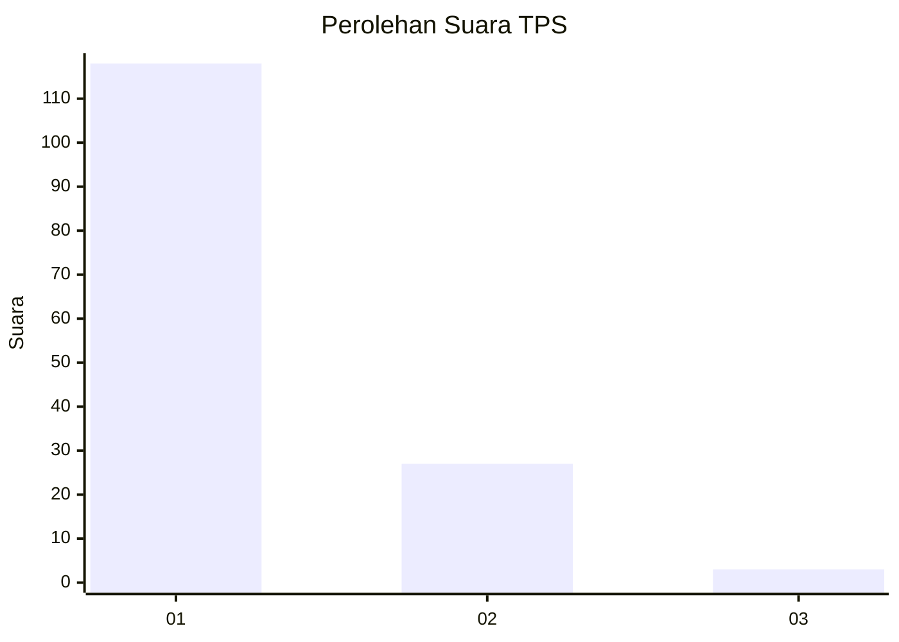
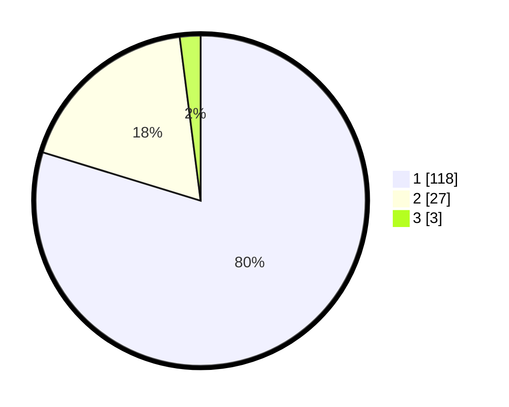

# Hasil

## Grafik

## Tabel

| No. | Nama Paslon    | Suara | Suara (raw) | Persentase |
|:--- |:-------------- | -----:| -----------:| ----------:|
| 1   | ANIES MUHAIMIN | 118   | [118][p-1]  | 79,73      |
| 2   | PRABOWO GIBRAN | 27    | [27][p-2]   | 18,24      |
| 3   | GANJAR MAHFUD  | 3     | [3][p-3]    | 2,03       |

[p-1]: https://github.com/gigit-pemilu/pemilu-2024-11-aceh/blob/main/pilpres/hitung-suara/sub/11-aceh/sub/07-pidie/sub/17-sakti/sub/2046-pasar-kota-bakti/sub/901-tps/sub/paslon-1.txt
[p-2]: https://github.com/gigit-pemilu/pemilu-2024-11-aceh/blob/main/pilpres/hitung-suara/sub/11-aceh/sub/07-pidie/sub/17-sakti/sub/2046-pasar-kota-bakti/sub/901-tps/sub/paslon-2.txt
[p-3]: https://github.com/gigit-pemilu/pemilu-2024-11-aceh/blob/main/pilpres/hitung-suara/sub/11-aceh/sub/07-pidie/sub/17-sakti/sub/2046-pasar-kota-bakti/sub/901-tps/sub/paslon-3.txt

## Foto C Plano

https://sirekap-obj-formc.kpu.go.id/6ef8/pemilu/ppwp/11/07/17/20/46/1107172046901-20240215-044035--034ab1b6-c73f-4a6a-bf2e-9e7c1b468bb7.jpg

https://sirekap-obj-formc.kpu.go.id/6ef8/pemilu/ppwp/11/07/17/20/46/1107172046901-20240215-044143--2928bb54-f9a2-4f2d-a2dd-f7213fe5c61a.jpg

https://sirekap-obj-formc.kpu.go.id/6ef8/pemilu/ppwp/11/07/17/20/46/1107172046901-20240215-044326--de38cb6b-f3ad-4e94-8fbf-ae1b9316bfbb.jpg

## Metadata

| Key        | Value               |
| ---------- | ------------------- |
| Time Stamp | 2024-02-15 20:00:44 |

## DATA PEMILIH TETAP

Jumlah pemilih dalam DPT: **88**.
 * L: **88**.
 * P: **0**.

## DATA PENGGUNA HAK PILIH

Jumlah pengguna hak pilih dalam DPT: **44**.
 * L: **44**.
 * P: **0**.

Jumlah pengguna hak pilih dalam DPTb: **108**.
 * L: **107**.
 * P: **1**.

Jumlah pengguna hak pilih dalam DPK: **0**.
 * L: **0**.
 * P: **0**.

Jumlah pengguna hak pilih: **152**.
 * L: **151**.
 * P: **1**.

## JUMLAH SUARA SAH DAN TIDAK SAH

JUMLAH SELURUH SUARA SAH: **148**.

JUMLAH SUARA TIDAK SAH: **4**.

JUMLAH SELURUH SUARA SAH DAN SUARA TIDAK SAH: **152**.

