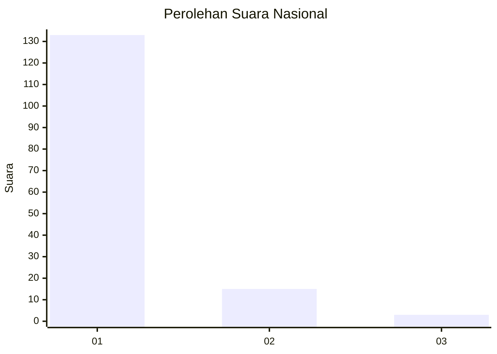
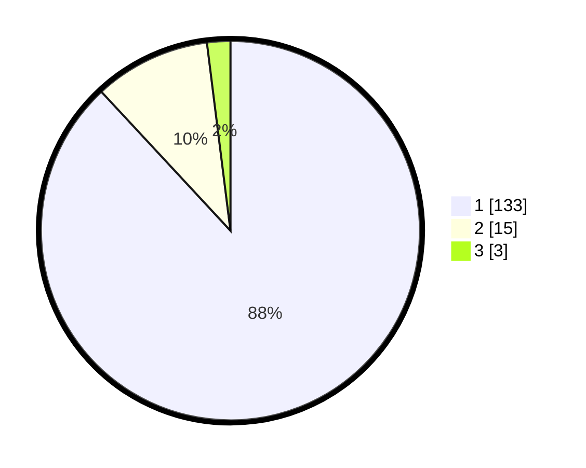

# Hasil

## Grafik

## Tabel

| No. | Nama Paslon    | Suara | Suara (raw) | Persentase |
|:--- |:-------------- | -----:| -----------:| ----------:|
| 1   | ANIES MUHAIMIN | 133   | [133][p-1]  | 88,08      |
| 2   | PRABOWO GIBRAN | 15    | [15][p-2]   | 9,93       |
| 3   | GANJAR MAHFUD  | 3     | [3][p-3]    | 1,99       |

[p-1]: https://github.com/gigit-pemilu/pemilu-2024/blob/main/pilpres/hitung-suara/sub/11-aceh/sub/07-pidie/sub/17-sakti/sub/2048-perlak-asan/sub/002-tps/sub/paslon-1.txt
[p-2]: https://github.com/gigit-pemilu/pemilu-2024/blob/main/pilpres/hitung-suara/sub/11-aceh/sub/07-pidie/sub/17-sakti/sub/2048-perlak-asan/sub/002-tps/sub/paslon-2.txt
[p-3]: https://github.com/gigit-pemilu/pemilu-2024/blob/main/pilpres/hitung-suara/sub/11-aceh/sub/07-pidie/sub/17-sakti/sub/2048-perlak-asan/sub/002-tps/sub/paslon-3.txt

## Foto C Plano

https://sirekap-obj-formc.kpu.go.id/e9a8/pemilu/ppwp/11/07/17/20/48/1107172048002-20240215-084111--a229a0d5-9f73-41a2-9b3f-b8b075cb1dc4.jpg

https://sirekap-obj-formc.kpu.go.id/e9a8/pemilu/ppwp/11/07/17/20/48/1107172048002-20240215-084225--bb5e108f-bcc9-4ddf-b1e8-6978e21921a1.jpg

https://sirekap-obj-formc.kpu.go.id/e9a8/pemilu/ppwp/11/07/17/20/48/1107172048002-20240215-084338--e059c28c-5119-42ba-b55b-a992bbcd376f.jpg

## Metadata

| Key        | Value               |
| ---------- | ------------------- |
| Time Stamp | 2024-02-24 22:31:28 |

