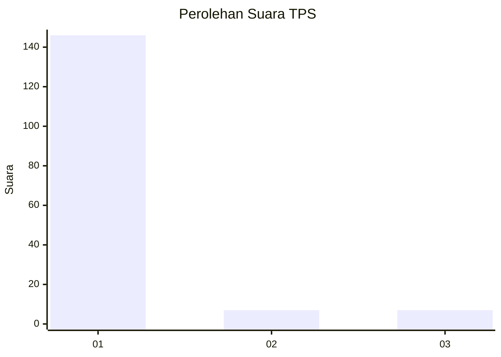
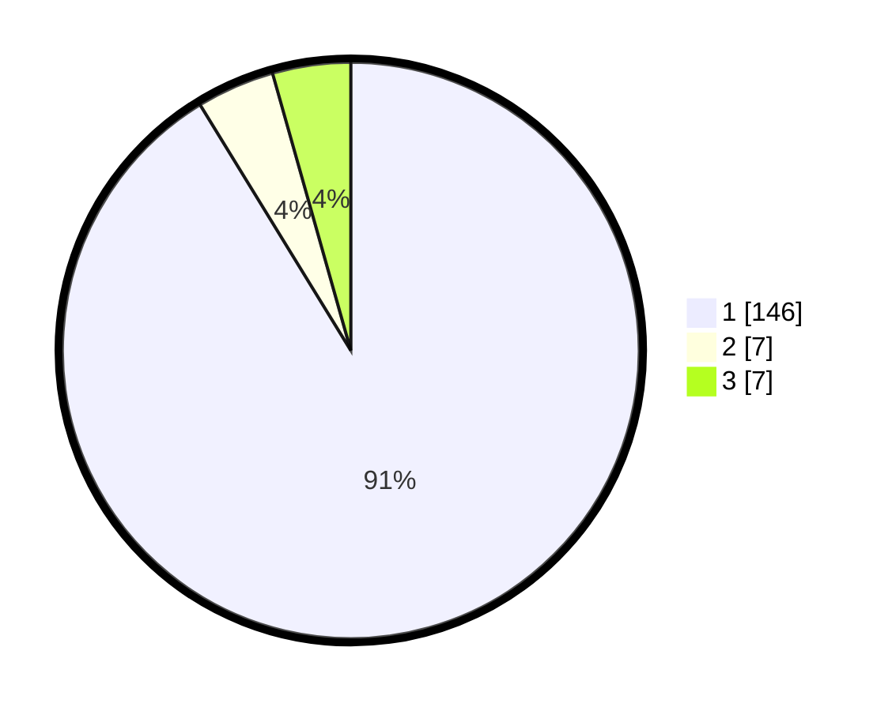

# Hasil

## Grafik

## Tabel

| No. | Nama Paslon    | Suara | Suara (raw) | Persentase |
|:--- |:-------------- | -----:| -----------:| ----------:|
| 1   | ANIES MUHAIMIN | 146   | [146][p-1]  | 91,25      |
| 2   | PRABOWO GIBRAN | 7     | [7][p-2]    | 4,38       |
| 3   | GANJAR MAHFUD  | 7     | [7][p-3]    | 4,38       |

[p-1]: https://github.com/gigit-pemilu/pemilu-2024-11-aceh/blob/main/pilpres/hitung-suara/sub/11-aceh/sub/07-pidie/sub/18-simpang-tiga/sub/2003-liliep/sub/001-tps/sub/paslon-1.txt
[p-2]: https://github.com/gigit-pemilu/pemilu-2024-11-aceh/blob/main/pilpres/hitung-suara/sub/11-aceh/sub/07-pidie/sub/18-simpang-tiga/sub/2003-liliep/sub/001-tps/sub/paslon-2.txt
[p-3]: https://github.com/gigit-pemilu/pemilu-2024-11-aceh/blob/main/pilpres/hitung-suara/sub/11-aceh/sub/07-pidie/sub/18-simpang-tiga/sub/2003-liliep/sub/001-tps/sub/paslon-3.txt

## Foto C Plano

https://sirekap-obj-formc.kpu.go.id/353a/pemilu/ppwp/11/07/18/20/03/1107182003001-20240214-224241--90d41f3d-b1f2-4570-bf12-42d007617874.jpg

https://sirekap-obj-formc.kpu.go.id/353a/pemilu/ppwp/11/07/18/20/03/1107182003001-20240214-225414--41dbfc3d-db88-4171-a561-472bd9fc0502.jpg

https://sirekap-obj-formc.kpu.go.id/353a/pemilu/ppwp/11/07/18/20/03/1107182003001-20240214-224519--a3920756-2341-4de1-ac24-12b3c9a86dac.jpg

## Metadata

| Key        | Value               |
| ---------- | ------------------- |
| Time Stamp | 2024-02-19 06:16:00 |

