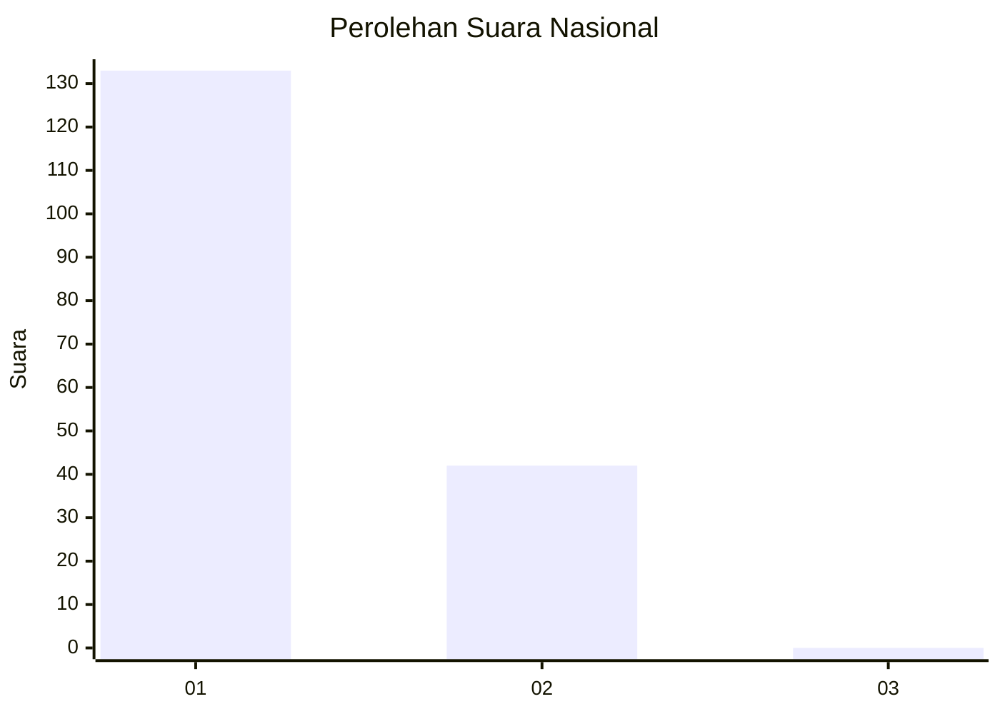
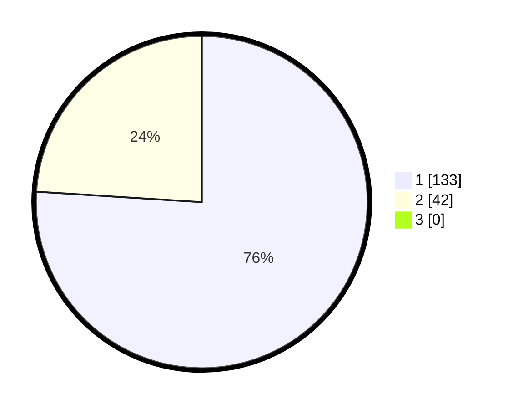

# Hasil

## Grafik

## Tabel

| No. | Nama Paslon    | Suara | Suara (raw) | Persentase |
|:--- |:-------------- | -----:| -----------:| ----------:|
| 1   | ANIES MUHAIMIN | 133   | [133][p-1]  | 76,00      |
| 2   | PRABOWO GIBRAN | 42    | [42][p-2]   | 24,00      |
| 3   | GANJAR MAHFUD  | 0     | [0][p-3]    | 0,00       |

[p-1]: https://github.com/gigit-pemilu/pemilu-2024/blob/main/pilpres/hitung-suara/sub/11-aceh/sub/07-pidie/sub/18-simpang-tiga/sub/2015-nien/sub/001-tps/sub/paslon-1.txt
[p-2]: https://github.com/gigit-pemilu/pemilu-2024/blob/main/pilpres/hitung-suara/sub/11-aceh/sub/07-pidie/sub/18-simpang-tiga/sub/2015-nien/sub/001-tps/sub/paslon-2.txt
[p-3]: https://github.com/gigit-pemilu/pemilu-2024/blob/main/pilpres/hitung-suara/sub/11-aceh/sub/07-pidie/sub/18-simpang-tiga/sub/2015-nien/sub/001-tps/sub/paslon-3.txt

## Foto C Plano

https://sirekap-obj-formc.kpu.go.id/91d5/pemilu/ppwp/11/07/18/20/15/1107182015001-20240215-064219--4116abd6-2e79-4fef-883b-b4223511e8bd.jpg

https://sirekap-obj-formc.kpu.go.id/91d5/pemilu/ppwp/11/07/18/20/15/1107182015001-20240215-073515--51e3cd37-4e20-4be7-8c12-b67c1298a653.jpg

## Metadata

| Key        | Value               |
| ---------- | ------------------- |
| Time Stamp | 2024-02-24 22:31:28 |

