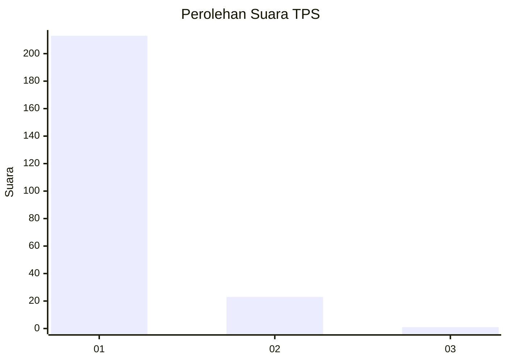
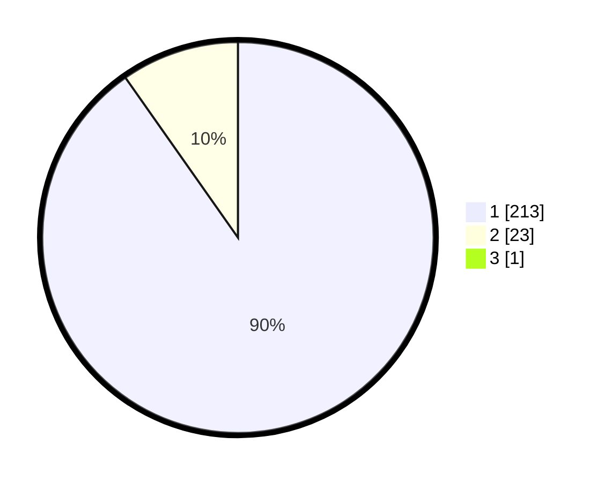

# Hasil

## Grafik

## Tabel

| No. | Nama Paslon    | Suara | Suara (raw) | Persentase |
|:--- |:-------------- | -----:| -----------:| ----------:|
| 1   | ANIES MUHAIMIN | 213   | [213][p-1]  | 89,87      |
| 2   | PRABOWO GIBRAN | 23    | [23][p-2]   | 9,70       |
| 3   | GANJAR MAHFUD  | 1     | [1][p-3]    | 0,42       |

[p-1]: https://github.com/gigit-pemilu/pemilu-2024-11-aceh/blob/main/pilpres/hitung-suara/sub/11-aceh/sub/07-pidie/sub/18-simpang-tiga/sub/2024-mamplam/sub/001-tps/sub/paslon-1.txt
[p-2]: https://github.com/gigit-pemilu/pemilu-2024-11-aceh/blob/main/pilpres/hitung-suara/sub/11-aceh/sub/07-pidie/sub/18-simpang-tiga/sub/2024-mamplam/sub/001-tps/sub/paslon-2.txt
[p-3]: https://github.com/gigit-pemilu/pemilu-2024-11-aceh/blob/main/pilpres/hitung-suara/sub/11-aceh/sub/07-pidie/sub/18-simpang-tiga/sub/2024-mamplam/sub/001-tps/sub/paslon-3.txt

## Foto C Plano

https://sirekap-obj-formc.kpu.go.id/59dc/pemilu/ppwp/11/07/18/20/24/1107182024001-20240214-204814--278695cc-80a0-488e-8978-1d871c4329cd.jpg

https://sirekap-obj-formc.kpu.go.id/59dc/pemilu/ppwp/11/07/18/20/24/1107182024001-20240214-205314--a14f426a-29fe-437b-a5c2-b3ab097d46a5.jpg

https://sirekap-obj-formc.kpu.go.id/59dc/pemilu/ppwp/11/07/18/20/24/1107182024001-20240214-205630--5be01765-dbff-449c-9aad-39a9d0991d95.jpg

## Metadata

| Key        | Value               |
| ---------- | ------------------- |
| Time Stamp | 2024-02-24 22:31:28 |

