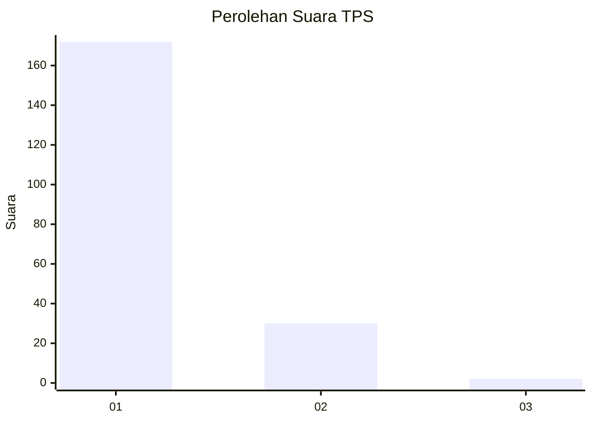
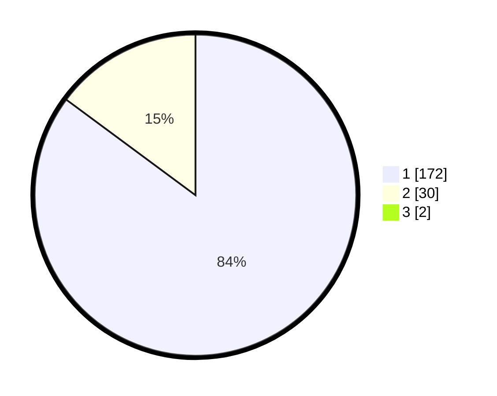

# Hasil

## Grafik

## Tabel

| No. | Nama Paslon    | Suara | Suara (raw) | Persentase |
|:--- |:-------------- | -----:| -----------:| ----------:|
| 1   | ANIES MUHAIMIN | 172   | [172][p-1]  | 84,31      |
| 2   | PRABOWO GIBRAN | 30    | [30][p-2]   | 14,71      |
| 3   | GANJAR MAHFUD  | 2     | [2][p-3]    | 0,98       |

[p-1]: https://github.com/gigit-pemilu/pemilu-2024-11-aceh/blob/main/pilpres/hitung-suara/sub/11-aceh/sub/07-pidie/sub/18-simpang-tiga/sub/2026-pante/sub/002-tps/sub/paslon-1.txt
[p-2]: https://github.com/gigit-pemilu/pemilu-2024-11-aceh/blob/main/pilpres/hitung-suara/sub/11-aceh/sub/07-pidie/sub/18-simpang-tiga/sub/2026-pante/sub/002-tps/sub/paslon-2.txt
[p-3]: https://github.com/gigit-pemilu/pemilu-2024-11-aceh/blob/main/pilpres/hitung-suara/sub/11-aceh/sub/07-pidie/sub/18-simpang-tiga/sub/2026-pante/sub/002-tps/sub/paslon-3.txt

## Foto C Plano

https://sirekap-obj-formc.kpu.go.id/7baa/pemilu/ppwp/11/07/18/20/26/1107182026002-20240214-155707--f5812e14-2db5-48e6-8e80-2b28e9ffbc8f.jpg

https://sirekap-obj-formc.kpu.go.id/7baa/pemilu/ppwp/11/07/18/20/26/1107182026002-20240214-155803--66987a18-f058-4609-adc7-90fbc6858d8c.jpg

https://sirekap-obj-formc.kpu.go.id/7baa/pemilu/ppwp/11/07/18/20/26/1107182026002-20240214-155857--43f5a690-c9ab-45b1-9a39-4e13cadca082.jpg

## Metadata

| Key        | Value               |
| ---------- | ------------------- |
| Time Stamp | 2024-02-24 22:31:28 |

