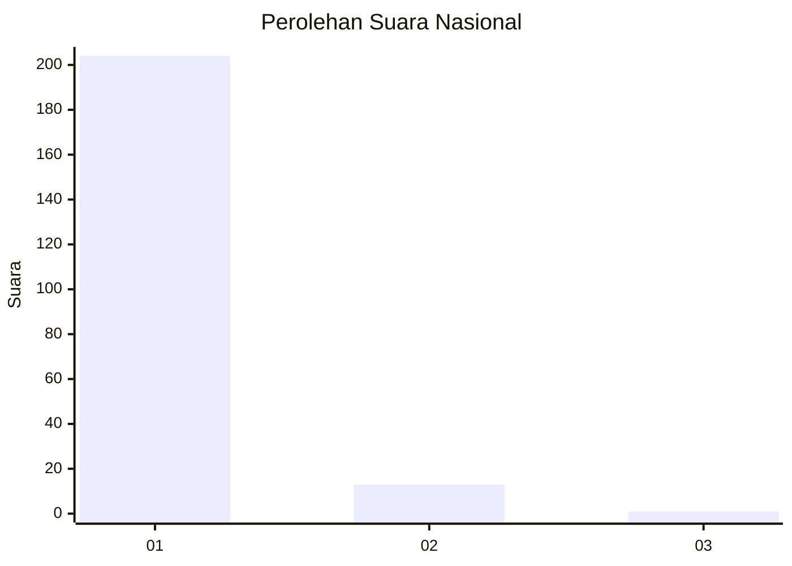
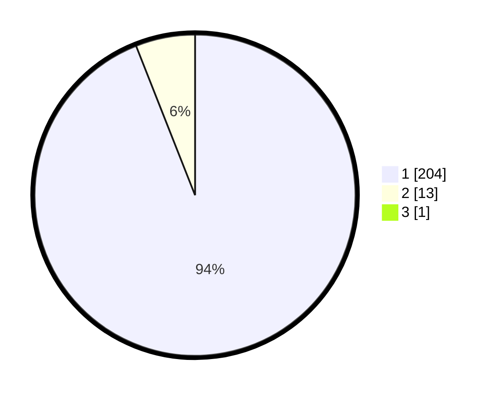

# Hasil

## Grafik

## Tabel

| No. | Nama Paslon    | Suara | Suara (raw) | Persentase |
|:--- |:-------------- | -----:| -----------:| ----------:|
| 1   | ANIES MUHAIMIN | 204   | [204][p-1]  | 93,58      |
| 2   | PRABOWO GIBRAN | 13    | [13][p-2]   | 5,96       |
| 3   | GANJAR MAHFUD  | 1     | [1][p-3]    | 0,46       |

[p-1]: https://github.com/gigit-pemilu/pemilu-2024/blob/main/pilpres/hitung-suara/sub/11-aceh/sub/07-pidie/sub/18-simpang-tiga/sub/2030-dayah-lampoh-awe/sub/001-tps/sub/paslon-1.txt
[p-2]: https://github.com/gigit-pemilu/pemilu-2024/blob/main/pilpres/hitung-suara/sub/11-aceh/sub/07-pidie/sub/18-simpang-tiga/sub/2030-dayah-lampoh-awe/sub/001-tps/sub/paslon-2.txt
[p-3]: https://github.com/gigit-pemilu/pemilu-2024/blob/main/pilpres/hitung-suara/sub/11-aceh/sub/07-pidie/sub/18-simpang-tiga/sub/2030-dayah-lampoh-awe/sub/001-tps/sub/paslon-3.txt

## Foto C Plano

https://sirekap-obj-formc.kpu.go.id/1dba/pemilu/ppwp/11/07/18/20/30/1107182030001-20240215-045752--aa23fddc-b5b3-4676-acac-b798a299a6ca.jpg

https://sirekap-obj-formc.kpu.go.id/1dba/pemilu/ppwp/11/07/18/20/30/1107182030001-20240215-045830--fa0d12f0-fd00-46d2-b221-10b79939bca5.jpg

https://sirekap-obj-formc.kpu.go.id/1dba/pemilu/ppwp/11/07/18/20/30/1107182030001-20240215-045942--68fad3e5-6a93-429a-8fed-1f9a0f2d2073.jpg

## Metadata

| Key        | Value               |
| ---------- | ------------------- |
| Time Stamp | 2024-02-19 06:16:00 |

