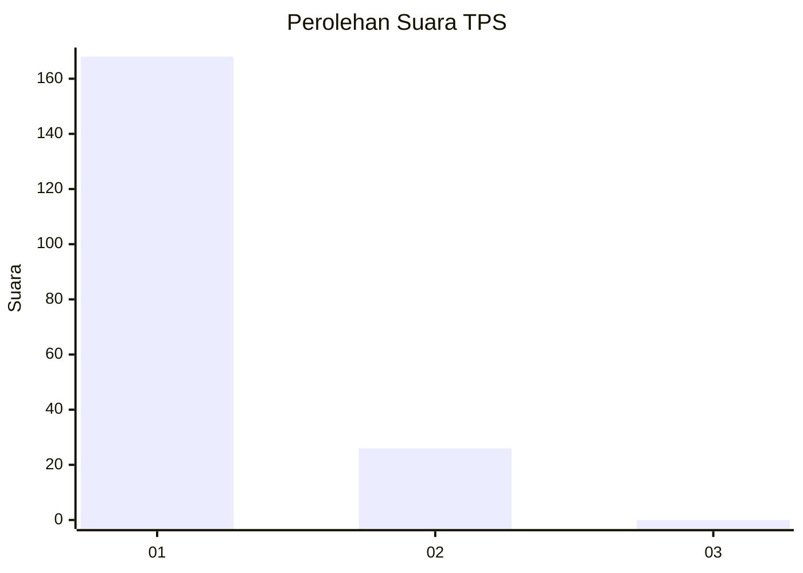
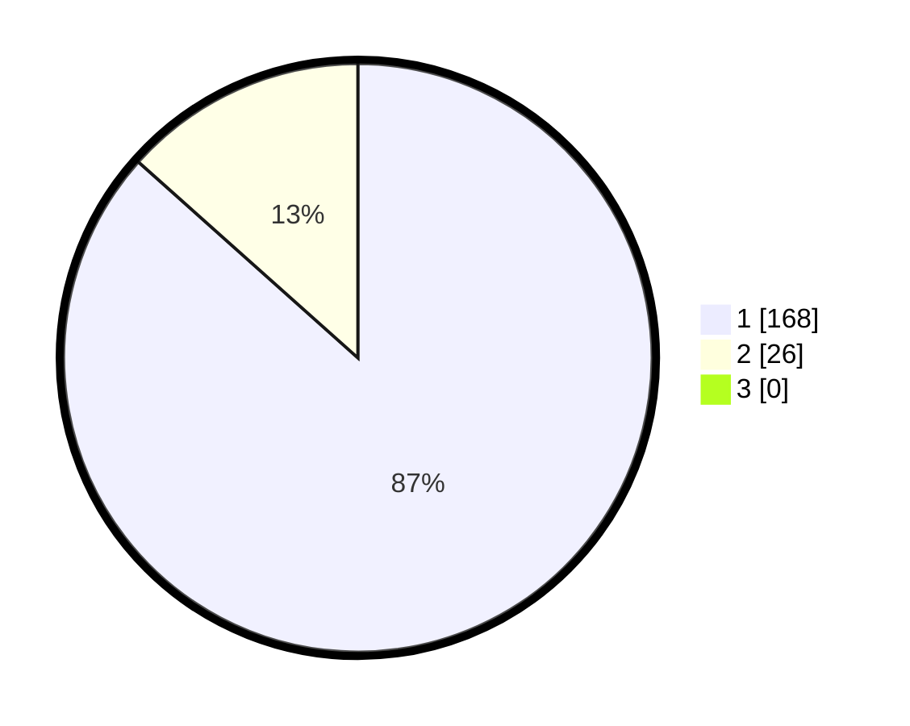

# Hasil

## Grafik

## Tabel

| No. | Nama Paslon    | Suara | Suara (raw) | Persentase |
|:--- |:-------------- | -----:| -----------:| ----------:|
| 1   | ANIES MUHAIMIN | 168   | [168][p-1]  | 86,60      |
| 2   | PRABOWO GIBRAN | 26    | [26][p-2]   | 13,40      |
| 3   | GANJAR MAHFUD  | 0     | [0][p-3]    | 0,00       |

[p-1]: https://github.com/gigit-pemilu/pemilu-2024-11-aceh/blob/main/pilpres/hitung-suara/sub/11-aceh/sub/07-pidie/sub/18-simpang-tiga/sub/2031-meunasah-blang/sub/001-tps/sub/paslon-1.txt
[p-2]: https://github.com/gigit-pemilu/pemilu-2024-11-aceh/blob/main/pilpres/hitung-suara/sub/11-aceh/sub/07-pidie/sub/18-simpang-tiga/sub/2031-meunasah-blang/sub/001-tps/sub/paslon-2.txt
[p-3]: https://github.com/gigit-pemilu/pemilu-2024-11-aceh/blob/main/pilpres/hitung-suara/sub/11-aceh/sub/07-pidie/sub/18-simpang-tiga/sub/2031-meunasah-blang/sub/001-tps/sub/paslon-3.txt

## Foto C Plano

https://sirekap-obj-formc.kpu.go.id/af42/pemilu/ppwp/11/07/18/20/31/1107182031001-20240216-110152--737b019e-1567-45c3-afc4-25ff233123f9.jpg

https://sirekap-obj-formc.kpu.go.id/af42/pemilu/ppwp/11/07/18/20/31/1107182031001-20240215-025907--03600441-a16b-4fdf-8de4-0f73afc65752.jpg

https://sirekap-obj-formc.kpu.go.id/af42/pemilu/ppwp/11/07/18/20/31/1107182031001-20240215-030134--74ac2d35-0f16-46ac-9864-64366d8c6acc.jpg

## Metadata

| Key        | Value               |
| ---------- | ------------------- |
| Time Stamp | 2024-02-24 22:31:28 |

