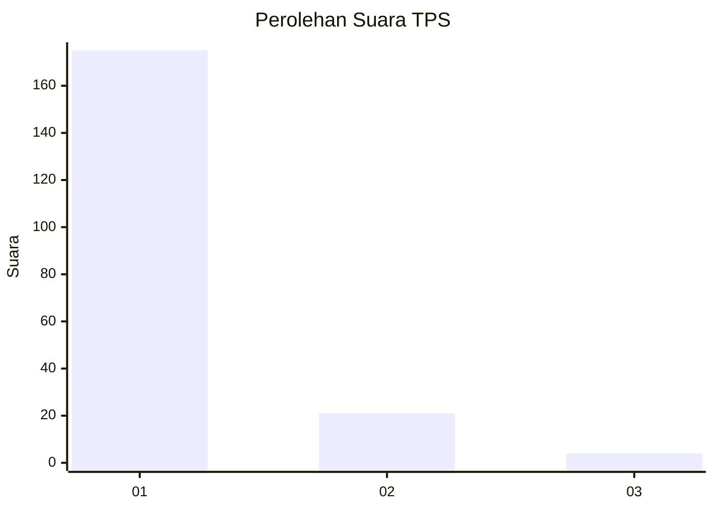
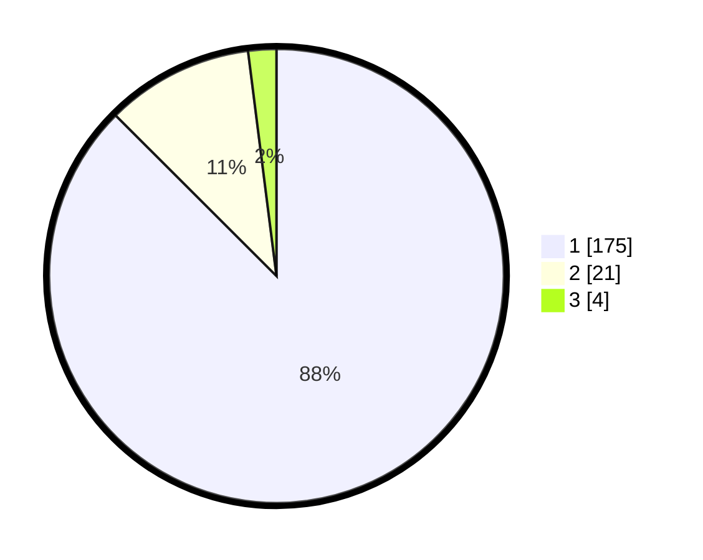

# Hasil

## Grafik

## Tabel

| No. | Nama Paslon    | Suara | Suara (raw) | Persentase |
|:--- |:-------------- | -----:| -----------:| ----------:|
| 1   | ANIES MUHAIMIN | 175   | [175][p-1]  | 87,50      |
| 2   | PRABOWO GIBRAN | 21    | [21][p-2]   | 10,50      |
| 3   | GANJAR MAHFUD  | 4     | [4][p-3]    | 2,00       |

[p-1]: https://github.com/gigit-pemilu/pemilu-2024-11-aceh/blob/main/pilpres/hitung-suara/sub/11-aceh/sub/07-pidie/sub/18-simpang-tiga/sub/2038-cot-ara/sub/001-tps/sub/paslon-1.txt
[p-2]: https://github.com/gigit-pemilu/pemilu-2024-11-aceh/blob/main/pilpres/hitung-suara/sub/11-aceh/sub/07-pidie/sub/18-simpang-tiga/sub/2038-cot-ara/sub/001-tps/sub/paslon-2.txt
[p-3]: https://github.com/gigit-pemilu/pemilu-2024-11-aceh/blob/main/pilpres/hitung-suara/sub/11-aceh/sub/07-pidie/sub/18-simpang-tiga/sub/2038-cot-ara/sub/001-tps/sub/paslon-3.txt

## Foto C Plano

https://sirekap-obj-formc.kpu.go.id/23bd/pemilu/ppwp/11/07/18/20/38/1107182038001-20240214-225033--67fbfb5a-321b-4b88-8b50-36044d6ffbfa.jpg

https://sirekap-obj-formc.kpu.go.id/23bd/pemilu/ppwp/11/07/18/20/38/1107182038001-20240215-075552--6c942754-c66c-4867-b380-e45e1fb2a1fe.jpg

https://sirekap-obj-formc.kpu.go.id/23bd/pemilu/ppwp/11/07/18/20/38/1107182038001-20240214-225248--a86074fa-3565-4cb2-83a0-a1d2c70dad6b.jpg

## Metadata

| Key        | Value               |
| ---------- | ------------------- |
| Time Stamp | 2024-02-15 21:30:27 |

