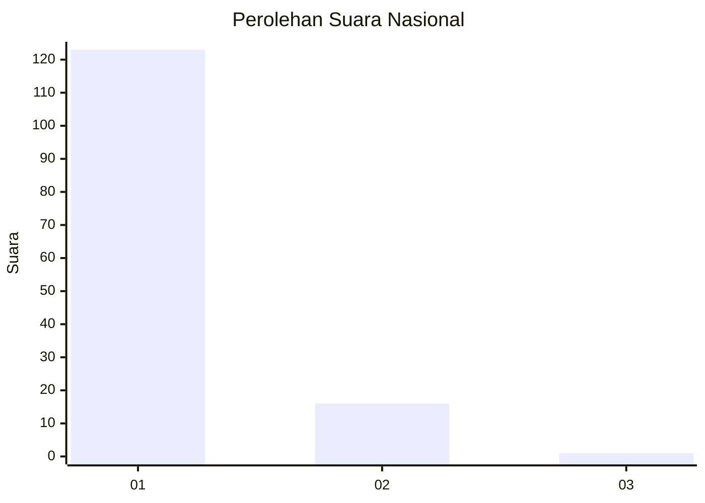
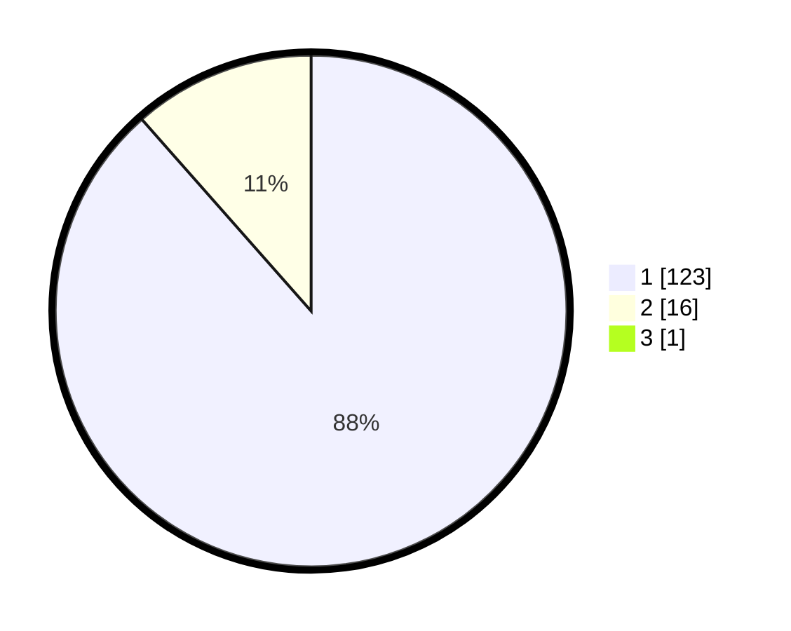

# Hasil

## Grafik

## Tabel

| No. | Nama Paslon    | Suara | Suara (raw) | Persentase |
|:--- |:-------------- | -----:| -----------:| ----------:|
| 1   | ANIES MUHAIMIN | 123   | [123][p-1]  | 87,86      |
| 2   | PRABOWO GIBRAN | 16    | [16][p-2]   | 11,43      |
| 3   | GANJAR MAHFUD  | 1     | [1][p-3]    | 0,71       |

[p-1]: https://github.com/gigit-pemilu/pemilu-2024/blob/main/pilpres/hitung-suara/sub/11-aceh/sub/07-pidie/sub/18-simpang-tiga/sub/2042-madika/sub/002-tps/sub/paslon-1.txt
[p-2]: https://github.com/gigit-pemilu/pemilu-2024/blob/main/pilpres/hitung-suara/sub/11-aceh/sub/07-pidie/sub/18-simpang-tiga/sub/2042-madika/sub/002-tps/sub/paslon-2.txt
[p-3]: https://github.com/gigit-pemilu/pemilu-2024/blob/main/pilpres/hitung-suara/sub/11-aceh/sub/07-pidie/sub/18-simpang-tiga/sub/2042-madika/sub/002-tps/sub/paslon-3.txt

## Foto C Plano

https://sirekap-obj-formc.kpu.go.id/ed8a/pemilu/ppwp/11/07/18/20/42/1107182042002-20240215-024523--851209c6-ca37-418d-a7eb-07355151d7fe.jpg

https://sirekap-obj-formc.kpu.go.id/ed8a/pemilu/ppwp/11/07/18/20/42/1107182042002-20240215-024617--2949d694-b531-49ce-bf66-8a0ff3fdc4db.jpg

https://sirekap-obj-formc.kpu.go.id/ed8a/pemilu/ppwp/11/07/18/20/42/1107182042002-20240215-024726--86afabc1-6594-48e6-b53f-be2a5e80d562.jpg

## Metadata

| Key        | Value               |
| ---------- | ------------------- |
| Time Stamp | 2024-02-19 06:16:00 |

