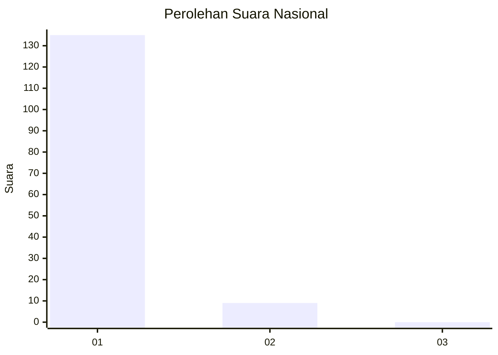
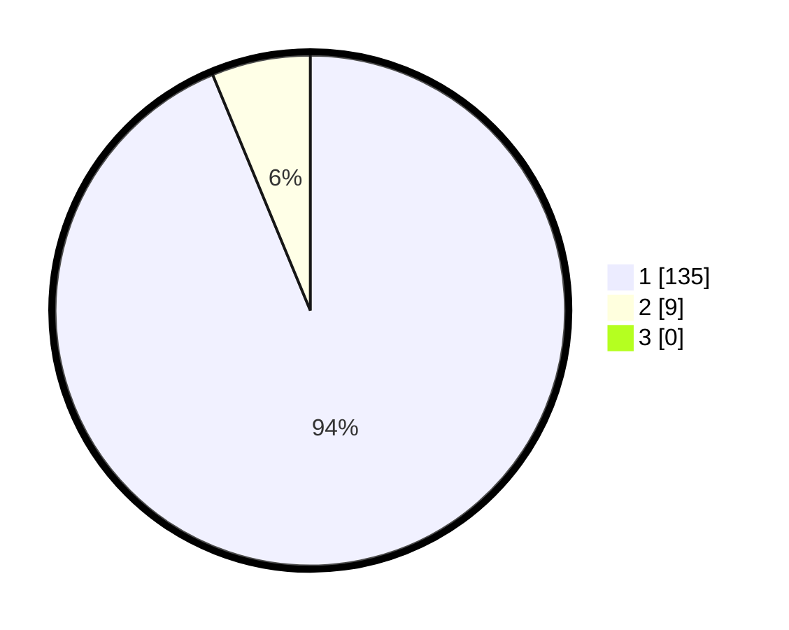

# Hasil

## Grafik

## Tabel

| No. | Nama Paslon    | Suara | Suara (raw) | Persentase |
|:--- |:-------------- | -----:| -----------:| ----------:|
| 1   | ANIES MUHAIMIN | 135   | [135][p-1]  | 93,75      |
| 2   | PRABOWO GIBRAN | 9     | [9][p-2]    | 6,25       |
| 3   | GANJAR MAHFUD  | 0     | [0][p-3]    | 0,00       |

[p-1]: https://github.com/gigit-pemilu/pemilu-2024/blob/main/pilpres/hitung-suara/sub/11-aceh/sub/07-pidie/sub/18-simpang-tiga/sub/2052-ulee-barat/sub/001-tps/sub/paslon-1.txt
[p-2]: https://github.com/gigit-pemilu/pemilu-2024/blob/main/pilpres/hitung-suara/sub/11-aceh/sub/07-pidie/sub/18-simpang-tiga/sub/2052-ulee-barat/sub/001-tps/sub/paslon-2.txt
[p-3]: https://github.com/gigit-pemilu/pemilu-2024/blob/main/pilpres/hitung-suara/sub/11-aceh/sub/07-pidie/sub/18-simpang-tiga/sub/2052-ulee-barat/sub/001-tps/sub/paslon-3.txt

## Foto C Plano

https://sirekap-obj-formc.kpu.go.id/c8d7/pemilu/ppwp/11/07/18/20/52/1107182052001-20240215-120827--4cf7f16e-5f22-4a0c-a977-6009033266dc.jpg

https://sirekap-obj-formc.kpu.go.id/c8d7/pemilu/ppwp/11/07/18/20/52/1107182052001-20240215-121046--25e0df74-5d5e-4882-888b-61f206f593d5.jpg

https://sirekap-obj-formc.kpu.go.id/c8d7/pemilu/ppwp/11/07/18/20/52/1107182052001-20240215-121342--36c26b5d-e7de-46b9-b757-84f04b82160b.jpg

## Metadata

| Key        | Value               |
| ---------- | ------------------- |
| Time Stamp | 2024-02-19 06:16:00 |

