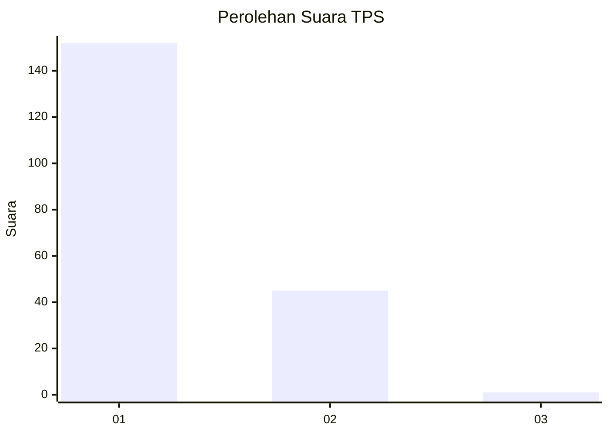
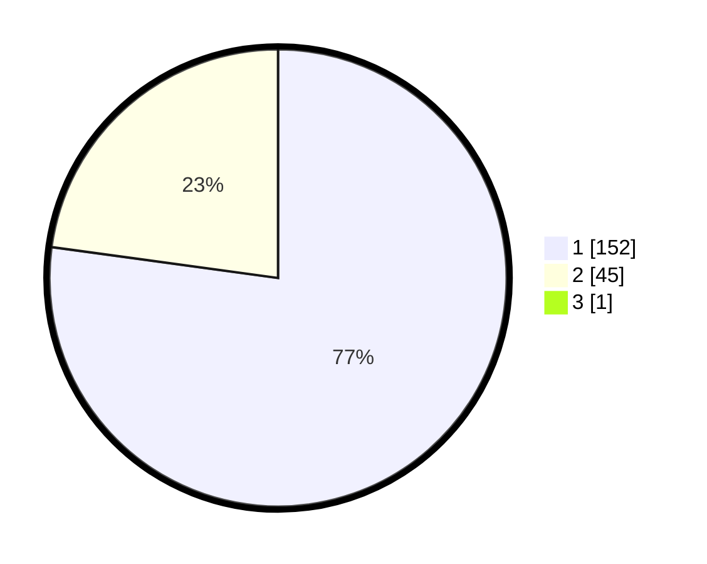

# Hasil

## Grafik

## Tabel

| No. | Nama Paslon    | Suara | Suara (raw) | Persentase |
|:--- |:-------------- | -----:| -----------:| ----------:|
| 1   | ANIES MUHAIMIN | 152   | [152][p-1]  | 76,77      |
| 2   | PRABOWO GIBRAN | 45    | [45][p-2]   | 22,73      |
| 3   | GANJAR MAHFUD  | 1     | [1][p-3]    | 0,51       |

[p-1]: https://github.com/gigit-pemilu/pemilu-2024-11-aceh/blob/main/pilpres/hitung-suara/sub/11-aceh/sub/07-pidie/sub/19-tangse/sub/2001-keude-tangse/sub/001-tps/sub/paslon-1.txt
[p-2]: https://github.com/gigit-pemilu/pemilu-2024-11-aceh/blob/main/pilpres/hitung-suara/sub/11-aceh/sub/07-pidie/sub/19-tangse/sub/2001-keude-tangse/sub/001-tps/sub/paslon-2.txt
[p-3]: https://github.com/gigit-pemilu/pemilu-2024-11-aceh/blob/main/pilpres/hitung-suara/sub/11-aceh/sub/07-pidie/sub/19-tangse/sub/2001-keude-tangse/sub/001-tps/sub/paslon-3.txt

## Foto C Plano

https://sirekap-obj-formc.kpu.go.id/e9c1/pemilu/ppwp/11/07/19/20/01/1107192001001-20240215-125833--5ae3d316-cfb3-4a0b-b855-3f5998c6bf74.jpg

https://sirekap-obj-formc.kpu.go.id/e9c1/pemilu/ppwp/11/07/19/20/01/1107192001001-20240215-130031--bda0af70-cc75-429b-a4a1-4e06dc39cee1.jpg

https://sirekap-obj-formc.kpu.go.id/e9c1/pemilu/ppwp/11/07/19/20/01/1107192001001-20240215-130210--d37fbe70-3b0d-4ff2-a397-c9a382e102ce.jpg

## Metadata

| Key        | Value               |
| ---------- | ------------------- |
| Time Stamp | 2024-02-19 06:16:00 |

