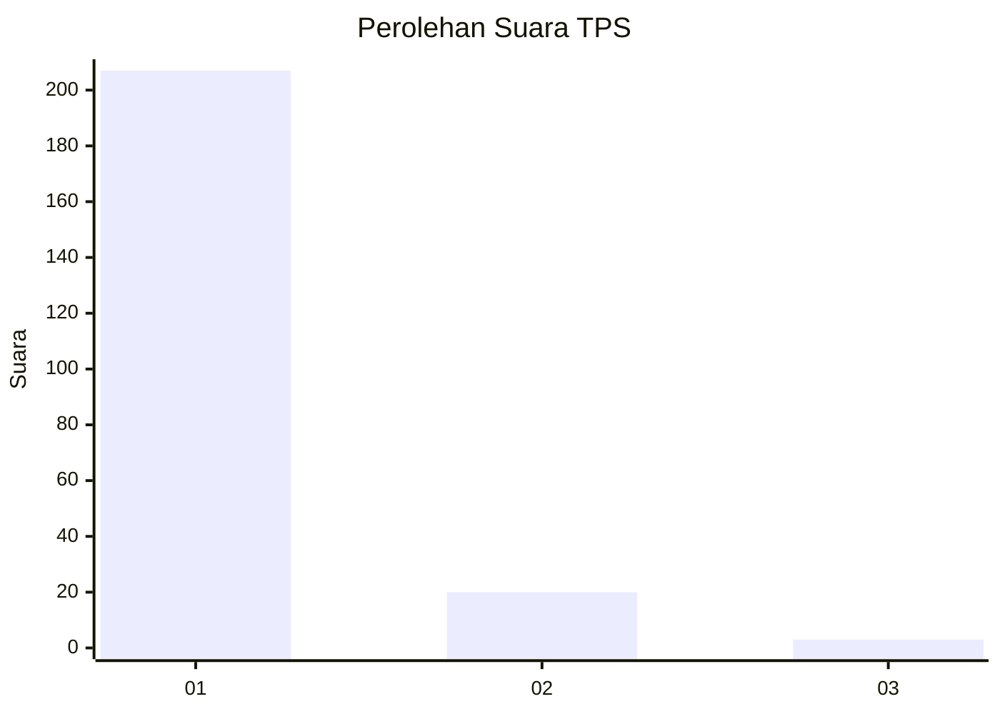
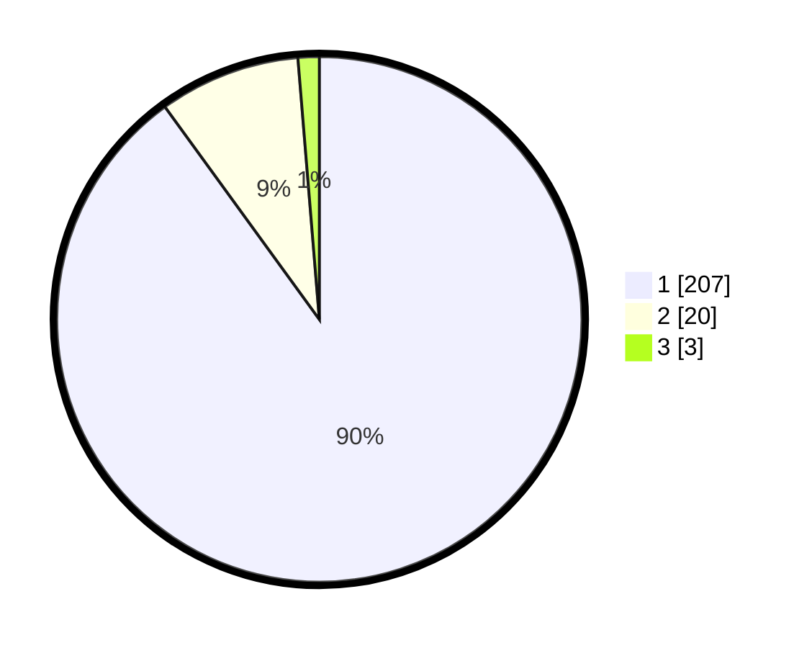

# Hasil

## Grafik

## Tabel

| No. | Nama Paslon    | Suara | Suara (raw) | Persentase |
|:--- |:-------------- | -----:| -----------:| ----------:|
| 1   | ANIES MUHAIMIN | 207   | [207][p-1]  | 90,00      |
| 2   | PRABOWO GIBRAN | 20    | [20][p-2]   | 8,70       |
| 3   | GANJAR MAHFUD  | 3     | [3][p-3]    | 1,30       |

[p-1]: https://github.com/gigit-pemilu/pemilu-2024-11-aceh/blob/main/pilpres/hitung-suara/sub/11-aceh/sub/07-pidie/sub/19-tangse/sub/2003-pulo-mesjid-ii/sub/001-tps/sub/paslon-1.txt
[p-2]: https://github.com/gigit-pemilu/pemilu-2024-11-aceh/blob/main/pilpres/hitung-suara/sub/11-aceh/sub/07-pidie/sub/19-tangse/sub/2003-pulo-mesjid-ii/sub/001-tps/sub/paslon-2.txt
[p-3]: https://github.com/gigit-pemilu/pemilu-2024-11-aceh/blob/main/pilpres/hitung-suara/sub/11-aceh/sub/07-pidie/sub/19-tangse/sub/2003-pulo-mesjid-ii/sub/001-tps/sub/paslon-3.txt

## Foto C Plano

https://sirekap-obj-formc.kpu.go.id/0f79/pemilu/ppwp/11/07/19/20/03/1107192003001-20240215-004331--bad86a79-b2a4-44f9-97c0-c66030e423f3.jpg

https://sirekap-obj-formc.kpu.go.id/0f79/pemilu/ppwp/11/07/19/20/03/1107192003001-20240215-005126--435b45b1-3c53-4abc-b388-a919c01b5c69.jpg

https://sirekap-obj-formc.kpu.go.id/0f79/pemilu/ppwp/11/07/19/20/03/1107192003001-20240215-004528--32622edf-c044-43dc-a0f5-c98d0055ef88.jpg

## Metadata

| Key        | Value               |
| ---------- | ------------------- |
| Time Stamp | 2024-02-15 15:00:29 |

