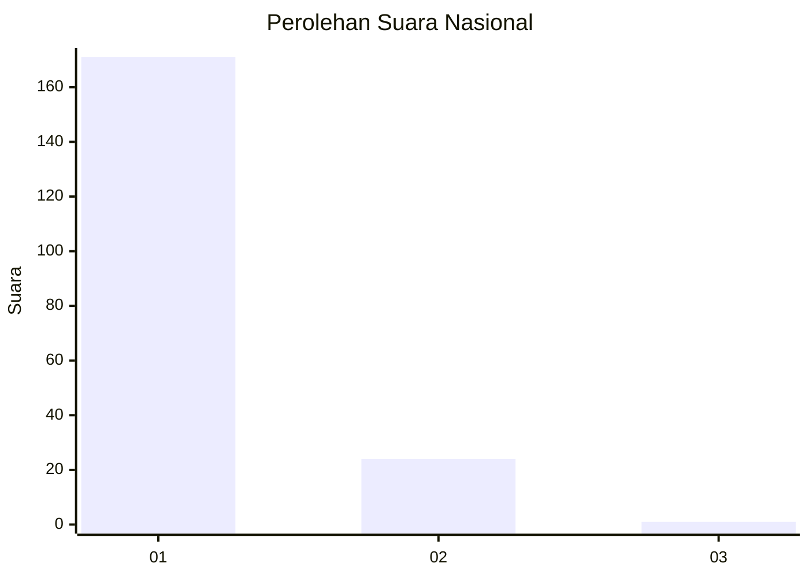
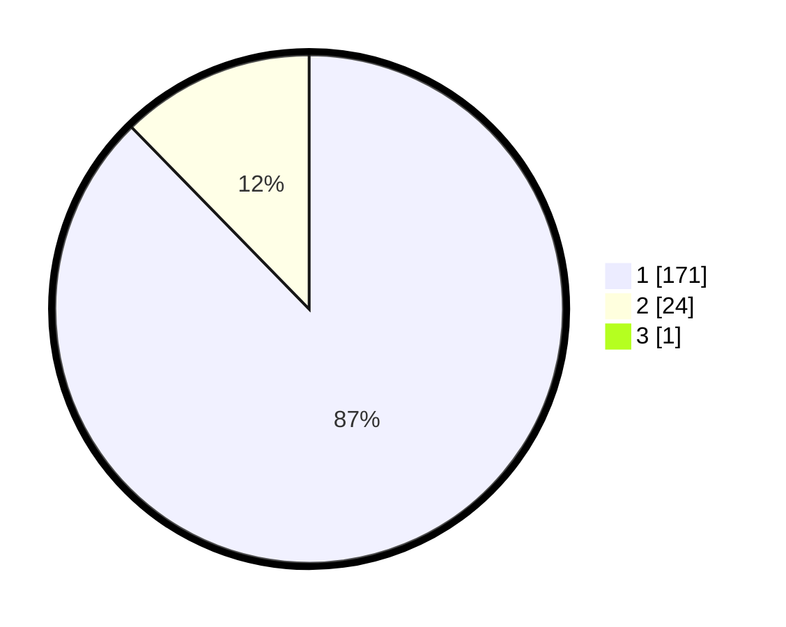

# Hasil

## Grafik

## Tabel

| No. | Nama Paslon    | Suara | Suara (raw) | Persentase |
|:--- |:-------------- | -----:| -----------:| ----------:|
| 1   | ANIES MUHAIMIN | 171   | [171][p-1]  | 87,24      |
| 2   | PRABOWO GIBRAN | 24    | [24][p-2]   | 12,24      |
| 3   | GANJAR MAHFUD  | 1     | [1][p-3]    | 0,51       |

[p-1]: https://github.com/gigit-pemilu/pemilu-2024/blob/main/pilpres/hitung-suara/sub/11-aceh/sub/07-pidie/sub/19-tangse/sub/2004-pulo-sejahtera/sub/002-tps/sub/paslon-1.txt
[p-2]: https://github.com/gigit-pemilu/pemilu-2024/blob/main/pilpres/hitung-suara/sub/11-aceh/sub/07-pidie/sub/19-tangse/sub/2004-pulo-sejahtera/sub/002-tps/sub/paslon-2.txt
[p-3]: https://github.com/gigit-pemilu/pemilu-2024/blob/main/pilpres/hitung-suara/sub/11-aceh/sub/07-pidie/sub/19-tangse/sub/2004-pulo-sejahtera/sub/002-tps/sub/paslon-3.txt

## Foto C Plano

https://sirekap-obj-formc.kpu.go.id/13f7/pemilu/ppwp/11/07/19/20/04/1107192004002-20240215-031353--7d89955d-f628-4ee5-ad16-3febd1994e0f.jpg

https://sirekap-obj-formc.kpu.go.id/13f7/pemilu/ppwp/11/07/19/20/04/1107192004002-20240215-031427--903be7e6-a8fa-49b4-8ee1-49b7f106b324.jpg

https://sirekap-obj-formc.kpu.go.id/13f7/pemilu/ppwp/11/07/19/20/04/1107192004002-20240215-031447--43cbd294-100d-46ec-ae47-3272eaa08049.jpg

## Metadata

| Key        | Value               |
| ---------- | ------------------- |
| Time Stamp | 2024-02-19 06:16:00 |

