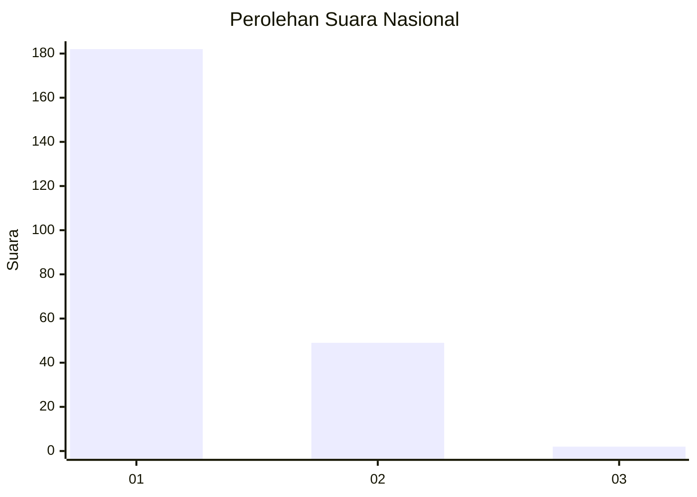
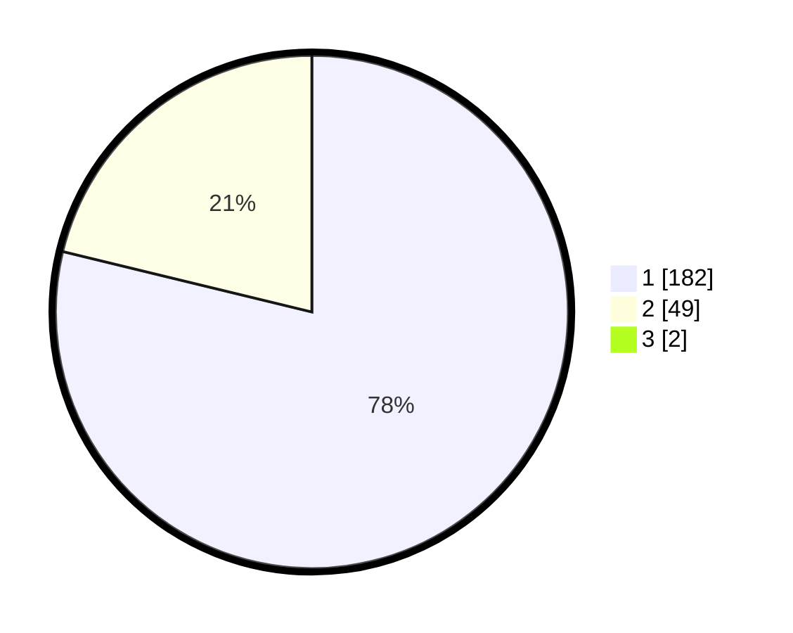

# Hasil

## Grafik

## Tabel

| No. | Nama Paslon    | Suara | Suara (raw) | Persentase |
|:--- |:-------------- | -----:| -----------:| ----------:|
| 1   | ANIES MUHAIMIN | 182   | [182][p-1]  | 78,11      |
| 2   | PRABOWO GIBRAN | 49    | [49][p-2]   | 21,03      |
| 3   | GANJAR MAHFUD  | 2     | [2][p-3]    | 0,86       |

[p-1]: https://github.com/gigit-pemilu/pemilu-2024/blob/main/pilpres/hitung-suara/sub/11-aceh/sub/07-pidie/sub/19-tangse/sub/2005-pulo-kawa/sub/001-tps/sub/paslon-1.txt
[p-2]: https://github.com/gigit-pemilu/pemilu-2024/blob/main/pilpres/hitung-suara/sub/11-aceh/sub/07-pidie/sub/19-tangse/sub/2005-pulo-kawa/sub/001-tps/sub/paslon-2.txt
[p-3]: https://github.com/gigit-pemilu/pemilu-2024/blob/main/pilpres/hitung-suara/sub/11-aceh/sub/07-pidie/sub/19-tangse/sub/2005-pulo-kawa/sub/001-tps/sub/paslon-3.txt

## Foto C Plano

https://sirekap-obj-formc.kpu.go.id/6458/pemilu/ppwp/11/07/19/20/05/1107192005001-20240214-224424--71b89789-7edf-4c1e-b67f-caecc4cfb52c.jpg

https://sirekap-obj-formc.kpu.go.id/6458/pemilu/ppwp/11/07/19/20/05/1107192005001-20240214-224608--f51e2b2f-5621-44d1-bd3e-a07698d5af0b.jpg

https://sirekap-obj-formc.kpu.go.id/6458/pemilu/ppwp/11/07/19/20/05/1107192005001-20240214-224754--292ba87b-eaa9-4be6-a4e5-3e4cb487fd7f.jpg

## Metadata

| Key        | Value               |
| ---------- | ------------------- |
| Time Stamp | 2024-02-24 22:31:28 |

