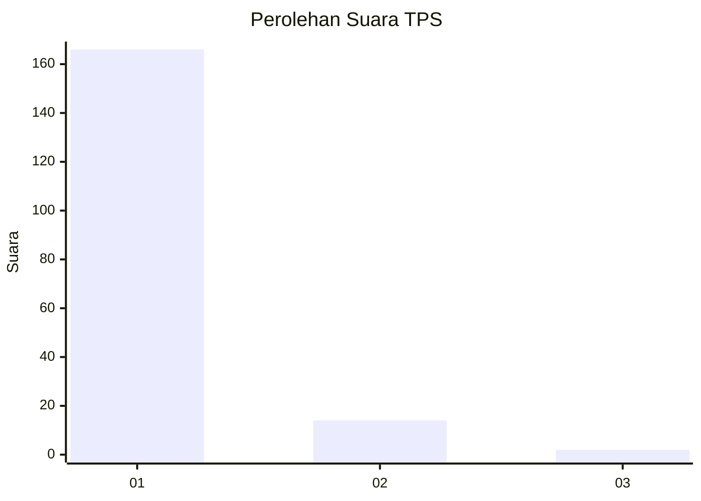
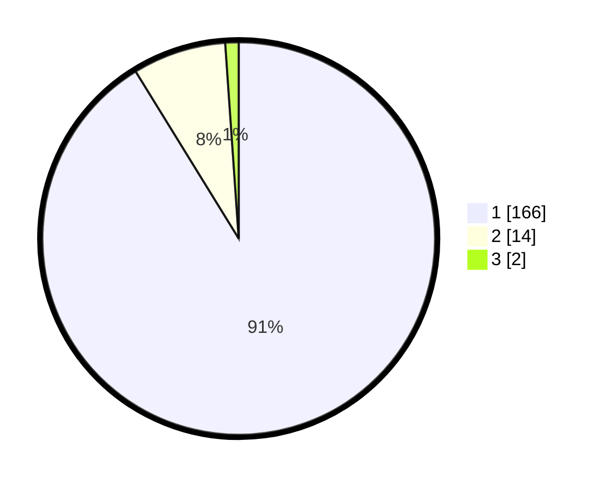

# Hasil

## Grafik

## Tabel

| No. | Nama Paslon    | Suara | Suara (raw) | Persentase |
|:--- |:-------------- | -----:| -----------:| ----------:|
| 1   | ANIES MUHAIMIN | 166   | [166][p-1]  | 91,21      |
| 2   | PRABOWO GIBRAN | 14    | [14][p-2]   | 7,69       |
| 3   | GANJAR MAHFUD  | 2     | [2][p-3]    | 1,10       |

[p-1]: https://github.com/gigit-pemilu/pemilu-2024-11-aceh/blob/main/pilpres/hitung-suara/sub/11-aceh/sub/07-pidie/sub/19-tangse/sub/2005-pulo-kawa/sub/003-tps/sub/paslon-1.txt
[p-2]: https://github.com/gigit-pemilu/pemilu-2024-11-aceh/blob/main/pilpres/hitung-suara/sub/11-aceh/sub/07-pidie/sub/19-tangse/sub/2005-pulo-kawa/sub/003-tps/sub/paslon-2.txt
[p-3]: https://github.com/gigit-pemilu/pemilu-2024-11-aceh/blob/main/pilpres/hitung-suara/sub/11-aceh/sub/07-pidie/sub/19-tangse/sub/2005-pulo-kawa/sub/003-tps/sub/paslon-3.txt

## Foto C Plano

https://sirekap-obj-formc.kpu.go.id/0df9/pemilu/ppwp/11/07/19/20/05/1107192005003-20240215-124206--c42e7f4d-ecfc-44a2-bebe-9e5cf93efb3d.jpg

https://sirekap-obj-formc.kpu.go.id/0df9/pemilu/ppwp/11/07/19/20/05/1107192005003-20240215-022658--e30f6797-3a30-49de-acea-c72ccfa9ae86.jpg

https://sirekap-obj-formc.kpu.go.id/0df9/pemilu/ppwp/11/07/19/20/05/1107192005003-20240215-022729--bb5caf35-22bb-4473-b4f3-1acdb57cc397.jpg

## Metadata

| Key        | Value               |
| ---------- | ------------------- |
| Time Stamp | 2024-02-19 06:16:00 |

