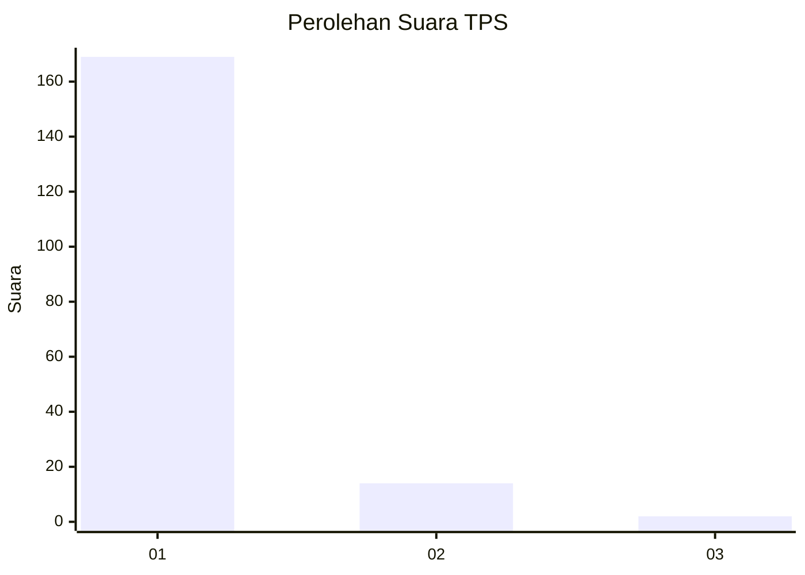
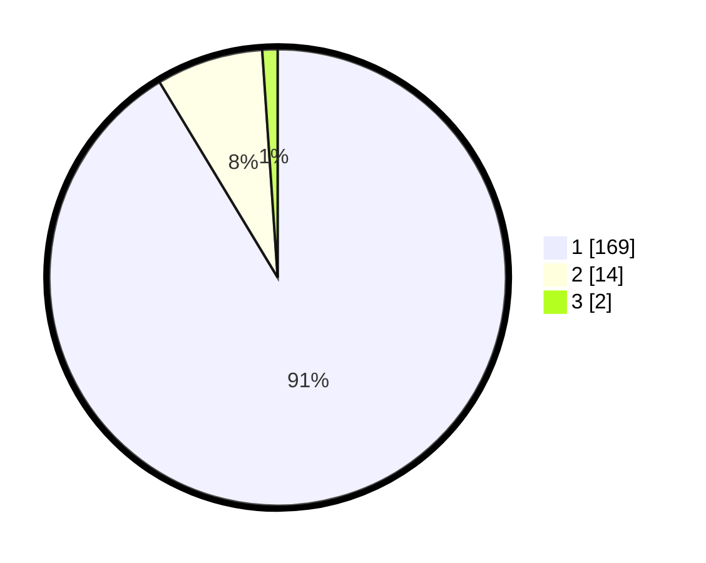

# Hasil

## Grafik

## Tabel

| No. | Nama Paslon    | Suara | Suara (raw) | Persentase |
|:--- |:-------------- | -----:| -----------:| ----------:|
| 1   | ANIES MUHAIMIN | 169   | [169][p-1]  | 91,35      |
| 2   | PRABOWO GIBRAN | 14    | [14][p-2]   | 7,57       |
| 3   | GANJAR MAHFUD  | 2     | [2][p-3]    | 1,08       |

[p-1]: https://github.com/gigit-pemilu/pemilu-2024-11-aceh/blob/main/pilpres/hitung-suara/sub/11-aceh/sub/07-pidie/sub/19-tangse/sub/2006-pulo-seunong/sub/001-tps/sub/paslon-1.txt
[p-2]: https://github.com/gigit-pemilu/pemilu-2024-11-aceh/blob/main/pilpres/hitung-suara/sub/11-aceh/sub/07-pidie/sub/19-tangse/sub/2006-pulo-seunong/sub/001-tps/sub/paslon-2.txt
[p-3]: https://github.com/gigit-pemilu/pemilu-2024-11-aceh/blob/main/pilpres/hitung-suara/sub/11-aceh/sub/07-pidie/sub/19-tangse/sub/2006-pulo-seunong/sub/001-tps/sub/paslon-3.txt

## Foto C Plano

https://sirekap-obj-formc.kpu.go.id/1cc3/pemilu/ppwp/11/07/19/20/06/1107192006001-20240215-124843--8ff7d028-85e5-4ded-ba32-1a32492c65fe.jpg

https://sirekap-obj-formc.kpu.go.id/1cc3/pemilu/ppwp/11/07/19/20/06/1107192006001-20240215-125025--87ff9645-bd91-4ade-a8b0-4496496ca73b.jpg

https://sirekap-obj-formc.kpu.go.id/1cc3/pemilu/ppwp/11/07/19/20/06/1107192006001-20240215-125113--c972e32c-7be2-474c-9786-dae741ec0d16.jpg

## Metadata

| Key        | Value               |
| ---------- | ------------------- |
| Time Stamp | 2024-02-19 06:16:00 |

