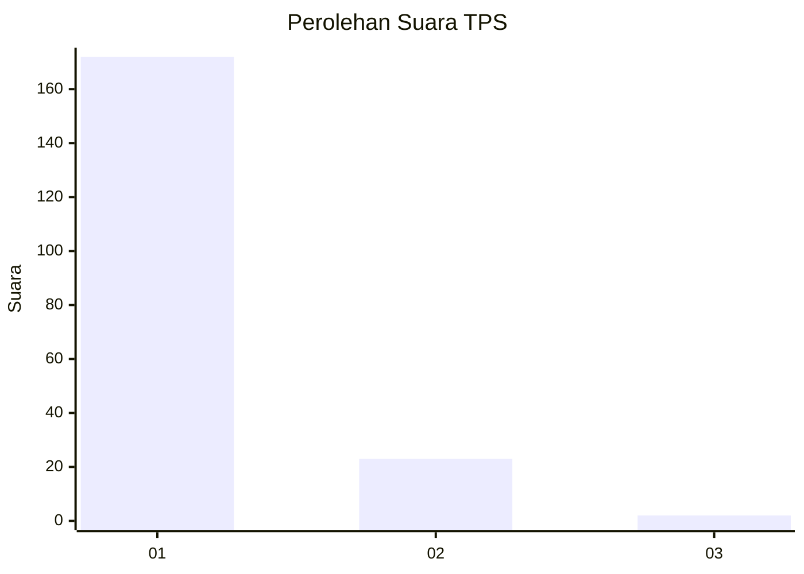
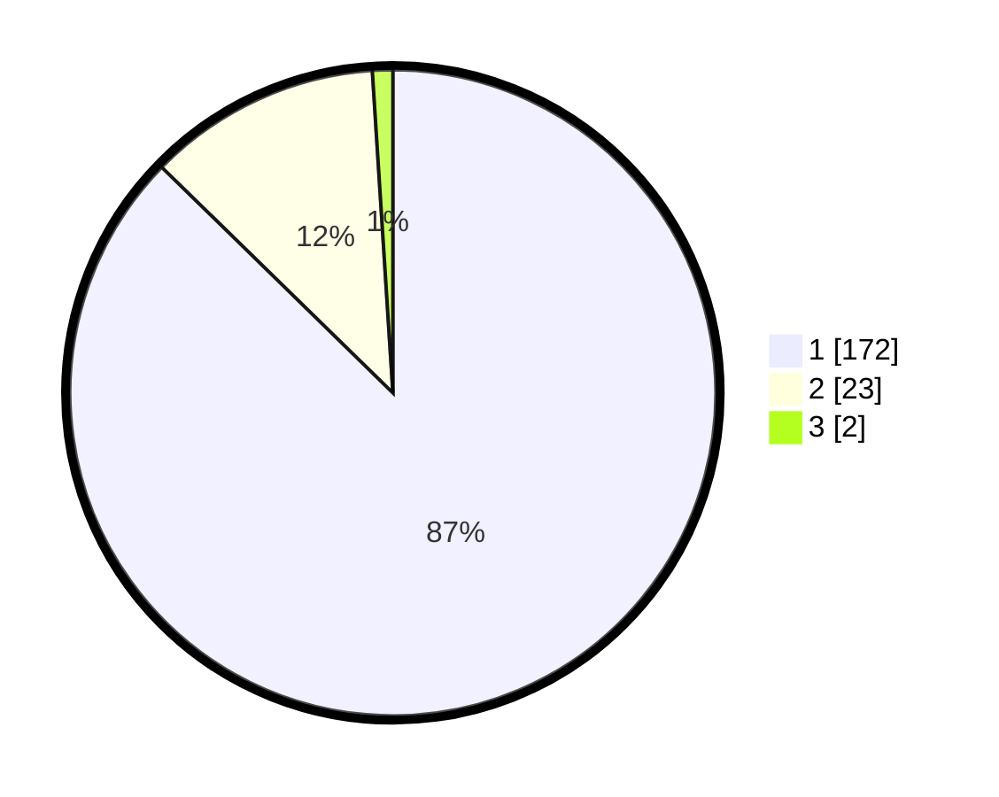

# Hasil

## Grafik

## Tabel

| No. | Nama Paslon    | Suara | Suara (raw) | Persentase |
|:--- |:-------------- | -----:| -----------:| ----------:|
| 1   | ANIES MUHAIMIN | 172   | [172][p-1]  | 87,31      |
| 2   | PRABOWO GIBRAN | 23    | [23][p-2]   | 11,68      |
| 3   | GANJAR MAHFUD  | 2     | [2][p-3]    | 1,02       |

[p-1]: https://github.com/gigit-pemilu/pemilu-2024-11-aceh/blob/main/pilpres/hitung-suara/sub/11-aceh/sub/07-pidie/sub/19-tangse/sub/2006-pulo-seunong/sub/003-tps/sub/paslon-1.txt
[p-2]: https://github.com/gigit-pemilu/pemilu-2024-11-aceh/blob/main/pilpres/hitung-suara/sub/11-aceh/sub/07-pidie/sub/19-tangse/sub/2006-pulo-seunong/sub/003-tps/sub/paslon-2.txt
[p-3]: https://github.com/gigit-pemilu/pemilu-2024-11-aceh/blob/main/pilpres/hitung-suara/sub/11-aceh/sub/07-pidie/sub/19-tangse/sub/2006-pulo-seunong/sub/003-tps/sub/paslon-3.txt

## Foto C Plano

https://sirekap-obj-formc.kpu.go.id/e60d/pemilu/ppwp/11/07/19/20/06/1107192006003-20240215-125617--dfce852d-edd9-4dba-b748-bb5c93d873cf.jpg

https://sirekap-obj-formc.kpu.go.id/e60d/pemilu/ppwp/11/07/19/20/06/1107192006003-20240215-131203--fcb20f96-a62a-4686-bd9c-293a9ce0323c.jpg

https://sirekap-obj-formc.kpu.go.id/e60d/pemilu/ppwp/11/07/19/20/06/1107192006003-20240215-125815--52a22d1f-d806-4e0a-80ec-95e87698ddc1.jpg

## Metadata

| Key        | Value               |
| ---------- | ------------------- |
| Time Stamp | 2024-02-19 06:16:00 |

