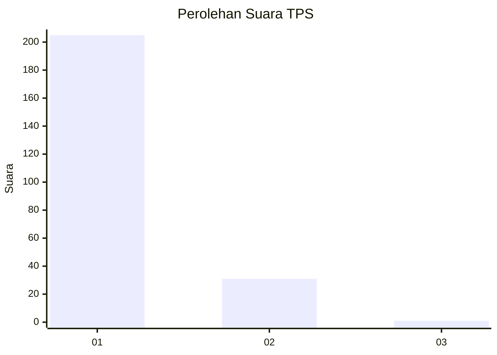
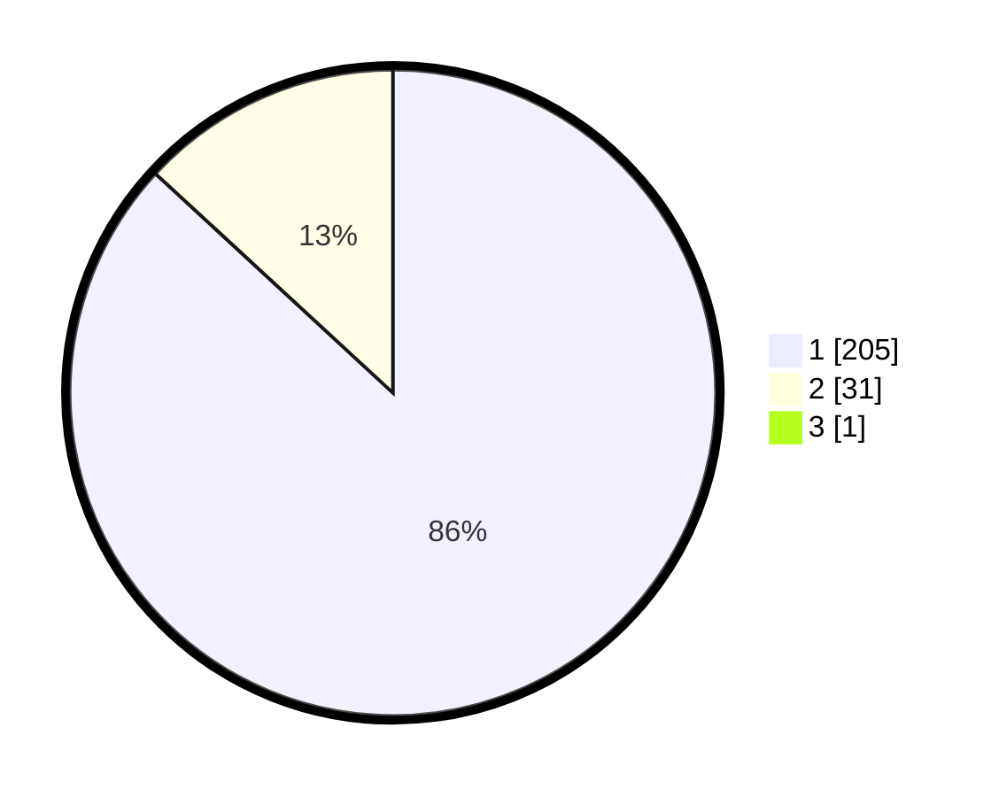

# Hasil

## Grafik

## Tabel

| No. | Nama Paslon    | Suara | Suara (raw) | Persentase |
|:--- |:-------------- | -----:| -----------:| ----------:|
| 1   | ANIES MUHAIMIN | 205   | [205][p-1]  | 86,50      |
| 2   | PRABOWO GIBRAN | 31    | [31][p-2]   | 13,08      |
| 3   | GANJAR MAHFUD  | 1     | [1][p-3]    | 0,42       |

[p-1]: https://github.com/gigit-pemilu/pemilu-2024-11-aceh/blob/main/pilpres/hitung-suara/sub/11-aceh/sub/07-pidie/sub/19-tangse/sub/2008-blang-jeurat/sub/001-tps/sub/paslon-1.txt
[p-2]: https://github.com/gigit-pemilu/pemilu-2024-11-aceh/blob/main/pilpres/hitung-suara/sub/11-aceh/sub/07-pidie/sub/19-tangse/sub/2008-blang-jeurat/sub/001-tps/sub/paslon-2.txt
[p-3]: https://github.com/gigit-pemilu/pemilu-2024-11-aceh/blob/main/pilpres/hitung-suara/sub/11-aceh/sub/07-pidie/sub/19-tangse/sub/2008-blang-jeurat/sub/001-tps/sub/paslon-3.txt

## Foto C Plano

https://sirekap-obj-formc.kpu.go.id/8b5b/pemilu/ppwp/11/07/19/20/08/1107192008001-20240215-143549--57c99325-24c7-4b73-bc8b-5ed3b77bfaf6.jpg

https://sirekap-obj-formc.kpu.go.id/8b5b/pemilu/ppwp/11/07/19/20/08/1107192008001-20240215-170005--b4bffcb9-dd6f-4250-a4a7-4db9439bd2b1.jpg

https://sirekap-obj-formc.kpu.go.id/8b5b/pemilu/ppwp/11/07/19/20/08/1107192008001-20240215-170357--ee63ada9-2021-4b75-9e30-aad3dcdba9fb.jpg

## Metadata

| Key        | Value               |
| ---------- | ------------------- |
| Time Stamp | 2024-02-19 06:16:00 |

