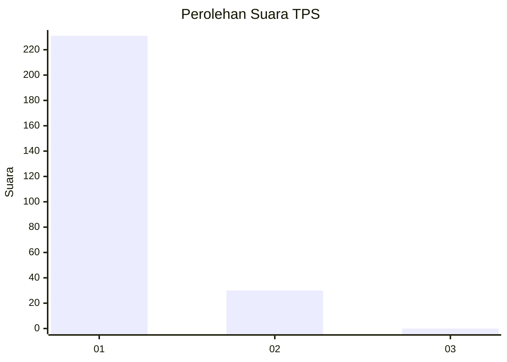
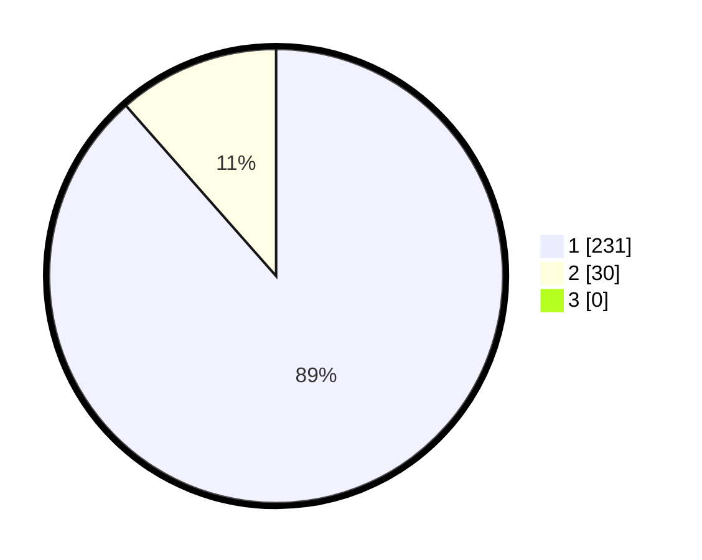

# Hasil

## Grafik

## Tabel

| No. | Nama Paslon    | Suara | Suara (raw) | Persentase |
|:--- |:-------------- | -----:| -----------:| ----------:|
| 1   | ANIES MUHAIMIN | 231   | [231][p-1]  | 88,51      |
| 2   | PRABOWO GIBRAN | 30    | [30][p-2]   | 11,49      |
| 3   | GANJAR MAHFUD  | 0     | [0][p-3]    | 0,00       |

[p-1]: https://github.com/gigit-pemilu/pemilu-2024-11-aceh/blob/main/pilpres/hitung-suara/sub/11-aceh/sub/07-pidie/sub/19-tangse/sub/2010-layan/sub/001-tps/sub/paslon-1.txt
[p-2]: https://github.com/gigit-pemilu/pemilu-2024-11-aceh/blob/main/pilpres/hitung-suara/sub/11-aceh/sub/07-pidie/sub/19-tangse/sub/2010-layan/sub/001-tps/sub/paslon-2.txt
[p-3]: https://github.com/gigit-pemilu/pemilu-2024-11-aceh/blob/main/pilpres/hitung-suara/sub/11-aceh/sub/07-pidie/sub/19-tangse/sub/2010-layan/sub/001-tps/sub/paslon-3.txt

## Foto C Plano

https://sirekap-obj-formc.kpu.go.id/bc47/pemilu/ppwp/11/07/19/20/10/1107192010001-20240215-130417--1dac9418-b104-4fe0-a80b-96c78eabb12b.jpg

https://sirekap-obj-formc.kpu.go.id/bc47/pemilu/ppwp/11/07/19/20/10/1107192010001-20240215-130513--1694f169-2ff5-4391-a034-1c2a3c7f4e9e.jpg

https://sirekap-obj-formc.kpu.go.id/bc47/pemilu/ppwp/11/07/19/20/10/1107192010001-20240215-130601--761292a0-40a1-4810-8d8e-cd3ab3fb4597.jpg

## Metadata

| Key        | Value               |
| ---------- | ------------------- |
| Time Stamp | 2024-02-19 06:16:00 |

