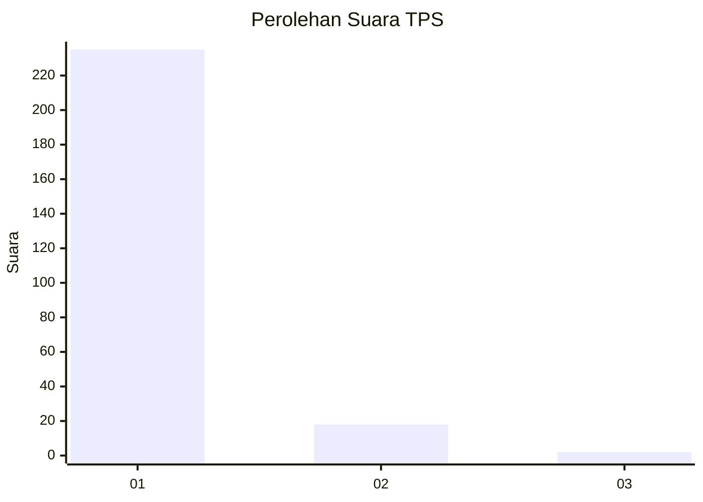
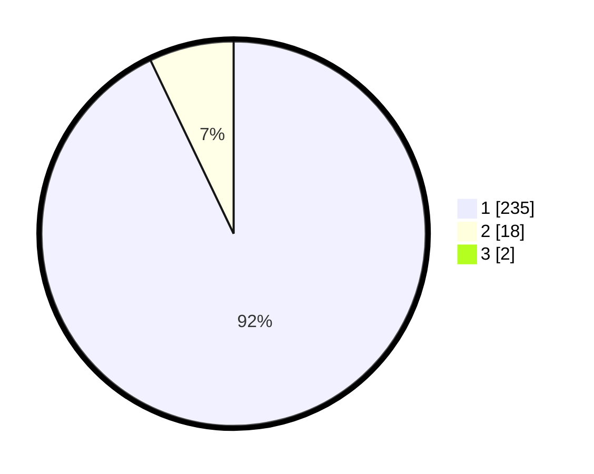

# Hasil

## Grafik

## Tabel

| No. | Nama Paslon    | Suara | Suara (raw) | Persentase |
|:--- |:-------------- | -----:| -----------:| ----------:|
| 1   | ANIES MUHAIMIN | 235   | [235][p-1]  | 92,16      |
| 2   | PRABOWO GIBRAN | 18    | [18][p-2]   | 7,06       |
| 3   | GANJAR MAHFUD  | 2     | [2][p-3]    | 0,78       |

[p-1]: https://github.com/gigit-pemilu/pemilu-2024-11-aceh/blob/main/pilpres/hitung-suara/sub/11-aceh/sub/07-pidie/sub/19-tangse/sub/2012-peunalom-i/sub/002-tps/sub/paslon-1.txt
[p-2]: https://github.com/gigit-pemilu/pemilu-2024-11-aceh/blob/main/pilpres/hitung-suara/sub/11-aceh/sub/07-pidie/sub/19-tangse/sub/2012-peunalom-i/sub/002-tps/sub/paslon-2.txt
[p-3]: https://github.com/gigit-pemilu/pemilu-2024-11-aceh/blob/main/pilpres/hitung-suara/sub/11-aceh/sub/07-pidie/sub/19-tangse/sub/2012-peunalom-i/sub/002-tps/sub/paslon-3.txt

## Foto C Plano

https://sirekap-obj-formc.kpu.go.id/8136/pemilu/ppwp/11/07/19/20/12/1107192012002-20240215-144750--0df0256e-9ca9-45f8-9649-a2fd846a72ec.jpg

https://sirekap-obj-formc.kpu.go.id/8136/pemilu/ppwp/11/07/19/20/12/1107192012002-20240215-144803--6d44f65e-0bb7-484c-a82e-0602c068b662.jpg

https://sirekap-obj-formc.kpu.go.id/8136/pemilu/ppwp/11/07/19/20/12/1107192012002-20240215-144827--6d98cb87-0b5b-4534-80d9-9bb956dc10f5.jpg

## Metadata

| Key        | Value               |
| ---------- | ------------------- |
| Time Stamp | 2024-02-19 06:16:00 |

