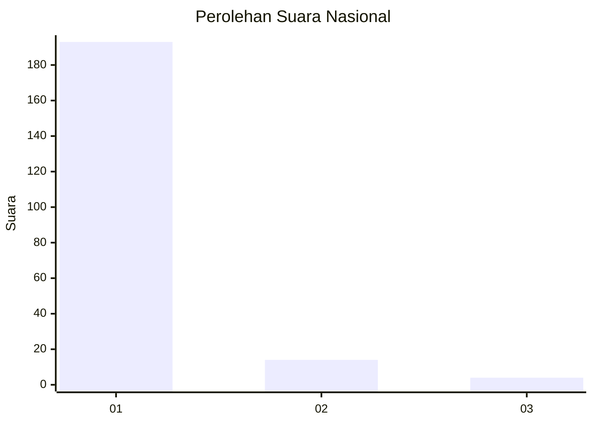
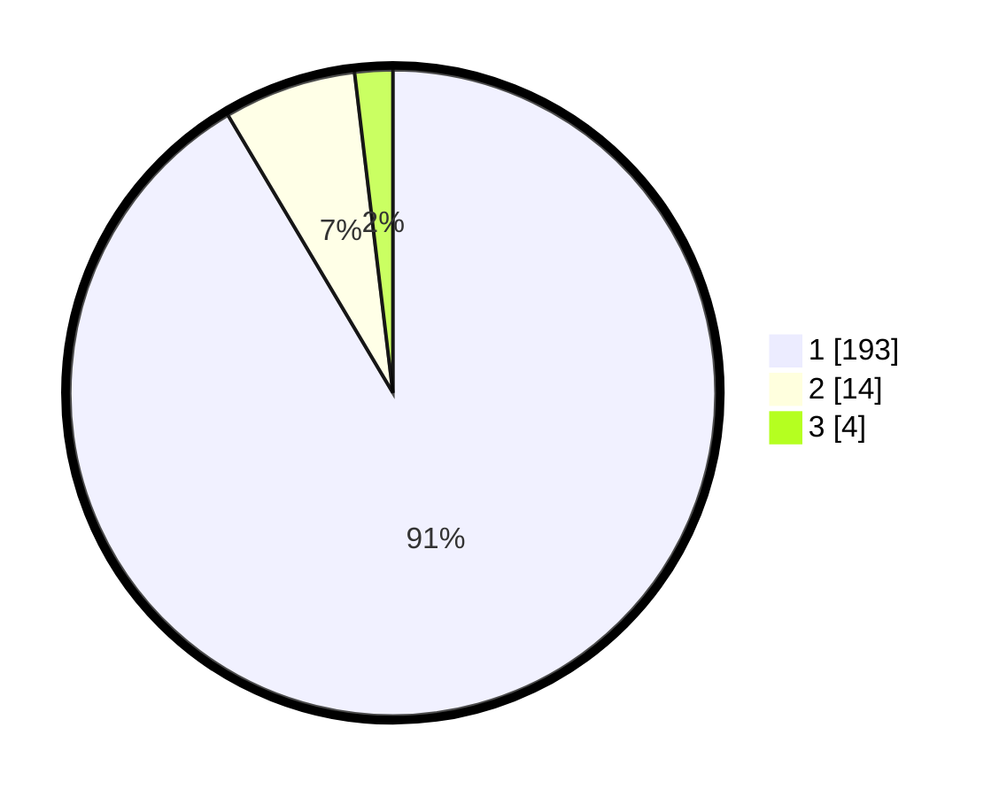

# Hasil

## Grafik

## Tabel

| No. | Nama Paslon    | Suara | Suara (raw) | Persentase |
|:--- |:-------------- | -----:| -----------:| ----------:|
| 1   | ANIES MUHAIMIN | 193   | [193][p-1]  | 91,47      |
| 2   | PRABOWO GIBRAN | 14    | [14][p-2]   | 6,64       |
| 3   | GANJAR MAHFUD  | 4     | [4][p-3]    | 1,90       |

[p-1]: https://github.com/gigit-pemilu/pemilu-2024/blob/main/pilpres/hitung-suara/sub/11-aceh/sub/07-pidie/sub/19-tangse/sub/2012-peunalom-i/sub/003-tps/sub/paslon-1.txt
[p-2]: https://github.com/gigit-pemilu/pemilu-2024/blob/main/pilpres/hitung-suara/sub/11-aceh/sub/07-pidie/sub/19-tangse/sub/2012-peunalom-i/sub/003-tps/sub/paslon-2.txt
[p-3]: https://github.com/gigit-pemilu/pemilu-2024/blob/main/pilpres/hitung-suara/sub/11-aceh/sub/07-pidie/sub/19-tangse/sub/2012-peunalom-i/sub/003-tps/sub/paslon-3.txt

## Foto C Plano

https://sirekap-obj-formc.kpu.go.id/40ff/pemilu/ppwp/11/07/19/20/12/1107192012003-20240215-120549--bf5e7c9d-ffb7-4e73-a4f3-3092b9c816af.jpg

https://sirekap-obj-formc.kpu.go.id/40ff/pemilu/ppwp/11/07/19/20/12/1107192012003-20240215-120708--7d19da5d-574d-4204-9519-22f1422d109e.jpg

https://sirekap-obj-formc.kpu.go.id/40ff/pemilu/ppwp/11/07/19/20/12/1107192012003-20240215-120814--70d9ef21-5ef6-4943-b147-321e4f58bb15.jpg

## Metadata

| Key        | Value               |
| ---------- | ------------------- |
| Time Stamp | 2024-02-25 14:00:00 |

