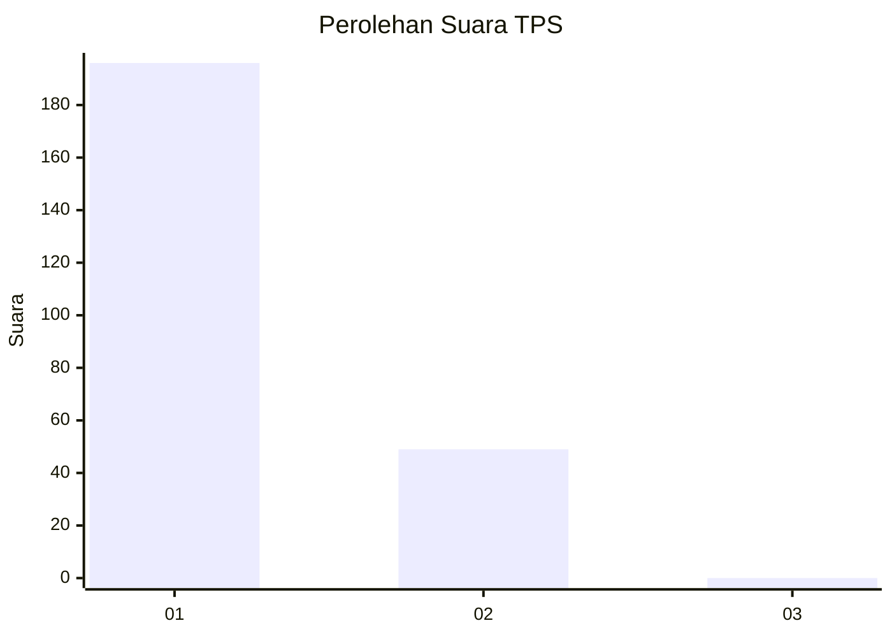
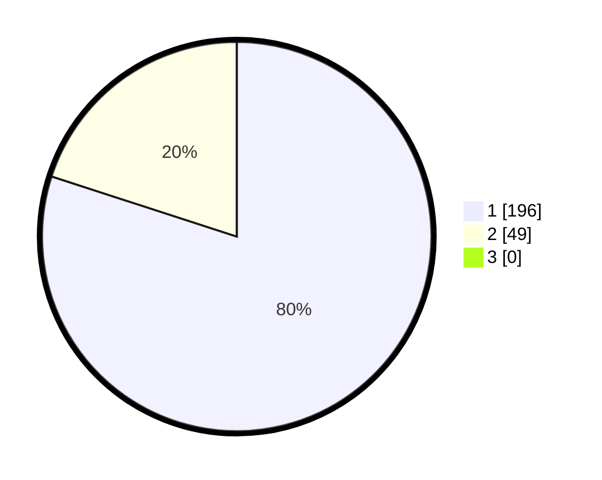

# Hasil

## Grafik

## Tabel

| No. | Nama Paslon    | Suara | Suara (raw) | Persentase |
|:--- |:-------------- | -----:| -----------:| ----------:|
| 1   | ANIES MUHAIMIN | 196   | [196][p-1]  | 80,00      |
| 2   | PRABOWO GIBRAN | 49    | [49][p-2]   | 20,00      |
| 3   | GANJAR MAHFUD  | 0     | [0][p-3]    | 0,00       |

[p-1]: https://github.com/gigit-pemilu/pemilu-2024-11-aceh/blob/main/pilpres/hitung-suara/sub/11-aceh/sub/07-pidie/sub/19-tangse/sub/2016-blang-dhot/sub/001-tps/sub/paslon-1.txt
[p-2]: https://github.com/gigit-pemilu/pemilu-2024-11-aceh/blob/main/pilpres/hitung-suara/sub/11-aceh/sub/07-pidie/sub/19-tangse/sub/2016-blang-dhot/sub/001-tps/sub/paslon-2.txt
[p-3]: https://github.com/gigit-pemilu/pemilu-2024-11-aceh/blob/main/pilpres/hitung-suara/sub/11-aceh/sub/07-pidie/sub/19-tangse/sub/2016-blang-dhot/sub/001-tps/sub/paslon-3.txt

## Foto C Plano

https://sirekap-obj-formc.kpu.go.id/6c33/pemilu/ppwp/11/07/19/20/16/1107192016001-20240215-004931--71ffe8df-bd7b-4f71-943c-5a201a695a9c.jpg

https://sirekap-obj-formc.kpu.go.id/6c33/pemilu/ppwp/11/07/19/20/16/1107192016001-20240215-005142--703d580d-2330-44b0-be46-4b042f2cc40d.jpg

https://sirekap-obj-formc.kpu.go.id/6c33/pemilu/ppwp/11/07/19/20/16/1107192016001-20240215-005404--391a513e-03d5-4d73-a0ff-df8f34246f07.jpg

## Metadata

| Key        | Value               |
| ---------- | ------------------- |
| Time Stamp | 2024-02-24 22:31:28 |

