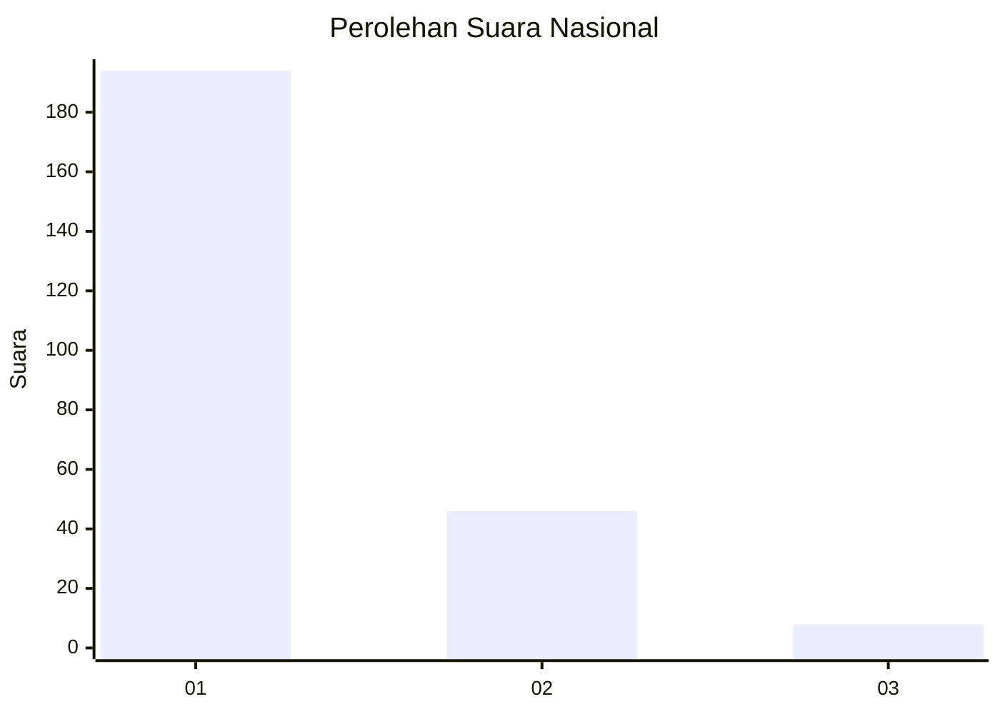
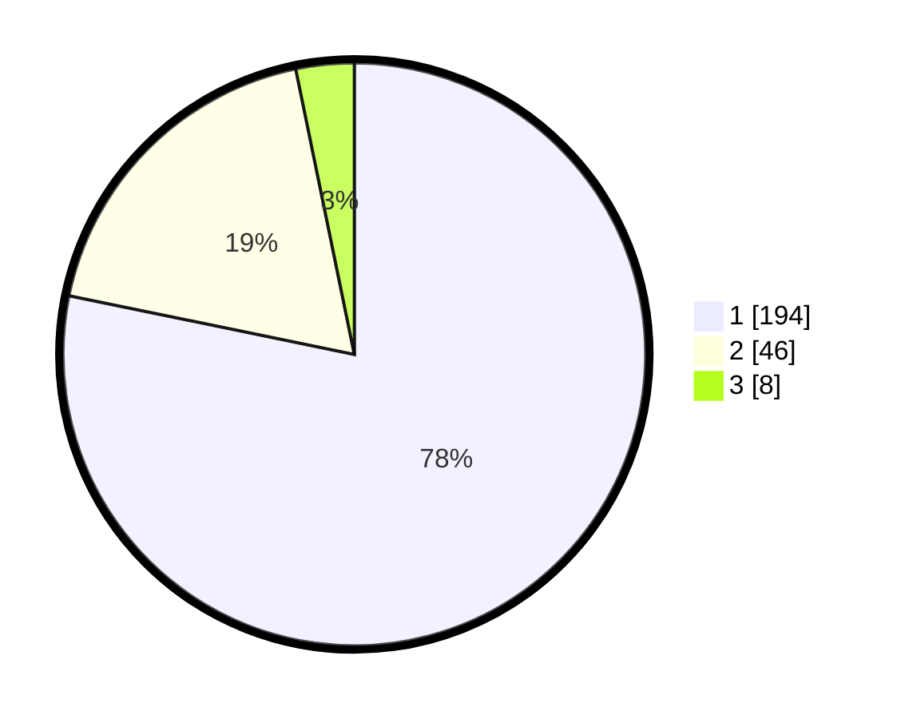

# Hasil

## Grafik

## Tabel

| No. | Nama Paslon    | Suara | Suara (raw) | Persentase |
|:--- |:-------------- | -----:| -----------:| ----------:|
| 1   | ANIES MUHAIMIN | 194   | [194][p-1]  | 78,23      |
| 2   | PRABOWO GIBRAN | 46    | [46][p-2]   | 18,55      |
| 3   | GANJAR MAHFUD  | 8     | [8][p-3]    | 3,23       |

[p-1]: https://github.com/gigit-pemilu/pemilu-2024/blob/main/pilpres/hitung-suara/sub/11-aceh/sub/07-pidie/sub/19-tangse/sub/2016-blang-dhot/sub/003-tps/sub/paslon-1.txt
[p-2]: https://github.com/gigit-pemilu/pemilu-2024/blob/main/pilpres/hitung-suara/sub/11-aceh/sub/07-pidie/sub/19-tangse/sub/2016-blang-dhot/sub/003-tps/sub/paslon-2.txt
[p-3]: https://github.com/gigit-pemilu/pemilu-2024/blob/main/pilpres/hitung-suara/sub/11-aceh/sub/07-pidie/sub/19-tangse/sub/2016-blang-dhot/sub/003-tps/sub/paslon-3.txt

## Foto C Plano

https://sirekap-obj-formc.kpu.go.id/0b1c/pemilu/ppwp/11/07/19/20/16/1107192016003-20240215-005233--4ba6ba63-3274-4c40-adc5-a499db5dec5a.jpg

https://sirekap-obj-formc.kpu.go.id/0b1c/pemilu/ppwp/11/07/19/20/16/1107192016003-20240215-005336--81a96db5-6368-4194-9073-cb7f6f1f3e49.jpg

https://sirekap-obj-formc.kpu.go.id/0b1c/pemilu/ppwp/11/07/19/20/16/1107192016003-20240215-005416--5933841a-af0f-46be-a3f1-9bd3c8eb6eec.jpg

## Metadata

| Key        | Value               |
| ---------- | ------------------- |
| Time Stamp | 2024-02-15 17:30:25 |

## DATA PEMILIH TETAP

Jumlah pemilih dalam DPT: **258**.
 * L: **96**.
 * P: **162**.

## DATA PENGGUNA HAK PILIH

Jumlah pengguna hak pilih dalam DPT: **256**.
 * L: **96**.
 * P: **160**.

Jumlah pengguna hak pilih dalam DPTb: **0**.
 * L: **0**.
 * P: **0**.

Jumlah pengguna hak pilih dalam DPK: **0**.
 * L: **0**.
 * P: **0**.

Jumlah pengguna hak pilih: **256**.
 * L: **96**.
 * P: **160**.

## JUMLAH SUARA SAH DAN TIDAK SAH

JUMLAH SELURUH SUARA SAH: **248**.

JUMLAH SUARA TIDAK SAH: **8**.

JUMLAH SELURUH SUARA SAH DAN SUARA TIDAK SAH: **256**.

