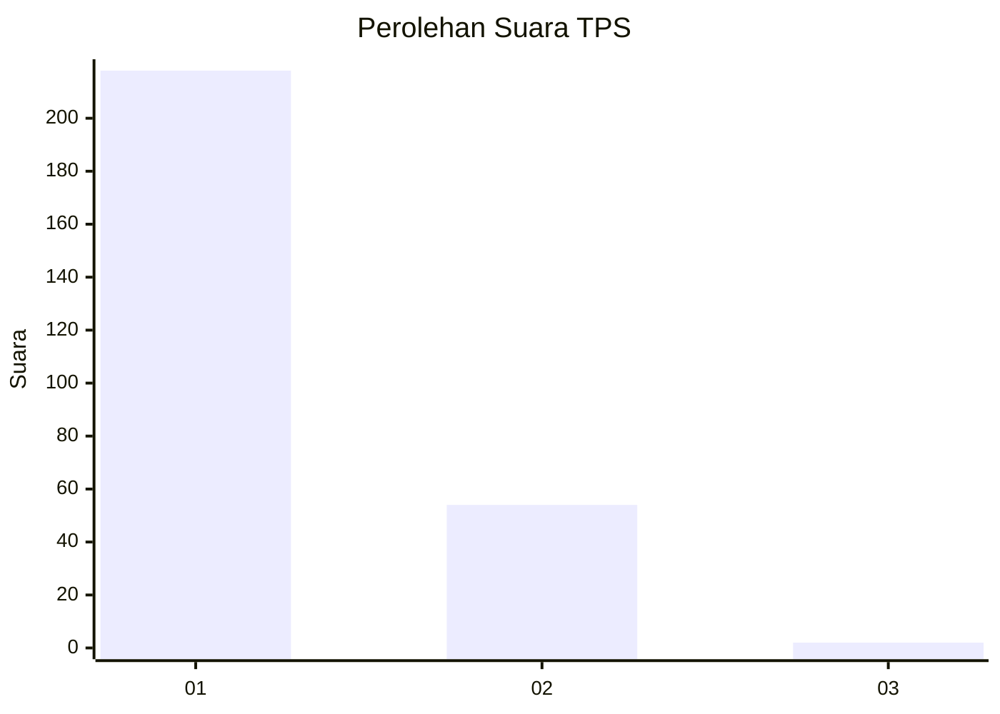
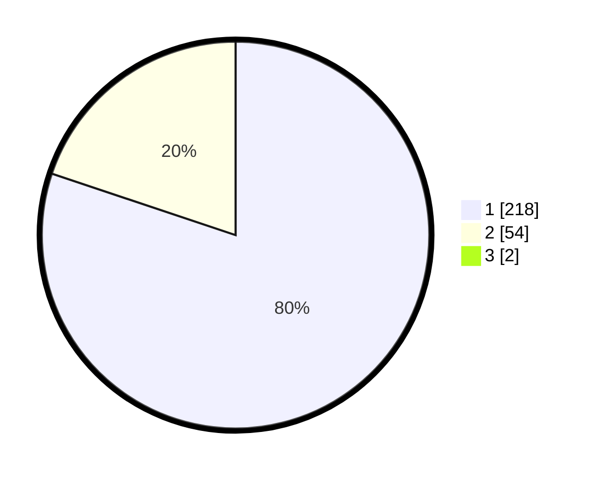

# Hasil

## Grafik

## Tabel

| No. | Nama Paslon    | Suara | Suara (raw) | Persentase |
|:--- |:-------------- | -----:| -----------:| ----------:|
| 1   | ANIES MUHAIMIN | 218   | [218][p-1]  | 79,56      |
| 2   | PRABOWO GIBRAN | 54    | [54][p-2]   | 19,71      |
| 3   | GANJAR MAHFUD  | 2     | [2][p-3]    | 0,73       |

[p-1]: https://github.com/gigit-pemilu/pemilu-2024-11-aceh/blob/main/pilpres/hitung-suara/sub/11-aceh/sub/07-pidie/sub/19-tangse/sub/2016-blang-dhot/sub/004-tps/sub/paslon-1.txt
[p-2]: https://github.com/gigit-pemilu/pemilu-2024-11-aceh/blob/main/pilpres/hitung-suara/sub/11-aceh/sub/07-pidie/sub/19-tangse/sub/2016-blang-dhot/sub/004-tps/sub/paslon-2.txt
[p-3]: https://github.com/gigit-pemilu/pemilu-2024-11-aceh/blob/main/pilpres/hitung-suara/sub/11-aceh/sub/07-pidie/sub/19-tangse/sub/2016-blang-dhot/sub/004-tps/sub/paslon-3.txt

## Foto C Plano

https://sirekap-obj-formc.kpu.go.id/6db0/pemilu/ppwp/11/07/19/20/16/1107192016004-20240215-021944--53859686-a12a-42dc-9731-956df9d46bcb.jpg

https://sirekap-obj-formc.kpu.go.id/6db0/pemilu/ppwp/11/07/19/20/16/1107192016004-20240215-022313--11a3e4c1-d7ff-44ba-9eb9-fad2fc96d634.jpg

https://sirekap-obj-formc.kpu.go.id/6db0/pemilu/ppwp/11/07/19/20/16/1107192016004-20240215-022558--262c6dc1-9268-4ec7-bad6-cc9dd2e566e3.jpg

## Metadata

| Key        | Value               |
| ---------- | ------------------- |
| Time Stamp | 2024-02-19 06:16:00 |

