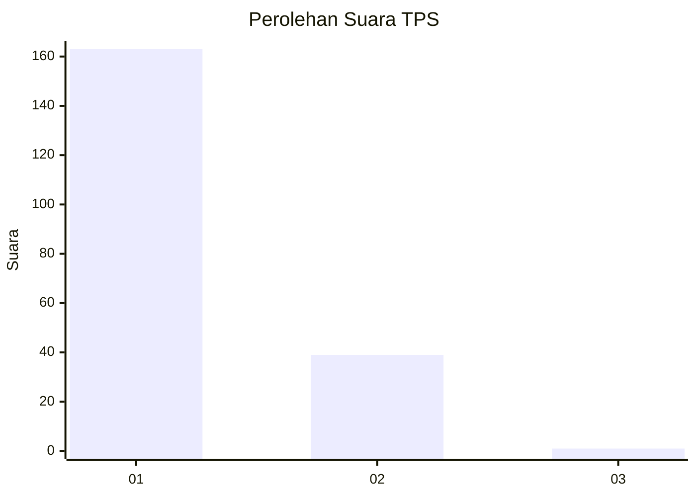
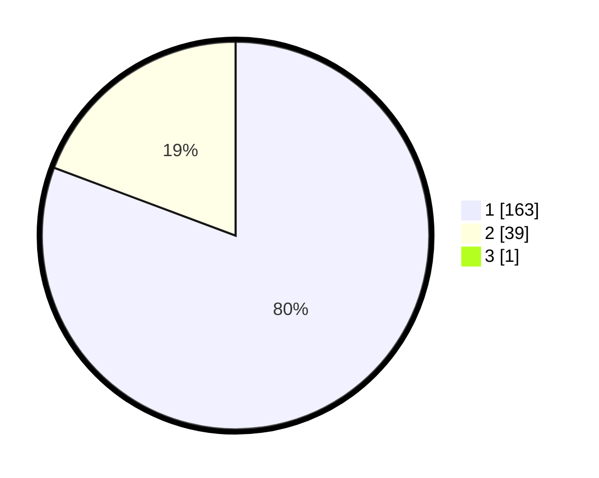

# Hasil

## Grafik

## Tabel

| No. | Nama Paslon    | Suara | Suara (raw) | Persentase |
|:--- |:-------------- | -----:| -----------:| ----------:|
| 1   | ANIES MUHAIMIN | 163   | [163][p-1]  | 80,30      |
| 2   | PRABOWO GIBRAN | 39    | [39][p-2]   | 19,21      |
| 3   | GANJAR MAHFUD  | 1     | [1][p-3]    | 0,49       |

[p-1]: https://github.com/gigit-pemilu/pemilu-2024-11-aceh/blob/main/pilpres/hitung-suara/sub/11-aceh/sub/07-pidie/sub/19-tangse/sub/2017-blang-bungong/sub/001-tps/sub/paslon-1.txt
[p-2]: https://github.com/gigit-pemilu/pemilu-2024-11-aceh/blob/main/pilpres/hitung-suara/sub/11-aceh/sub/07-pidie/sub/19-tangse/sub/2017-blang-bungong/sub/001-tps/sub/paslon-2.txt
[p-3]: https://github.com/gigit-pemilu/pemilu-2024-11-aceh/blob/main/pilpres/hitung-suara/sub/11-aceh/sub/07-pidie/sub/19-tangse/sub/2017-blang-bungong/sub/001-tps/sub/paslon-3.txt

## Foto C Plano

https://sirekap-obj-formc.kpu.go.id/1015/pemilu/ppwp/11/07/19/20/17/1107192017001-20240214-202821--ef7fccc8-7d0e-4e24-8214-acc5704389ca.jpg

https://sirekap-obj-formc.kpu.go.id/1015/pemilu/ppwp/11/07/19/20/17/1107192017001-20240214-220258--8a5bb524-3a79-44ed-87b6-0a6cf0ff4e9e.jpg

https://sirekap-obj-formc.kpu.go.id/1015/pemilu/ppwp/11/07/19/20/17/1107192017001-20240214-203150--4e401e9a-ac74-4874-a0bd-4e8d093f26b4.jpg

## Metadata

| Key        | Value               |
| ---------- | ------------------- |
| Time Stamp | 2024-02-19 06:16:00 |

