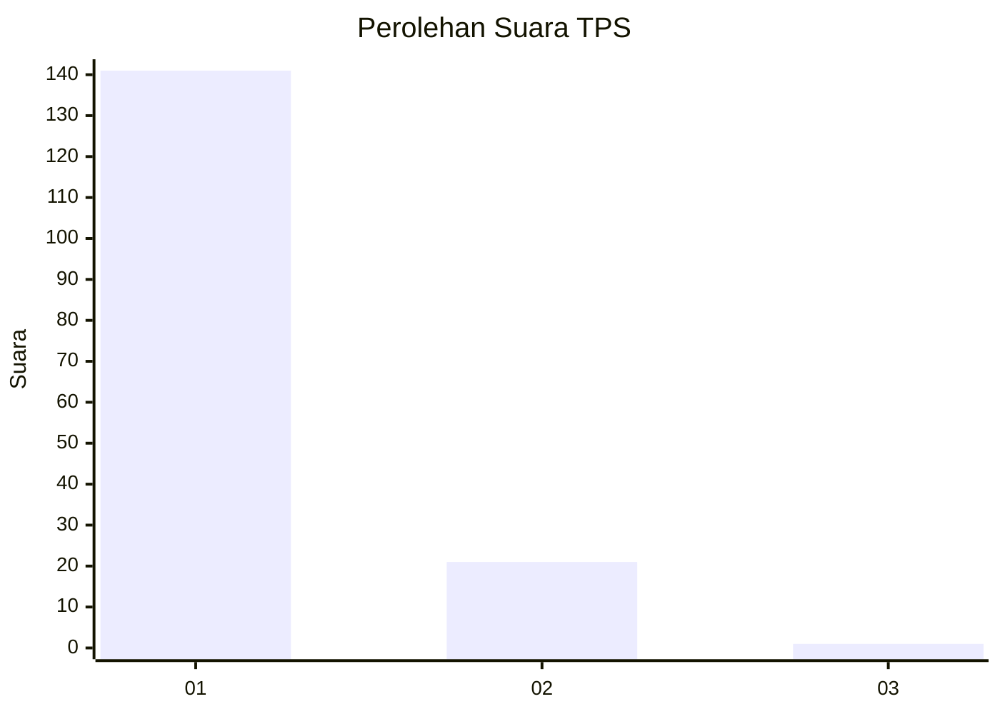
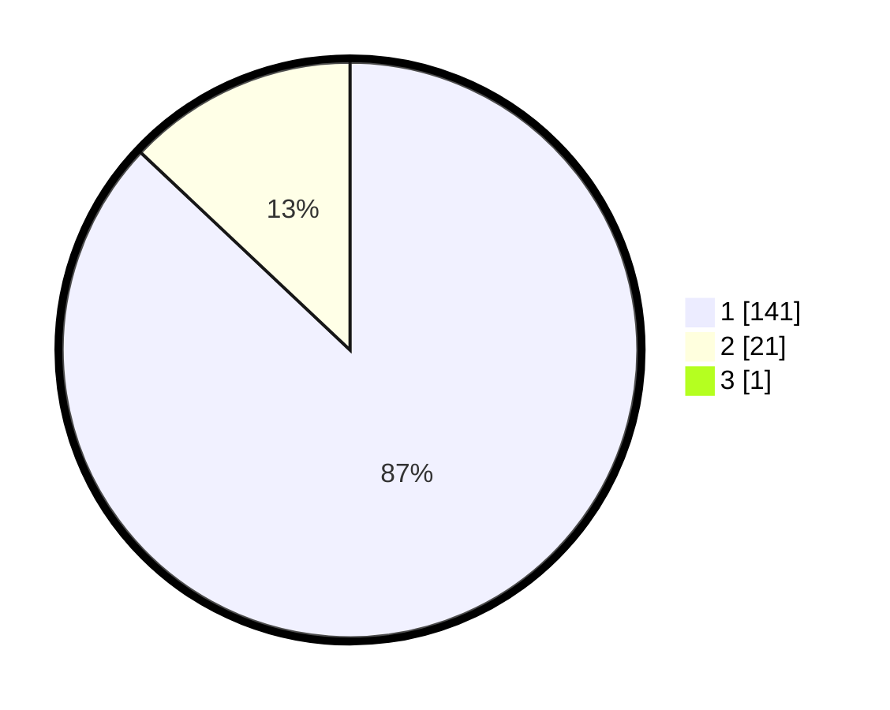

# Hasil

## Grafik

## Tabel

| No. | Nama Paslon    | Suara | Suara (raw) | Persentase |
|:--- |:-------------- | -----:| -----------:| ----------:|
| 1   | ANIES MUHAIMIN | 141   | [141][p-1]  | 86,50      |
| 2   | PRABOWO GIBRAN | 21    | [21][p-2]   | 12,88      |
| 3   | GANJAR MAHFUD  | 1     | [1][p-3]    | 0,61       |

[p-1]: https://github.com/gigit-pemilu/pemilu-2024-11-aceh/blob/main/pilpres/hitung-suara/sub/11-aceh/sub/07-pidie/sub/19-tangse/sub/2017-blang-bungong/sub/003-tps/sub/paslon-1.txt
[p-2]: https://github.com/gigit-pemilu/pemilu-2024-11-aceh/blob/main/pilpres/hitung-suara/sub/11-aceh/sub/07-pidie/sub/19-tangse/sub/2017-blang-bungong/sub/003-tps/sub/paslon-2.txt
[p-3]: https://github.com/gigit-pemilu/pemilu-2024-11-aceh/blob/main/pilpres/hitung-suara/sub/11-aceh/sub/07-pidie/sub/19-tangse/sub/2017-blang-bungong/sub/003-tps/sub/paslon-3.txt

## Foto C Plano

https://sirekap-obj-formc.kpu.go.id/1a8e/pemilu/ppwp/11/07/19/20/17/1107192017003-20240215-005713--719718fd-37b1-4ce7-87f3-1e5edec9e261.jpg

https://sirekap-obj-formc.kpu.go.id/1a8e/pemilu/ppwp/11/07/19/20/17/1107192017003-20240215-020625--f26fcf3e-1849-4575-b28c-9879f7554ee0.jpg

https://sirekap-obj-formc.kpu.go.id/1a8e/pemilu/ppwp/11/07/19/20/17/1107192017003-20240215-010209--a048a8bf-2361-494a-ba39-70d275a1016c.jpg

## Metadata

| Key        | Value               |
| ---------- | ------------------- |
| Time Stamp | 2024-02-24 22:31:28 |

