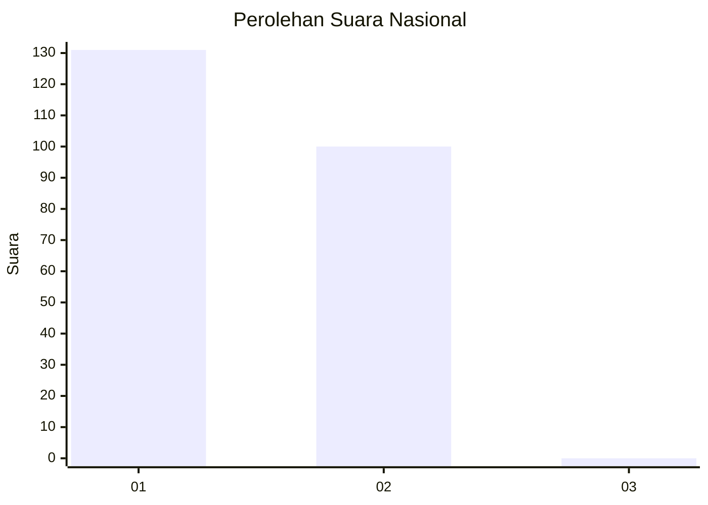
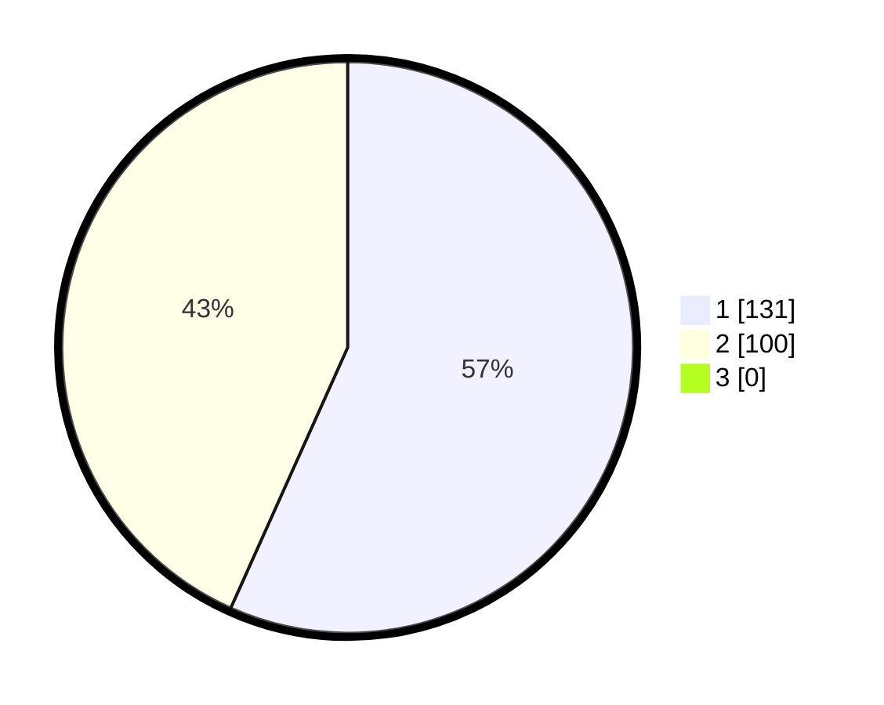

# Hasil

## Grafik

## Tabel

| No. | Nama Paslon    | Suara | Suara (raw) | Persentase |
|:--- |:-------------- | -----:| -----------:| ----------:|
| 1   | ANIES MUHAIMIN | 131   | [131][p-1]  | 56,71      |
| 2   | PRABOWO GIBRAN | 100   | [100][p-2]  | 43,29      |
| 3   | GANJAR MAHFUD  | 0     | [0][p-3]    | 0,00       |

[p-1]: https://github.com/gigit-pemilu/pemilu-2024/blob/main/pilpres/hitung-suara/sub/11-aceh/sub/07-pidie/sub/19-tangse/sub/2018-ulee-gunong/sub/001-tps/sub/paslon-1.txt
[p-2]: https://github.com/gigit-pemilu/pemilu-2024/blob/main/pilpres/hitung-suara/sub/11-aceh/sub/07-pidie/sub/19-tangse/sub/2018-ulee-gunong/sub/001-tps/sub/paslon-2.txt
[p-3]: https://github.com/gigit-pemilu/pemilu-2024/blob/main/pilpres/hitung-suara/sub/11-aceh/sub/07-pidie/sub/19-tangse/sub/2018-ulee-gunong/sub/001-tps/sub/paslon-3.txt

## Foto C Plano

https://sirekap-obj-formc.kpu.go.id/4aff/pemilu/ppwp/11/07/19/20/18/1107192018001-20240215-113521--1eaf08e4-1131-479d-850f-49d5773584a7.jpg

https://sirekap-obj-formc.kpu.go.id/4aff/pemilu/ppwp/11/07/19/20/18/1107192018001-20240215-113738--8258ce50-1a02-4a12-95ba-0d392a692112.jpg

https://sirekap-obj-formc.kpu.go.id/4aff/pemilu/ppwp/11/07/19/20/18/1107192018001-20240215-113953--613b2b8e-ab21-4b0d-bfe9-eba6ebe71f36.jpg

## Metadata

| Key        | Value               |
| ---------- | ------------------- |
| Time Stamp | 2024-02-19 06:16:00 |

