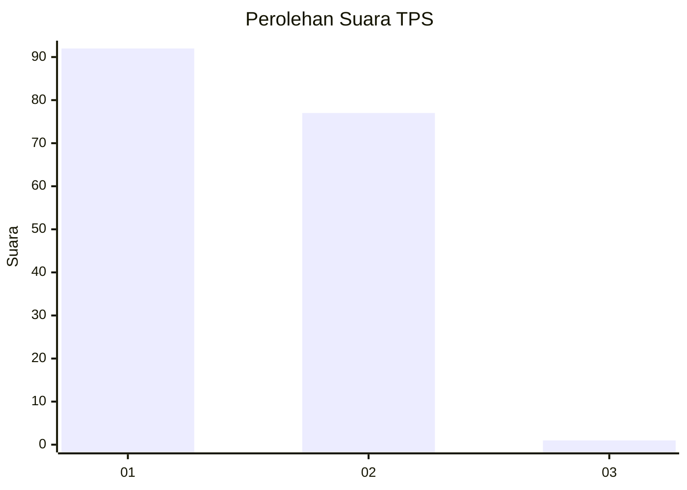
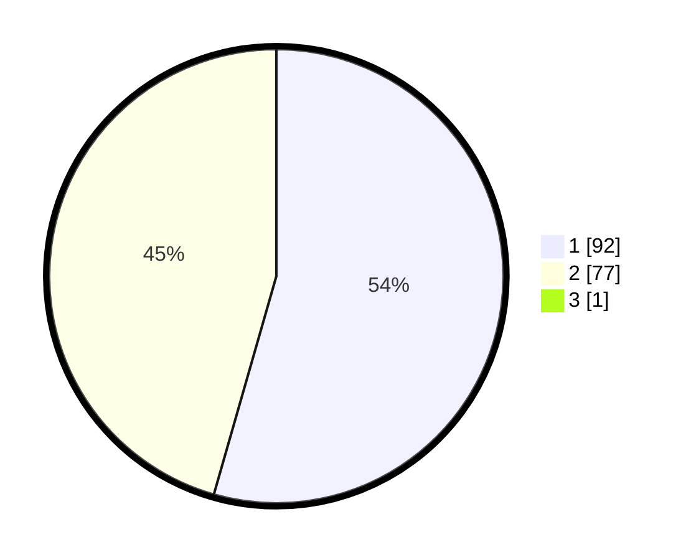

# Hasil

## Grafik

## Tabel

| No. | Nama Paslon    | Suara | Suara (raw) | Persentase |
|:--- |:-------------- | -----:| -----------:| ----------:|
| 1   | ANIES MUHAIMIN | 92    | [92][p-1]   | 54,12      |
| 2   | PRABOWO GIBRAN | 77    | [77][p-2]   | 45,29      |
| 3   | GANJAR MAHFUD  | 1     | [1][p-3]    | 0,59       |

[p-1]: https://github.com/gigit-pemilu/pemilu-2024-11-aceh/blob/main/pilpres/hitung-suara/sub/11-aceh/sub/07-pidie/sub/19-tangse/sub/2018-ulee-gunong/sub/002-tps/sub/paslon-1.txt
[p-2]: https://github.com/gigit-pemilu/pemilu-2024-11-aceh/blob/main/pilpres/hitung-suara/sub/11-aceh/sub/07-pidie/sub/19-tangse/sub/2018-ulee-gunong/sub/002-tps/sub/paslon-2.txt
[p-3]: https://github.com/gigit-pemilu/pemilu-2024-11-aceh/blob/main/pilpres/hitung-suara/sub/11-aceh/sub/07-pidie/sub/19-tangse/sub/2018-ulee-gunong/sub/002-tps/sub/paslon-3.txt

## Foto C Plano

https://sirekap-obj-formc.kpu.go.id/804d/pemilu/ppwp/11/07/19/20/18/1107192018002-20240215-110858--bdde070c-4d38-49b8-89f7-89375f785a11.jpg

https://sirekap-obj-formc.kpu.go.id/804d/pemilu/ppwp/11/07/19/20/18/1107192018002-20240215-111020--5469bc60-9702-4d80-9c4e-8af399035936.jpg

https://sirekap-obj-formc.kpu.go.id/804d/pemilu/ppwp/11/07/19/20/18/1107192018002-20240215-111105--8691c2c3-f96f-4c8b-b959-5e9a37973dfe.jpg

## Metadata

| Key        | Value               |
| ---------- | ------------------- |
| Time Stamp | 2024-02-19 06:16:00 |

