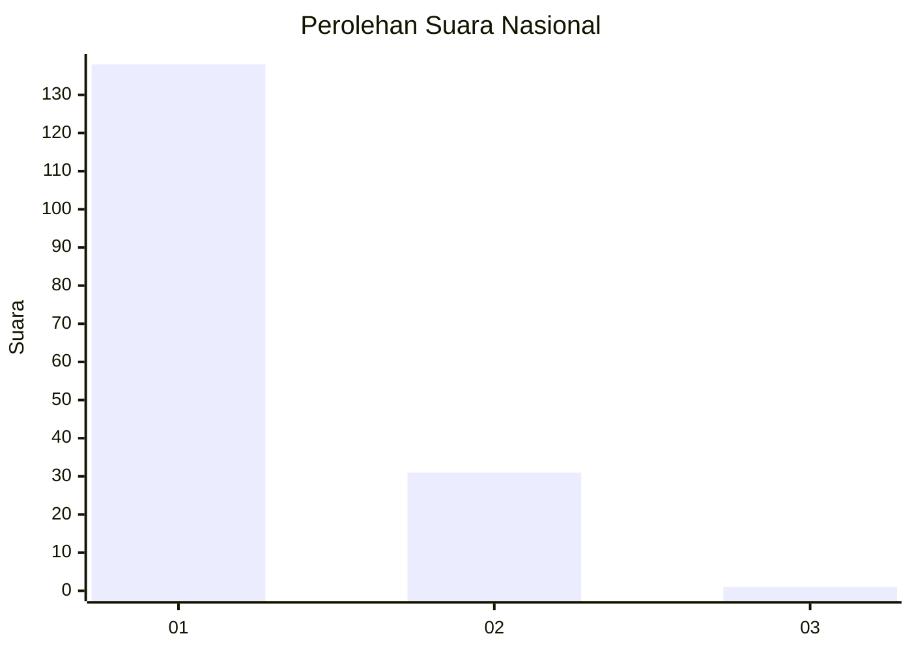
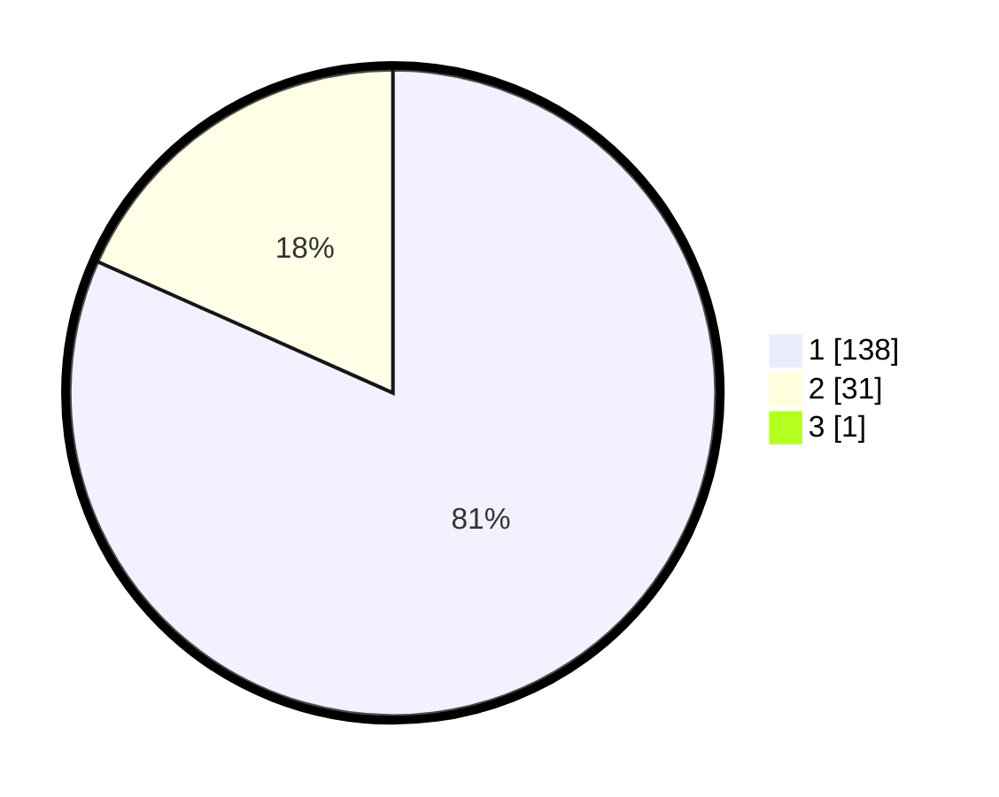

# Hasil

## Grafik

## Tabel

| No. | Nama Paslon    | Suara | Suara (raw) | Persentase |
|:--- |:-------------- | -----:| -----------:| ----------:|
| 1   | ANIES MUHAIMIN | 138   | [138][p-1]  | 81,18      |
| 2   | PRABOWO GIBRAN | 31    | [31][p-2]   | 18,24      |
| 3   | GANJAR MAHFUD  | 1     | [1][p-3]    | 0,59       |

[p-1]: https://github.com/gigit-pemilu/pemilu-2024/blob/main/pilpres/hitung-suara/sub/11-aceh/sub/07-pidie/sub/19-tangse/sub/2019-keubon-nilam/sub/001-tps/sub/paslon-1.txt
[p-2]: https://github.com/gigit-pemilu/pemilu-2024/blob/main/pilpres/hitung-suara/sub/11-aceh/sub/07-pidie/sub/19-tangse/sub/2019-keubon-nilam/sub/001-tps/sub/paslon-2.txt
[p-3]: https://github.com/gigit-pemilu/pemilu-2024/blob/main/pilpres/hitung-suara/sub/11-aceh/sub/07-pidie/sub/19-tangse/sub/2019-keubon-nilam/sub/001-tps/sub/paslon-3.txt

## Foto C Plano

https://sirekap-obj-formc.kpu.go.id/2e66/pemilu/ppwp/11/07/19/20/19/1107192019001-20240215-162802--b5bd3971-bbdd-42a2-9cf5-1d85a2ffddfc.jpg

https://sirekap-obj-formc.kpu.go.id/2e66/pemilu/ppwp/11/07/19/20/19/1107192019001-20240215-163024--5f057393-7e64-4bab-a534-207e096717f7.jpg

https://sirekap-obj-formc.kpu.go.id/2e66/pemilu/ppwp/11/07/19/20/19/1107192019001-20240215-163245--4b38d63c-b944-4822-8891-5ccba1498583.jpg

## Metadata

| Key        | Value               |
| ---------- | ------------------- |
| Time Stamp | 2024-02-24 22:31:28 |

