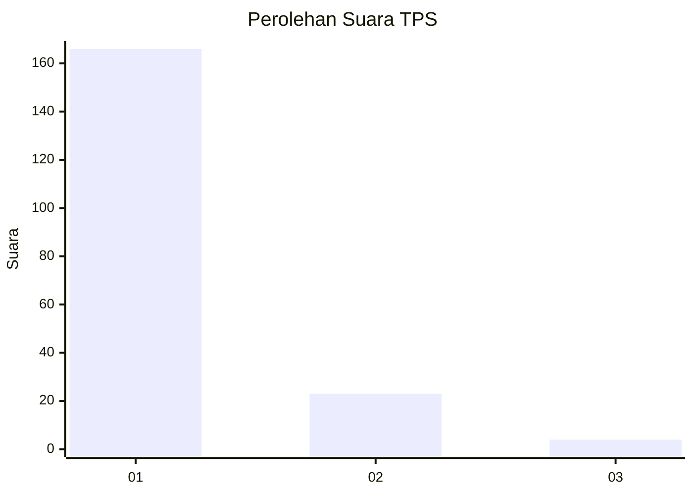
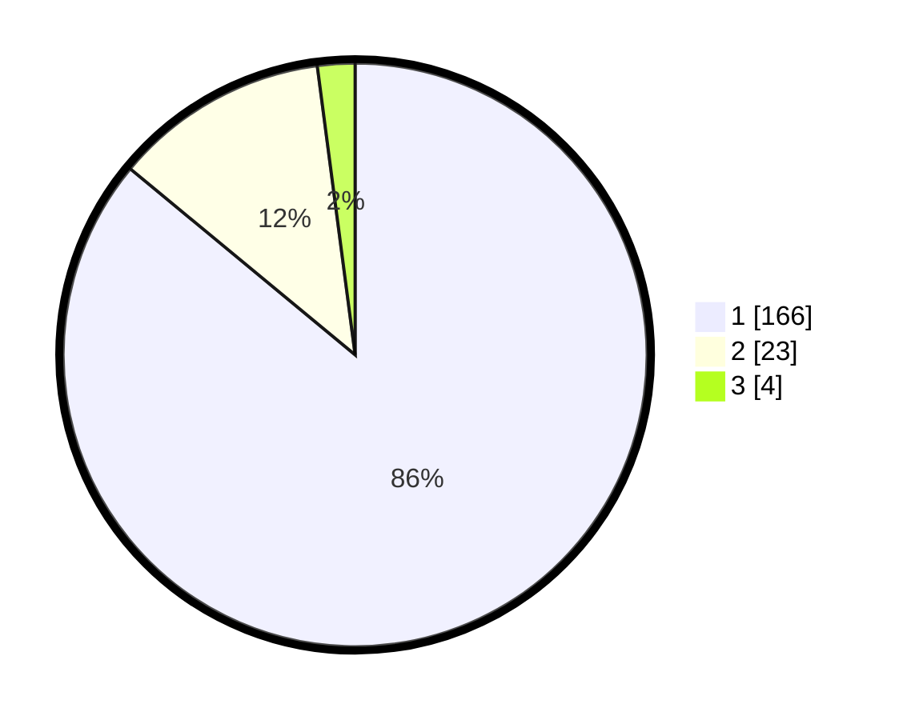

# Hasil

## Grafik

## Tabel

| No. | Nama Paslon    | Suara | Suara (raw) | Persentase |
|:--- |:-------------- | -----:| -----------:| ----------:|
| 1   | ANIES MUHAIMIN | 166   | [166][p-1]  | 86,01      |
| 2   | PRABOWO GIBRAN | 23    | [23][p-2]   | 11,92      |
| 3   | GANJAR MAHFUD  | 4     | [4][p-3]    | 2,07       |

[p-1]: https://github.com/gigit-pemilu/pemilu-2024-11-aceh/blob/main/pilpres/hitung-suara/sub/11-aceh/sub/07-pidie/sub/19-tangse/sub/2021-ranto-panyang/sub/001-tps/sub/paslon-1.txt
[p-2]: https://github.com/gigit-pemilu/pemilu-2024-11-aceh/blob/main/pilpres/hitung-suara/sub/11-aceh/sub/07-pidie/sub/19-tangse/sub/2021-ranto-panyang/sub/001-tps/sub/paslon-2.txt
[p-3]: https://github.com/gigit-pemilu/pemilu-2024-11-aceh/blob/main/pilpres/hitung-suara/sub/11-aceh/sub/07-pidie/sub/19-tangse/sub/2021-ranto-panyang/sub/001-tps/sub/paslon-3.txt

## Foto C Plano

https://sirekap-obj-formc.kpu.go.id/0da3/pemilu/ppwp/11/07/19/20/21/1107192021001-20240215-112704--5801a9f2-bcf1-40c2-83fd-6711a4d1b284.jpg

https://sirekap-obj-formc.kpu.go.id/0da3/pemilu/ppwp/11/07/19/20/21/1107192021001-20240215-112725--2bbb2fed-3d5b-45e7-b9a0-a705cb06d811.jpg

https://sirekap-obj-formc.kpu.go.id/0da3/pemilu/ppwp/11/07/19/20/21/1107192021001-20240215-112742--4ab8bad5-8fd5-434e-96ae-22a18f337e43.jpg

## Metadata

| Key        | Value               |
| ---------- | ------------------- |
| Time Stamp | 2024-02-24 22:31:28 |

