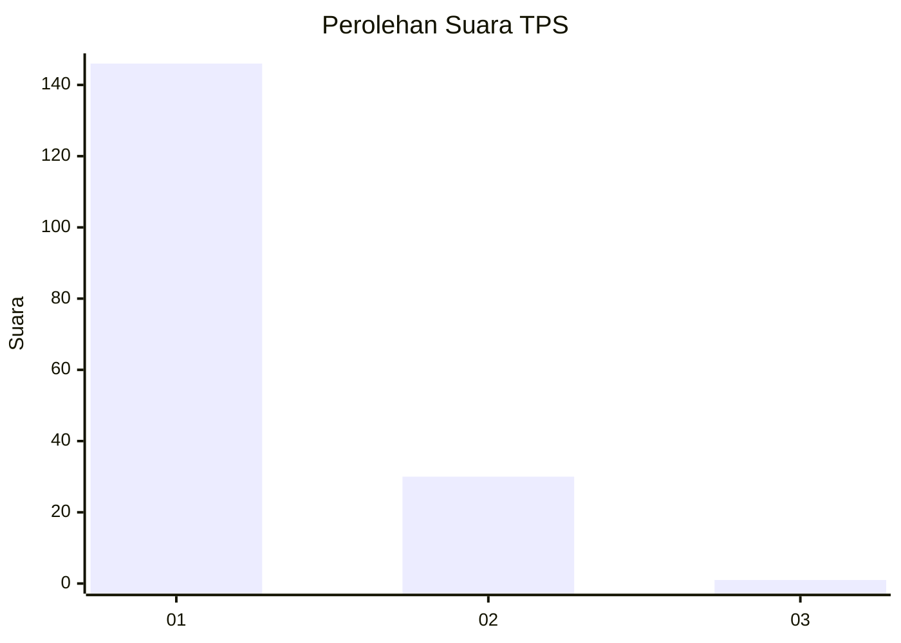
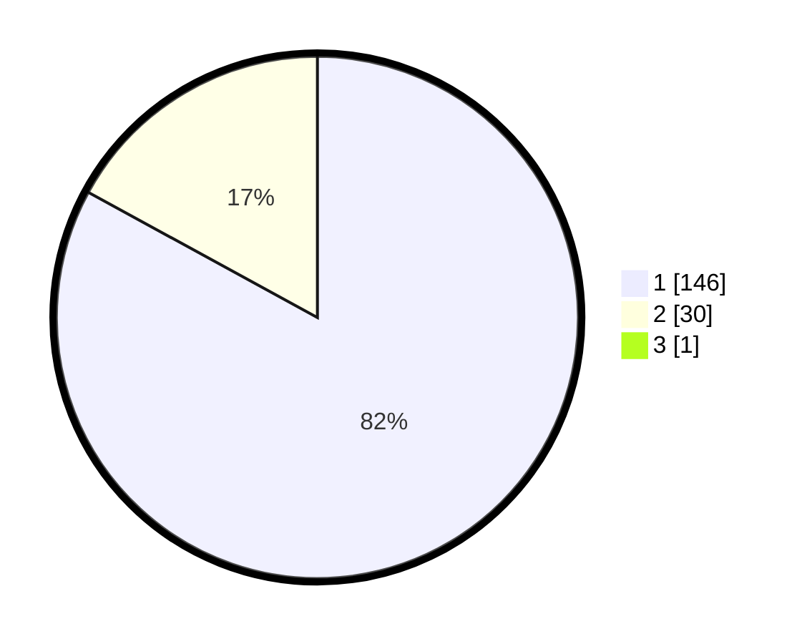

# Hasil

## Grafik

## Tabel

| No. | Nama Paslon    | Suara | Suara (raw) | Persentase |
|:--- |:-------------- | -----:| -----------:| ----------:|
| 1   | ANIES MUHAIMIN | 146   | [146][p-1]  | 82,49      |
| 2   | PRABOWO GIBRAN | 30    | [30][p-2]   | 16,95      |
| 3   | GANJAR MAHFUD  | 1     | [1][p-3]    | 0,56       |

[p-1]: https://github.com/gigit-pemilu/pemilu-2024-11-aceh/blob/main/pilpres/hitung-suara/sub/11-aceh/sub/07-pidie/sub/19-tangse/sub/2025-alue-calong/sub/001-tps/sub/paslon-1.txt
[p-2]: https://github.com/gigit-pemilu/pemilu-2024-11-aceh/blob/main/pilpres/hitung-suara/sub/11-aceh/sub/07-pidie/sub/19-tangse/sub/2025-alue-calong/sub/001-tps/sub/paslon-2.txt
[p-3]: https://github.com/gigit-pemilu/pemilu-2024-11-aceh/blob/main/pilpres/hitung-suara/sub/11-aceh/sub/07-pidie/sub/19-tangse/sub/2025-alue-calong/sub/001-tps/sub/paslon-3.txt

## Foto C Plano

https://sirekap-obj-formc.kpu.go.id/b711/pemilu/ppwp/11/07/19/20/25/1107192025001-20240215-003330--7e574cb0-93a5-455b-9a6a-04504123aadf.jpg

https://sirekap-obj-formc.kpu.go.id/b711/pemilu/ppwp/11/07/19/20/25/1107192025001-20240215-003509--aaebef7b-6f50-460f-a536-72996612aefd.jpg

https://sirekap-obj-formc.kpu.go.id/b711/pemilu/ppwp/11/07/19/20/25/1107192025001-20240215-003621--5f09b8ce-3e9a-4bf8-b134-3c3e349c8278.jpg

## Metadata

| Key        | Value               |
| ---------- | ------------------- |
| Time Stamp | 2024-02-24 22:31:28 |

