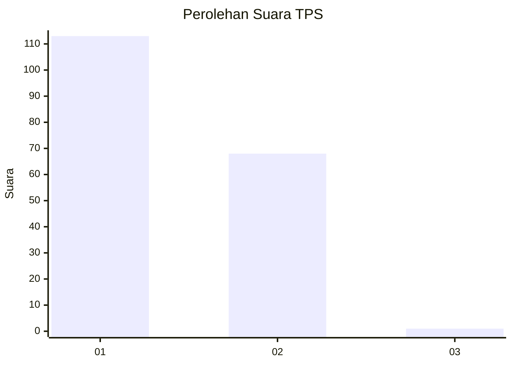
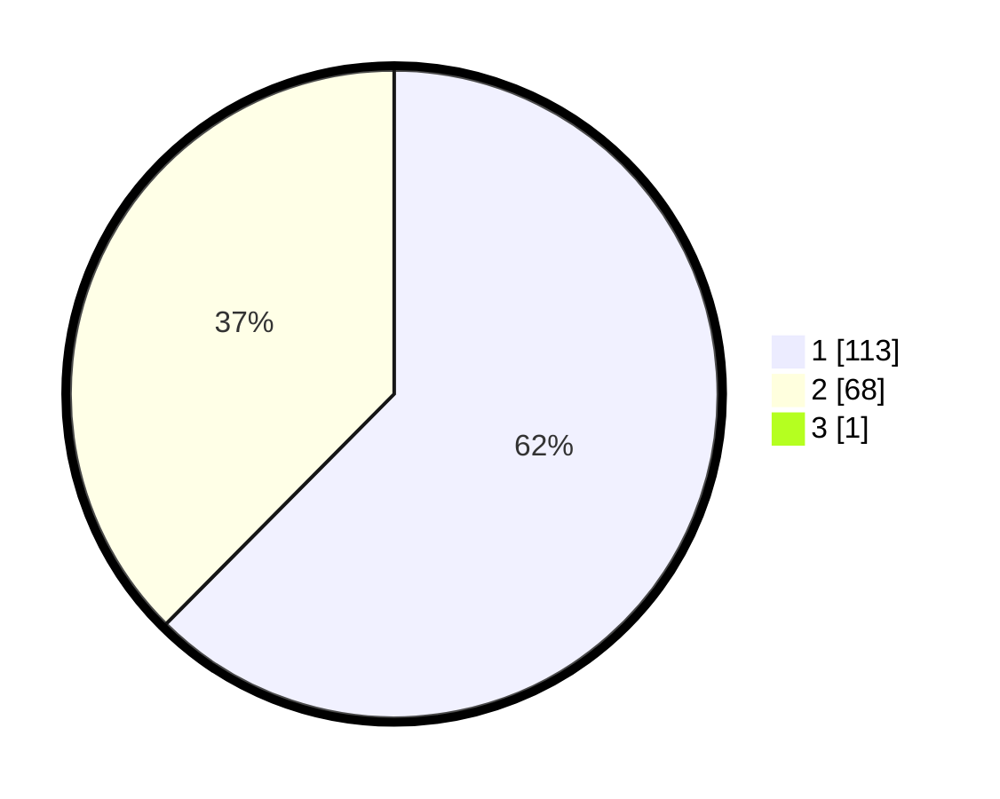

# Hasil

## Grafik

## Tabel

| No. | Nama Paslon    | Suara | Suara (raw) | Persentase |
|:--- |:-------------- | -----:| -----------:| ----------:|
| 1   | ANIES MUHAIMIN | 113   | [113][p-1]  | 62,09      |
| 2   | PRABOWO GIBRAN | 68    | [68][p-2]   | 37,36      |
| 3   | GANJAR MAHFUD  | 1     | [1][p-3]    | 0,55       |

[p-1]: https://github.com/gigit-pemilu/pemilu-2024-11-aceh/blob/main/pilpres/hitung-suara/sub/11-aceh/sub/07-pidie/sub/19-tangse/sub/2025-alue-calong/sub/002-tps/sub/paslon-1.txt
[p-2]: https://github.com/gigit-pemilu/pemilu-2024-11-aceh/blob/main/pilpres/hitung-suara/sub/11-aceh/sub/07-pidie/sub/19-tangse/sub/2025-alue-calong/sub/002-tps/sub/paslon-2.txt
[p-3]: https://github.com/gigit-pemilu/pemilu-2024-11-aceh/blob/main/pilpres/hitung-suara/sub/11-aceh/sub/07-pidie/sub/19-tangse/sub/2025-alue-calong/sub/002-tps/sub/paslon-3.txt

## Foto C Plano

https://sirekap-obj-formc.kpu.go.id/96ff/pemilu/ppwp/11/07/19/20/25/1107192025002-20240215-004523--00c40dee-b9e0-4ea2-9235-54ba2c5f95c2.jpg

https://sirekap-obj-formc.kpu.go.id/96ff/pemilu/ppwp/11/07/19/20/25/1107192025002-20240215-004548--95c929f2-c516-4a23-978d-07fc7f14c37d.jpg

https://sirekap-obj-formc.kpu.go.id/96ff/pemilu/ppwp/11/07/19/20/25/1107192025002-20240215-004606--debf26d1-3f61-4aa7-959f-167faa9d024c.jpg

## Metadata

| Key        | Value               |
| ---------- | ------------------- |
| Time Stamp | 2024-02-24 22:31:28 |

