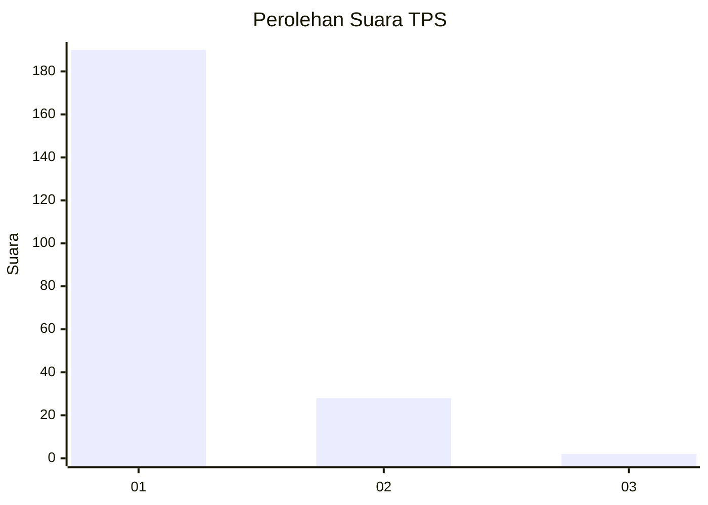
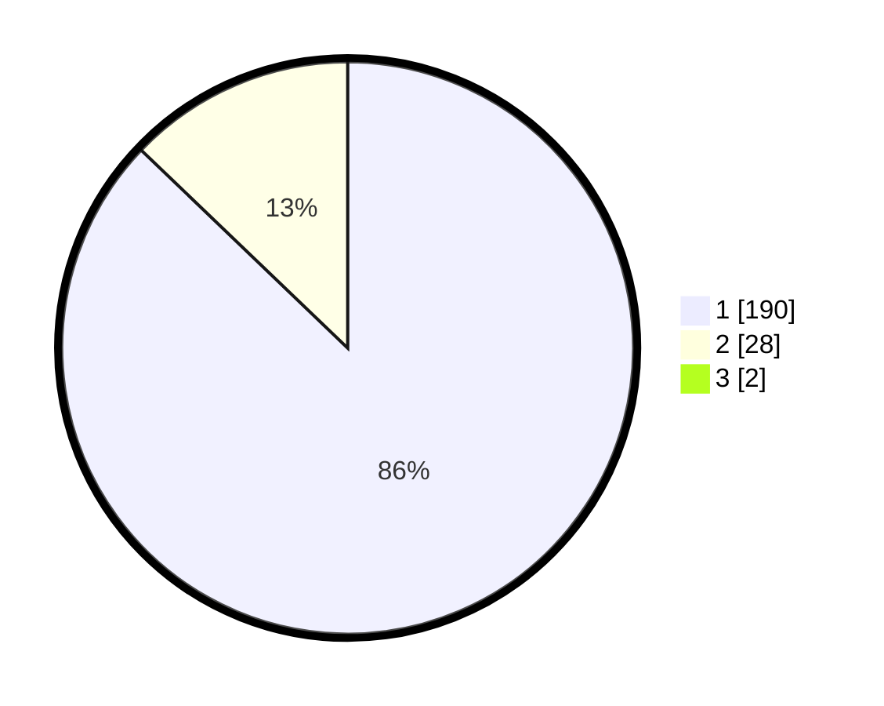

# Hasil

## Grafik

## Tabel

| No. | Nama Paslon    | Suara | Suara (raw) | Persentase |
|:--- |:-------------- | -----:| -----------:| ----------:|
| 1   | ANIES MUHAIMIN | 190   | [190][p-1]  | 86,36      |
| 2   | PRABOWO GIBRAN | 28    | [28][p-2]   | 12,73      |
| 3   | GANJAR MAHFUD  | 2     | [2][p-3]    | 0,91       |

[p-1]: https://github.com/gigit-pemilu/pemilu-2024-11-aceh/blob/main/pilpres/hitung-suara/sub/11-aceh/sub/07-pidie/sub/19-tangse/sub/2027-lhok-keutapang/sub/001-tps/sub/paslon-1.txt
[p-2]: https://github.com/gigit-pemilu/pemilu-2024-11-aceh/blob/main/pilpres/hitung-suara/sub/11-aceh/sub/07-pidie/sub/19-tangse/sub/2027-lhok-keutapang/sub/001-tps/sub/paslon-2.txt
[p-3]: https://github.com/gigit-pemilu/pemilu-2024-11-aceh/blob/main/pilpres/hitung-suara/sub/11-aceh/sub/07-pidie/sub/19-tangse/sub/2027-lhok-keutapang/sub/001-tps/sub/paslon-3.txt

## Foto C Plano

https://sirekap-obj-formc.kpu.go.id/62b5/pemilu/ppwp/11/07/19/20/27/1107192027001-20240214-195626--28078078-d995-431f-8913-c4091a524b75.jpg

https://sirekap-obj-formc.kpu.go.id/62b5/pemilu/ppwp/11/07/19/20/27/1107192027001-20240214-195743--13fb1fa3-8ff7-4a76-b432-627e0fbd54f6.jpg

https://sirekap-obj-formc.kpu.go.id/62b5/pemilu/ppwp/11/07/19/20/27/1107192027001-20240214-200127--a6e77e02-2d7b-4a37-b99b-88565f0c515f.jpg

## Metadata

| Key        | Value               |
| ---------- | ------------------- |
| Time Stamp | 2024-02-15 12:00:28 |

