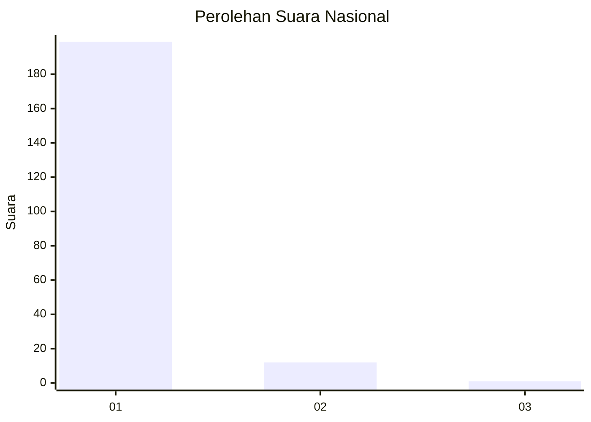
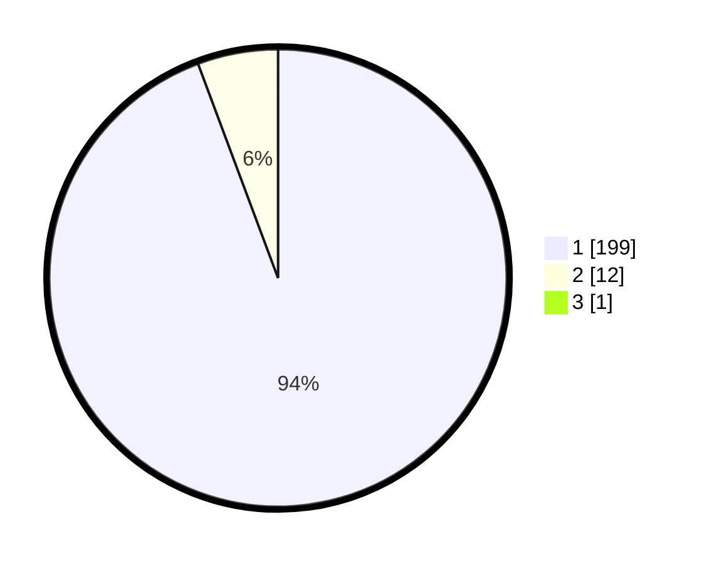

# Hasil

## Grafik

## Tabel

| No. | Nama Paslon    | Suara | Suara (raw) | Persentase |
|:--- |:-------------- | -----:| -----------:| ----------:|
| 1   | ANIES MUHAIMIN | 199   | [199][p-1]  | 93,87      |
| 2   | PRABOWO GIBRAN | 12    | [12][p-2]   | 5,66       |
| 3   | GANJAR MAHFUD  | 1     | [1][p-3]    | 0,47       |

[p-1]: https://github.com/gigit-pemilu/pemilu-2024/blob/main/pilpres/hitung-suara/sub/11-aceh/sub/07-pidie/sub/22-keumala/sub/2002-kumbang/sub/001-tps/sub/paslon-1.txt
[p-2]: https://github.com/gigit-pemilu/pemilu-2024/blob/main/pilpres/hitung-suara/sub/11-aceh/sub/07-pidie/sub/22-keumala/sub/2002-kumbang/sub/001-tps/sub/paslon-2.txt
[p-3]: https://github.com/gigit-pemilu/pemilu-2024/blob/main/pilpres/hitung-suara/sub/11-aceh/sub/07-pidie/sub/22-keumala/sub/2002-kumbang/sub/001-tps/sub/paslon-3.txt

## Foto C Plano

https://sirekap-obj-formc.kpu.go.id/619f/pemilu/ppwp/11/07/22/20/02/1107222002001-20240215-101857--c730483e-b819-4bb9-a89e-974076b05d21.jpg

https://sirekap-obj-formc.kpu.go.id/619f/pemilu/ppwp/11/07/22/20/02/1107222002001-20240215-102118--e8327309-feee-4f0b-b311-c4c6c0a8bf90.jpg

https://sirekap-obj-formc.kpu.go.id/619f/pemilu/ppwp/11/07/22/20/02/1107222002001-20240215-102308--44749933-b0f6-464e-808b-2b6d9b19750b.jpg

## Metadata

| Key        | Value               |
| ---------- | ------------------- |
| Time Stamp | 2024-02-24 22:31:28 |

