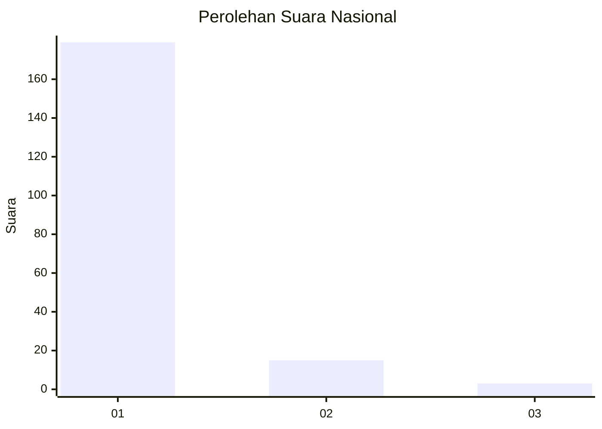
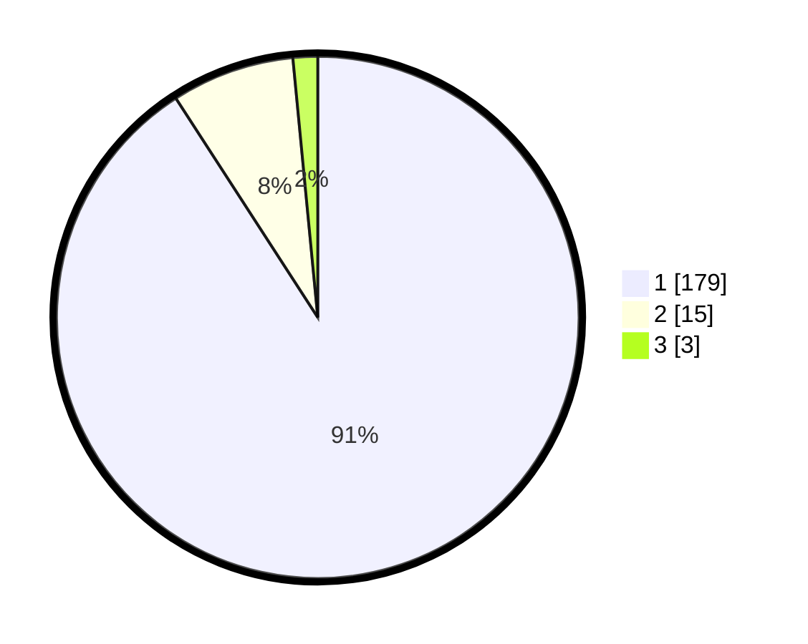

# Hasil

## Grafik

## Tabel

| No. | Nama Paslon    | Suara | Suara (raw) | Persentase |
|:--- |:-------------- | -----:| -----------:| ----------:|
| 1   | ANIES MUHAIMIN | 179   | [179][p-1]  | 90,86      |
| 2   | PRABOWO GIBRAN | 15    | [15][p-2]   | 7,61       |
| 3   | GANJAR MAHFUD  | 3     | [3][p-3]    | 1,52       |

[p-1]: https://github.com/gigit-pemilu/pemilu-2024/blob/main/pilpres/hitung-suara/sub/11-aceh/sub/07-pidie/sub/22-keumala/sub/2002-kumbang/sub/002-tps/sub/paslon-1.txt
[p-2]: https://github.com/gigit-pemilu/pemilu-2024/blob/main/pilpres/hitung-suara/sub/11-aceh/sub/07-pidie/sub/22-keumala/sub/2002-kumbang/sub/002-tps/sub/paslon-2.txt
[p-3]: https://github.com/gigit-pemilu/pemilu-2024/blob/main/pilpres/hitung-suara/sub/11-aceh/sub/07-pidie/sub/22-keumala/sub/2002-kumbang/sub/002-tps/sub/paslon-3.txt

## Foto C Plano

https://sirekap-obj-formc.kpu.go.id/4927/pemilu/ppwp/11/07/22/20/02/1107222002002-20240215-100715--2b4eea0e-fea5-494a-8e2d-b132b9904090.jpg

https://sirekap-obj-formc.kpu.go.id/4927/pemilu/ppwp/11/07/22/20/02/1107222002002-20240215-100932--c3e5b2fd-a977-405a-8b1c-c0a41fcabc48.jpg

https://sirekap-obj-formc.kpu.go.id/4927/pemilu/ppwp/11/07/22/20/02/1107222002002-20240215-101426--e4852e35-355f-4508-a66e-2113e442e5df.jpg

## Metadata

| Key        | Value               |
| ---------- | ------------------- |
| Time Stamp | 2024-02-16 02:30:27 |

