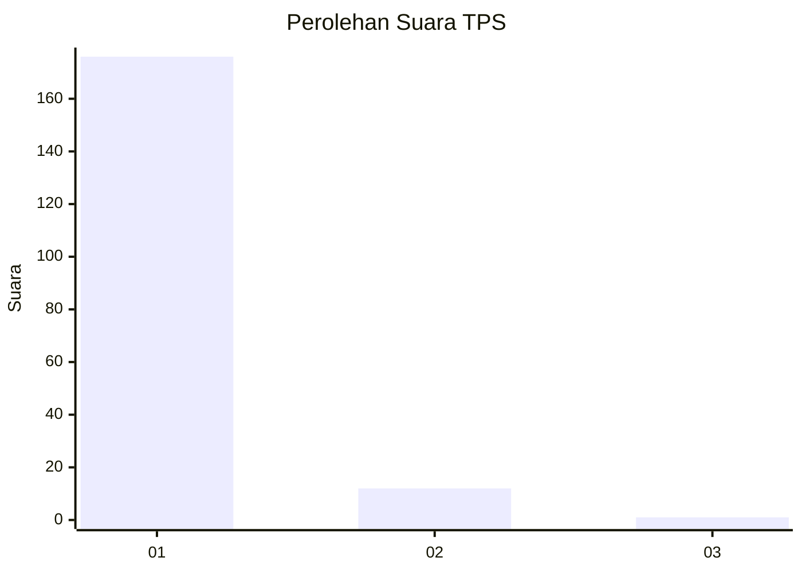
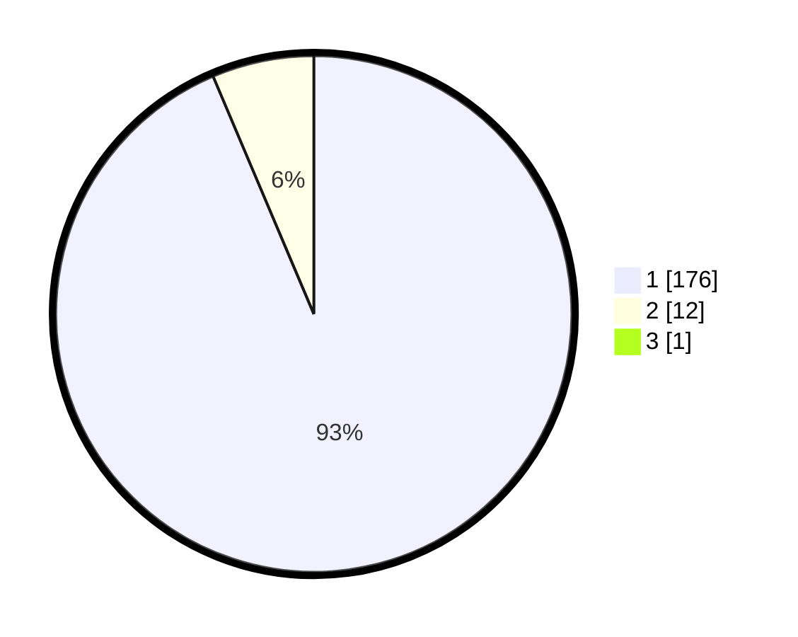

# Hasil

## Grafik

## Tabel

| No. | Nama Paslon    | Suara | Suara (raw) | Persentase |
|:--- |:-------------- | -----:| -----------:| ----------:|
| 1   | ANIES MUHAIMIN | 176   | [176][p-1]  | 93,12      |
| 2   | PRABOWO GIBRAN | 12    | [12][p-2]   | 6,35       |
| 3   | GANJAR MAHFUD  | 1     | [1][p-3]    | 0,53       |

[p-1]: https://github.com/gigit-pemilu/pemilu-2024-11-aceh/blob/main/pilpres/hitung-suara/sub/11-aceh/sub/07-pidie/sub/22-keumala/sub/2002-kumbang/sub/003-tps/sub/paslon-1.txt
[p-2]: https://github.com/gigit-pemilu/pemilu-2024-11-aceh/blob/main/pilpres/hitung-suara/sub/11-aceh/sub/07-pidie/sub/22-keumala/sub/2002-kumbang/sub/003-tps/sub/paslon-2.txt
[p-3]: https://github.com/gigit-pemilu/pemilu-2024-11-aceh/blob/main/pilpres/hitung-suara/sub/11-aceh/sub/07-pidie/sub/22-keumala/sub/2002-kumbang/sub/003-tps/sub/paslon-3.txt

## Foto C Plano

https://sirekap-obj-formc.kpu.go.id/2afd/pemilu/ppwp/11/07/22/20/02/1107222002003-20240215-084230--d5996519-8b89-4dd2-bb5c-c7a0a25e1548.jpg

https://sirekap-obj-formc.kpu.go.id/2afd/pemilu/ppwp/11/07/22/20/02/1107222002003-20240215-084413--42cf0a40-d1cb-4cde-bb2e-deb34837b66f.jpg

https://sirekap-obj-formc.kpu.go.id/2afd/pemilu/ppwp/11/07/22/20/02/1107222002003-20240215-084722--3974f7ef-0349-4af7-ba2f-4f2066992c9d.jpg

## Metadata

| Key        | Value               |
| ---------- | ------------------- |
| Time Stamp | 2024-02-24 22:31:28 |

