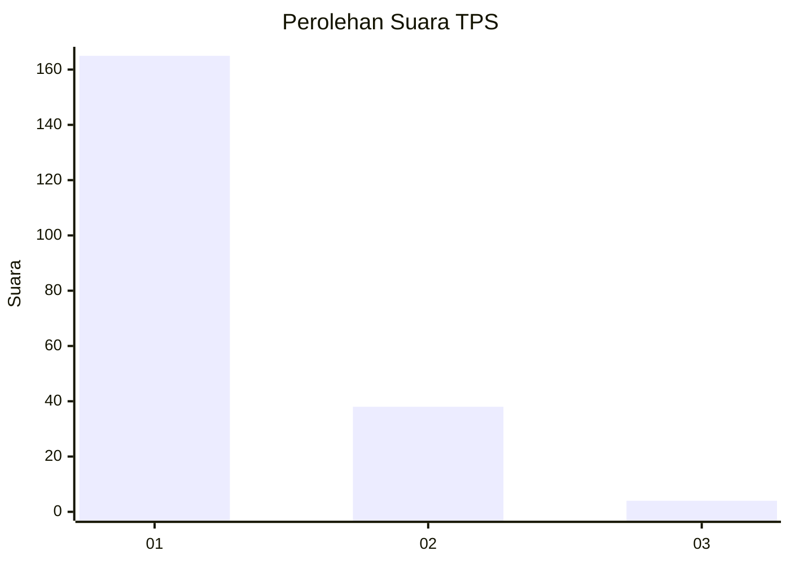
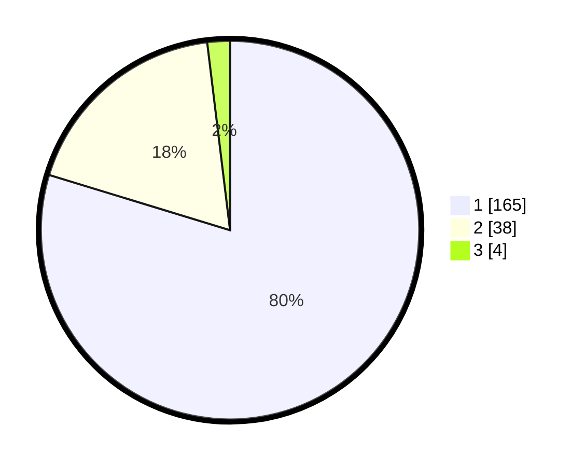

# Hasil

## Grafik

## Tabel

| No. | Nama Paslon    | Suara | Suara (raw) | Persentase |
|:--- |:-------------- | -----:| -----------:| ----------:|
| 1   | ANIES MUHAIMIN | 165   | [165][p-1]  | 79,71      |
| 2   | PRABOWO GIBRAN | 38    | [38][p-2]   | 18,36      |
| 3   | GANJAR MAHFUD  | 4     | [4][p-3]    | 1,93       |

[p-1]: https://github.com/gigit-pemilu/pemilu-2024-11-aceh/blob/main/pilpres/hitung-suara/sub/11-aceh/sub/07-pidie/sub/22-keumala/sub/2005-jijiem/sub/003-tps/sub/paslon-1.txt
[p-2]: https://github.com/gigit-pemilu/pemilu-2024-11-aceh/blob/main/pilpres/hitung-suara/sub/11-aceh/sub/07-pidie/sub/22-keumala/sub/2005-jijiem/sub/003-tps/sub/paslon-2.txt
[p-3]: https://github.com/gigit-pemilu/pemilu-2024-11-aceh/blob/main/pilpres/hitung-suara/sub/11-aceh/sub/07-pidie/sub/22-keumala/sub/2005-jijiem/sub/003-tps/sub/paslon-3.txt

## Foto C Plano

https://sirekap-obj-formc.kpu.go.id/2fe9/pemilu/ppwp/11/07/22/20/05/1107222005003-20240215-062057--83bf567e-d94b-4176-958c-9521229425bf.jpg

https://sirekap-obj-formc.kpu.go.id/2fe9/pemilu/ppwp/11/07/22/20/05/1107222005003-20240215-062254--74700e58-a551-47c4-a6c3-44217e74c936.jpg

https://sirekap-obj-formc.kpu.go.id/2fe9/pemilu/ppwp/11/07/22/20/05/1107222005003-20240215-062416--136c1a35-bd4e-475b-9d3b-b243c1aec0e4.jpg

## Metadata

| Key        | Value               |
| ---------- | ------------------- |
| Time Stamp | 2024-02-16 02:30:27 |

