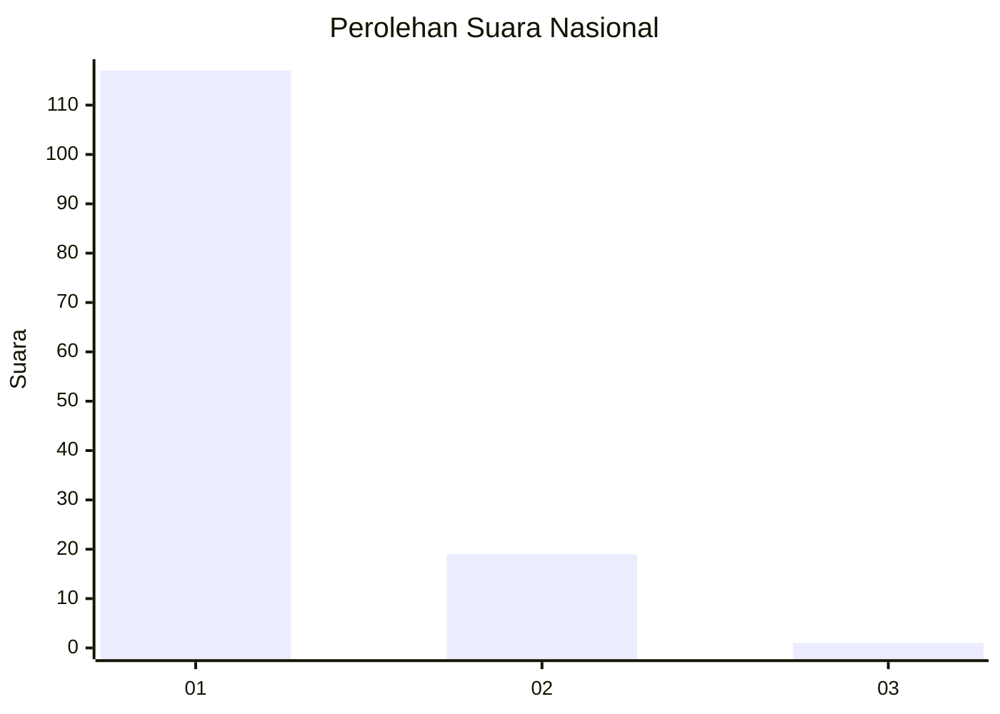
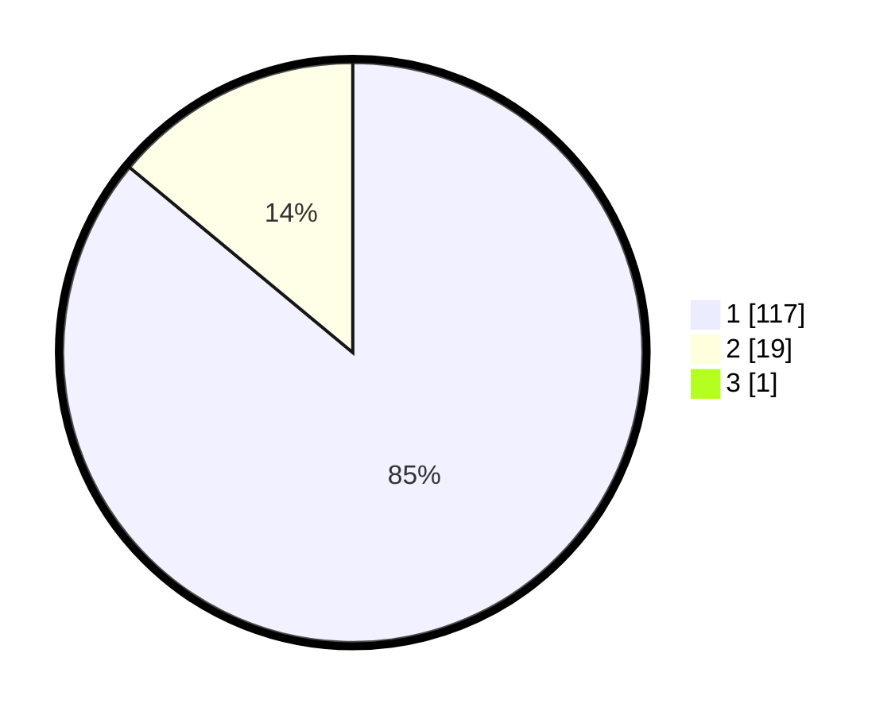

# Hasil

## Grafik

## Tabel

| No. | Nama Paslon    | Suara | Suara (raw) | Persentase |
|:--- |:-------------- | -----:| -----------:| ----------:|
| 1   | ANIES MUHAIMIN | 117   | [117][p-1]  | 85,40      |
| 2   | PRABOWO GIBRAN | 19    | [19][p-2]   | 13,87      |
| 3   | GANJAR MAHFUD  | 1     | [1][p-3]    | 0,73       |

[p-1]: https://github.com/gigit-pemilu/pemilu-2024/blob/main/pilpres/hitung-suara/sub/11-aceh/sub/07-pidie/sub/22-keumala/sub/2006-rheng/sub/001-tps/sub/paslon-1.txt
[p-2]: https://github.com/gigit-pemilu/pemilu-2024/blob/main/pilpres/hitung-suara/sub/11-aceh/sub/07-pidie/sub/22-keumala/sub/2006-rheng/sub/001-tps/sub/paslon-2.txt
[p-3]: https://github.com/gigit-pemilu/pemilu-2024/blob/main/pilpres/hitung-suara/sub/11-aceh/sub/07-pidie/sub/22-keumala/sub/2006-rheng/sub/001-tps/sub/paslon-3.txt

## Foto C Plano

https://sirekap-obj-formc.kpu.go.id/4197/pemilu/ppwp/11/07/22/20/06/1107222006001-20240215-022542--880c30cf-79b2-4818-bdb8-750ceb901278.jpg

https://sirekap-obj-formc.kpu.go.id/4197/pemilu/ppwp/11/07/22/20/06/1107222006001-20240215-022651--7453cc0a-2d71-448f-95ca-52f02a3fff03.jpg

https://sirekap-obj-formc.kpu.go.id/4197/pemilu/ppwp/11/07/22/20/06/1107222006001-20240215-022756--8c6bb27f-1107-43bb-8327-d11d5f217bcd.jpg

## Metadata

| Key        | Value               |
| ---------- | ------------------- |
| Time Stamp | 2024-02-16 02:30:27 |

